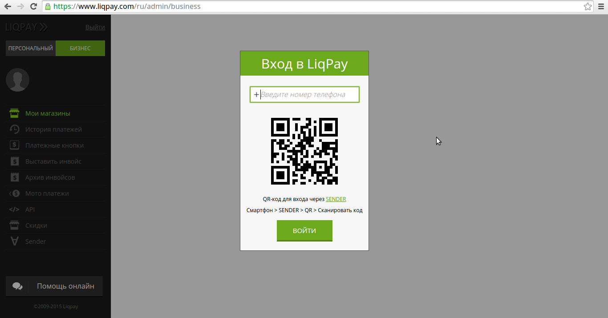
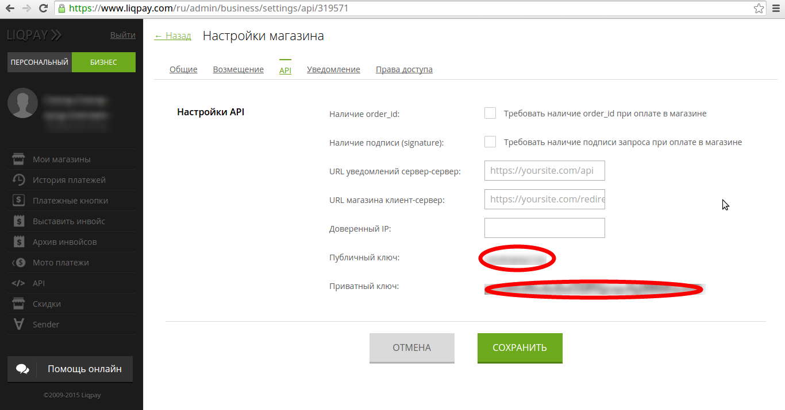
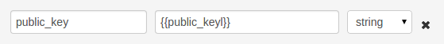
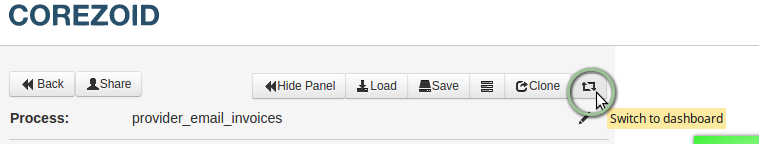
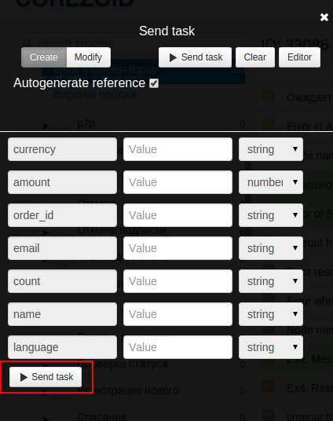
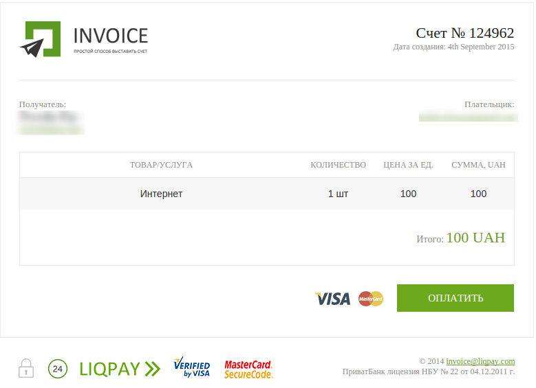
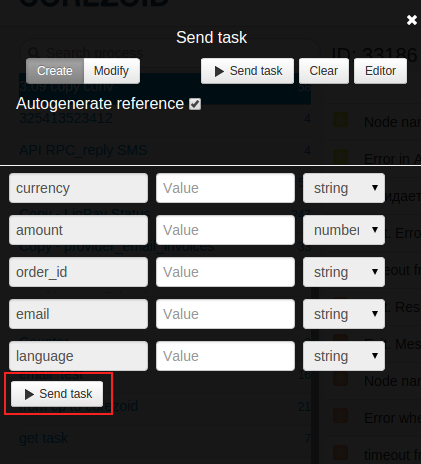
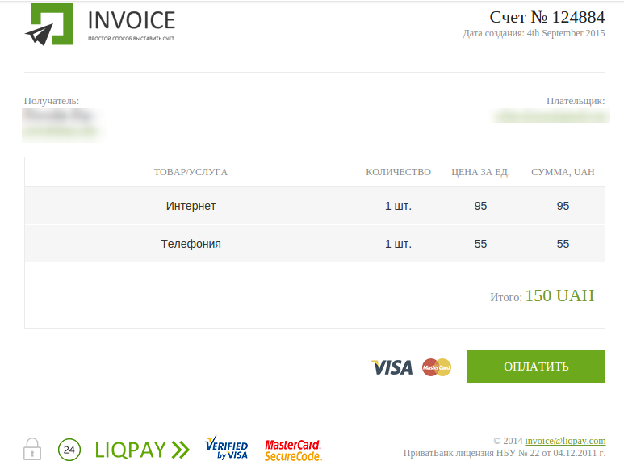
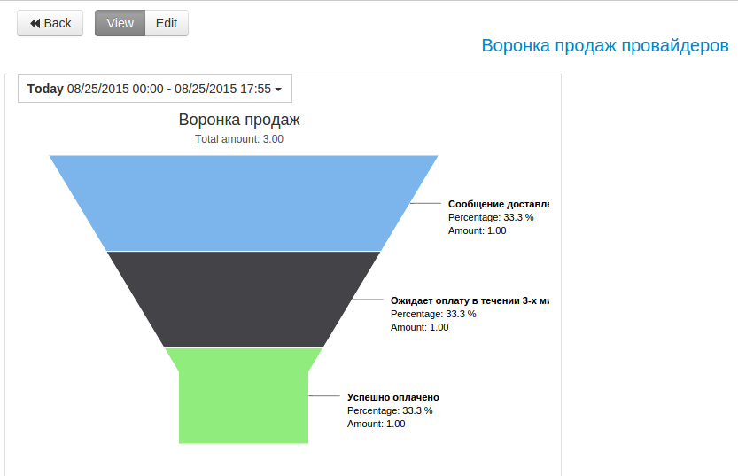

# Отправка инвойсов на email и проверка статуса платежа

###Для получения ключей от LiqPay:

**1)** Перейдите на страничку: https://www.liqpay.com/ru/admin/business



**2)** Введите номер телефона. ОТП и пароль от Приват24. Для упрощенной авторизации используйте Sender.

Перейти в настройки магазина. https://www.liqpay.com/ru/admin/business/settings/api/



**3)** На странице настройки магазина скопируйте публичный и приватный ключ.

###Настройка процесса

**1)** Клонируйте [папку "Invoice sending to email and payment status checking"](https://admin.corezoid.com/folder/conv/9329) для получения процесса и дашборда.


**2)** Перейдите в процесс и сгенерируйте ссылку для получения callback от LiqPay - в узле с Логикой **Callback "Wait callback from API LiqPay"** и **"Receive Callback LiqPay Status"**
нажмите на значок **"Corezoid"** и ссылка будет скопирована в буфер обмена. В поле **Path to task_id** нужно указать **obj_id.**


**3)** Вставьте полученный URL в значение параметра callback логики API, который находится в узле **Call API LiqPay** и  **LiqPay Status process**.


**4)** Вставьте Ваш **private key** из LiqPay в узел **LiqPay Status process** и **Call api LiqPay** в поле **Secret key**:


В поле {{public_key}} вставьте Ваш public key из LiqPay:



###Тестирование процесса

**1)** Для тестирования процесса отправки инвойса по одному товару\услуге, перейдите в режим **dashboard**



нажмите кнопку **Add task**, чтобы добавить заявку.


В открывшейся форме укажите обязательные параметры и нажмите **"Send task"**:



*Обязательные параметры:*
* `currency` - валюта (UAH;
* `amount` - сумма к оплате (1);
* `order_id` - уникальный номер заказа;
* `email` - адрес эл. почты, на который будет отправлен счет;
* `count` - количество (в шт.);
* `name` - наименование товара.
* `language` - язык инвойса (ru,uk,en);

Если все данные указаны корректно, Ваши клиенты получат счет на email:




**2)** Чтобы отправить N кол-во товаров (услуг) в заявку, параметр `goods` должен содержать массив объектов.

Пример:

```
"goods":
[
	{
	"amount":100,
	"count":2,
	"unit":"шт.",
	"name":"телефон"
	},
	{
	"amount":5,
	"count":1,
	"unit":"шт.",
	"name":"чехол"
	}
]```

В режиме **dashboard** нажмите кнопку **Add task**, чтобы добавить заявку.


В открывшейся форме укажите обязательные параметры и нажмите **"Send task"**:



*Обязательные параметры:*
* `currency` - валюта (UAH;
* `amount` - сумма к оплате (1);
* `order_id` - уникальный номер заказа;
* `email` - адрес эл. почты, на который будет отправлен счет;
* `language` - язык инвойса (ru,uk,en);


Если все данные переданы корректно, Ваши клиенты получат счет на email:



**В случае успеха** в заявку будут добавлены параметры:
* **status** - статус платежа
* **payment_id** - id платежа


**В случае ошибки заявка** перейдет в узел эскалации и будут добавлены параметры:

* **err_code** - код ошибки
* **err_description** - описание ошибки

Для просмотра воронки продаж, откройте дашборд в папке с процессом.


