# Invoice Multi Platform Bot

* [Копирование Бота в свой аккаунт](#copy)
* [Предназначение процессов](#description)
* [Интеграция с Facebook](#facebook)
* [Интеграция с Telegram](#telegram)
* [Интеграция с Viber](#viber)
* [Интеграция с API Invoice Bot LiqPay](#liqpay)
* [Тексты сообщений](#text)
* [Изображение товара](#img)
* [Контроль Ботов](#bot)

##Копирование Бота в свой аккаунт {#copy}

Клонируйте [папку с процессами "LiqPay invoice DEMO bot"](https://admin.corezoid.com/folder/conv/1923)

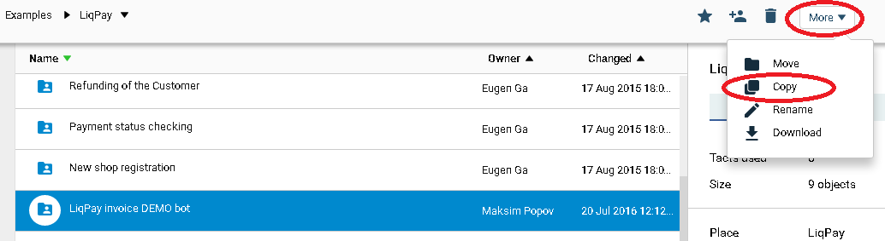

##Предназначение процессов {#description}

**[Receiver & Route message](https://admin.corezoid.com/editor/98033/149189)**
- принимает все сообщения от клиентов, как из Facebook, так и из Telegram
- приводит полученные данные к единому формату. Например сообщение из Facebook (`entry[0].messaging[0].message.text`) сообщение из Telegram (`message.text`) преобразует в параметр `user_text`
- передает преобразованные данные в процесс, где заложена основная логика - [`MAIN logic`](https://admin.corezoid.com/editor/98033/149183)
- передает и обновляет данные о пользователях в диаграмме состояний `Users`

**[MAIN logic](https://admin.corezoid.com/editor/98033/149183)**
- управляет основной логикой: определение полученных команд, инициация запросов для отправки соответствующих сообщений клиентам

**[Send messages](https://admin.corezoid.com/editor/98033/149193)**
- хранит текстовые сообщения и сообщения с кнопками для общения с клиентами
- передает запрос на отправку сообщения клиенту в зависимости от канала

**Telegram / [Telegram - Send message](https://admin.corezoid.com/editor/98034/149181)**
- отправляет сообщения в чат Telegram

**Telegram / [Telegram - Hide inline keyboard](https://admin.corezoid.com/editor/98034/149182)**
- скрывает кнопки в отправленном сообщении, если был выбор одной из них

**Facebook / [Facebook - Send message](https://admin.corezoid.com/editor/98036/149187)**
- отправляет сообщения в чат Facebook

**Facebook / [Set FB Bot Welcome Message](https://admin.corezoid.com/editor/98036/149188)**
- устанавливает для Facebook Бота кнопку "Get started", при нажатии на которую в процеcc [`Receiver & Route message`](https://admin.corezoid.com/editor/98033/149189) будет приходить сообщение (postback) с текстом "/start".

**Viber / [Viber - Send message](https://admin.corezoid.com/editor/118537/194287)**
- отправляет сообщения в чат Viber, распределяет по статусам отправки.

Успешные запросы передает в [Message statuses](https://admin.corezoid.com/editor/118537/194288) для получения конечного статуса сообщений.

**Viber / [Viber - Viber - Message statuses](https://admin.corezoid.com/editor/118537/194288)**
- распределяет успешные запросы по состояниям:

"Отправлено", "Доставлено", "Просмотрено", "Не доставлено 14 дней", "Не просмотрено 14 дней", "failed - не доставлено Viber".

**Viber / [Viber - Viber events](https://admin.corezoid.com/editor/118537/194286)**
- универсальный процесс, который приводит любой тип сообщения от пользователя ("event":"message") в параметр `user_text`.

Другие значения "event" распределяет по конечным узлам или модифицирует состояния сообщений в [Viber - Message statuses](https://admin.corezoid.com/editor/118537/194288)

**Config / [State chats](https://admin.corezoid.com/editor/98038/149192)**
- диаграмма состояний, в которой хранится и обновляется информация о текущем состоянии пользователя, а именно id процесса, в котором он сейчас находится. Эта информация всегда должна передаваться на первом шаге в процессах, которые расположены в папке `Commands`.

**Commands / [Create invoice](https://admin.corezoid.com/editor/98037/149191)**
- устанавливает текущее состояние пользователя (id текущего процесса)
- создает инвойс
- на разных шагах создания инвойса передает данные в [`Send messages`](https://admin.corezoid.com/editor/98033/149193) для отправки сообщений пользователям

**[Users](https://admin.corezoid.com/editor/98033/149190)**
- диаграмма состояний, которая хранит данные о пользователях

**[Statistic](https://www.corezoid.com/admin/view_dash/70343/98033)**
- дашборд с информацией о количестве отправленных сообщений и количестве пользователей Бота в разрезе каналов

##Интеграция с Facebook {#facebook}

**1)** Создайте facebook [приложение](https://developers.facebook.com/quickstarts/?platform=web) и [страницу](https://www.facebook.com/pages/create/). Получите `Page ID`.

**2)** В настройках facebook приложения кликните на `"+Добавить продукт"` и выберите `Messenger`

**3)** Получите маркер доступа страницы - `Page Access Token`

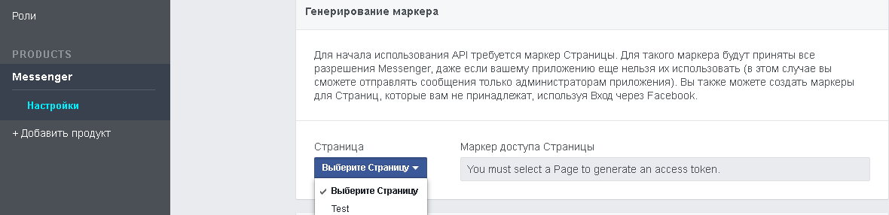

**4)** Подключите процесс [**Receiver & Route message**](https://admin.corezoid.com/editor/98033/149189) к FB Messenger, указав маркер доступа Вашей страницы

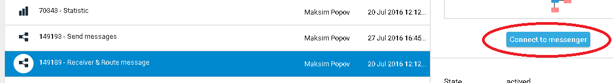

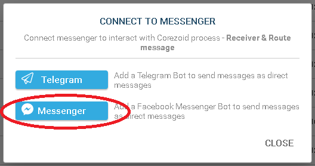

**5)** Получите webhook-url процесса [**Receiver & Route message**](https://admin.corezoid.com/editor/98033/149189) для FB Messenger

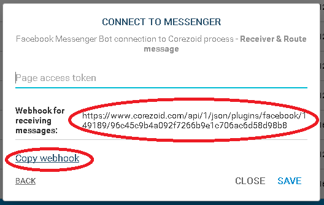

**6)** Установите webhook в настройках facebook приложения, указав полученный webhook-url процесса [**Receiver & Route message**](https://admin.corezoid.com/editor/98033/149189) в поле `Обратный, URL-адрес`, а маркер доступа страницы - в поле `Подтвердить маркер`

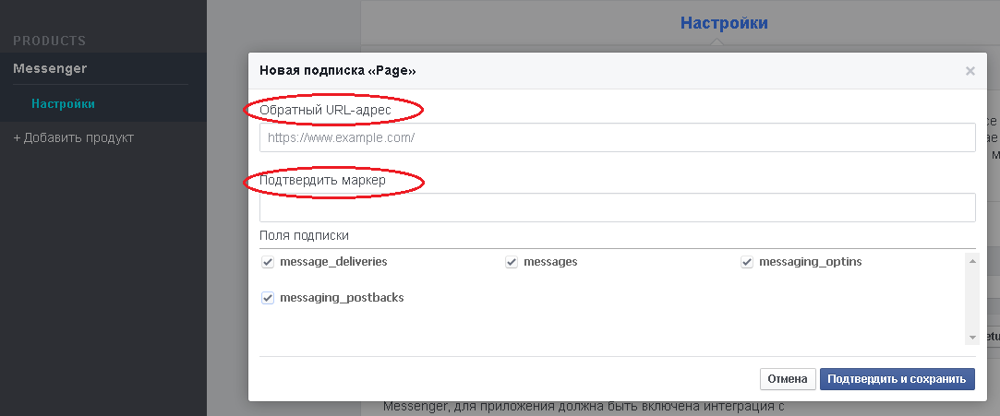

**7)** Выбрав нужную страницу подпишите webhook к ее событиям

[Подробная инструкция на Facebook](https://developers.facebook.com/docs/messenger-platform/product-overview)

**8)** Установите для Facebook Бота кнопку "Get started", при нажатии на которую в процесс [`Receiver & Route message`](https://admin.corezoid.com/editor/98033/149189) будет приходить сообщение (postback) с текстом "/start"**

Для этого:

 - перейдите в режим `View` процесса [Set FB Bot Welcome Message](https://www.corezoid.com/admin/edit_conv/149188/98036)

 - нажмите кнопку `New task` - новая заявка.

 - в появившемся окне укажите значение обязательных параметров 
   - **fb_access_token** - маркер доступа страницы (`Page Access Token`)
   - **page_id** - идентификатор страницы

 - нажмите кнопку `Add task`.

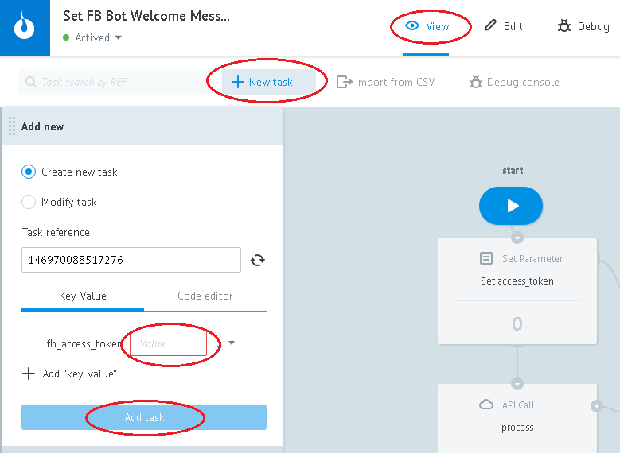

##Интеграция с Telegram {#telegram}

Подключите процесс [**Receiver & Route message**](https://admin.corezoid.com/editor/98033/149189) к Telegram, указав ключ Вашего Бота

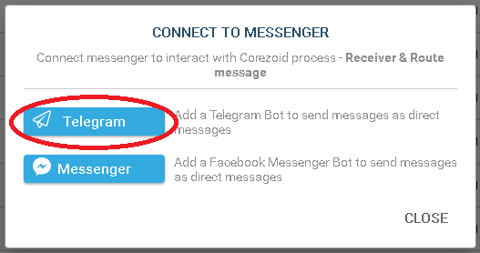

Для получения ключа Бота нужно отправить команду `/newbot` в чат с **@BotFather**. Далее указать имя и имя пользователя Бота. Вы получите:

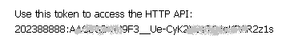

##Интеграция с Viber {#viber}

Подключите [**Receiver & Route message**](https://admin.corezoid.com/editor/98033/149189) к Viber Webhook:

* перейдите на вкладку `Webhook`
* нажмите на `Connect to messenger`
* выберите `Viber`
* нажмите на кнопку `"Set Webhook"` и укажите токен Вашего Public Account

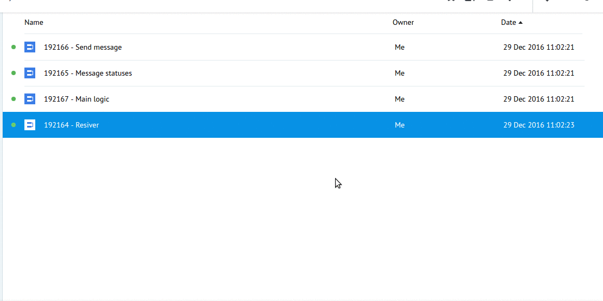

####Welcome message

Установите приветственное сообщение для Вашего Public Account:

* после выбора `Viber` нажмите на кнопку `"Set Welcome message"`
* выберите тип приветственного сообщения - картинка с текстом или текст (например, "Приветсвуем! Чтобы выставить счет, отправьте команду pay")
* заполните нужные поля

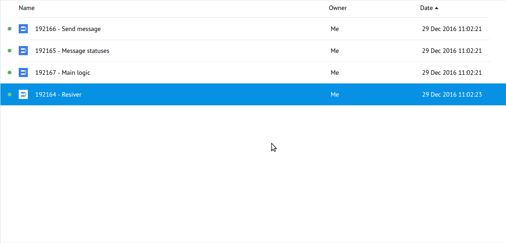

Приветственное сообщение отправляется в ответ на полученный webhook, содержащий `"event": "conversation_started"`.

Это событие сигнализирует о том, что пользователь перешел в чат с Вашим Public Account первый раз (т.е. история отсутствует) или когда чат открыт через deep link.

`"conversation_started"` не считается подпиской и не позволяет Public Account отправлять сообщения пользователям.

Но разрешает отправить одно приветственное.

####Установка параметров Viber Public Account

Для отправки сообщений в Viber перейдите в **Viber / [Viber - Send message](https://admin.corezoid.com/editor/118537/194287)** и установите значения параметров

* **name** - имя Public Account
* **avatar** - линк на аватар Public Account (необязательный парамерт)

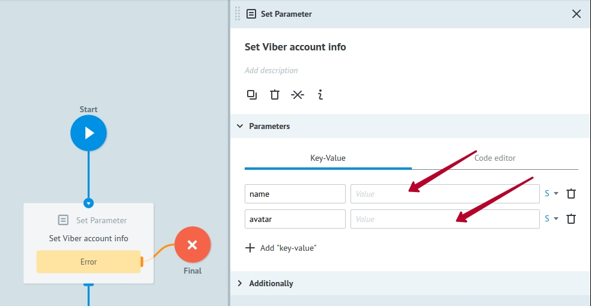

##Интеграция с API Invoice Bot LiqPay {#liqpay}

В процессе [`Create invoice`](https://admin.corezoid.com/editor/98037/149191) (что в папке `Commands`) настроен вызов **API Invoice Bot LiqPay** для создания инвойсов.

**1)** Добавьте секретный ключ, полученный при регистрации Вашего магазина в поле `Sign the request by secret key`

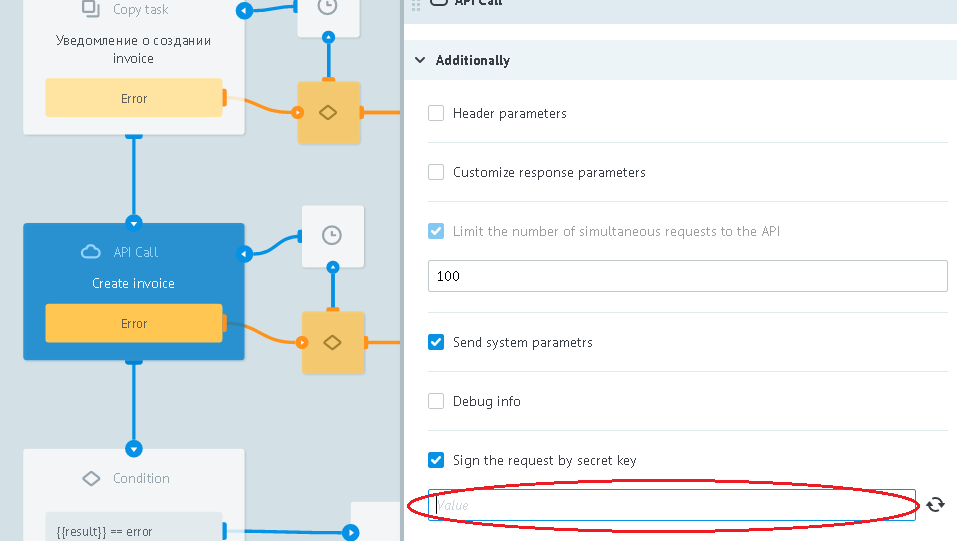

**2)** Добавьте `public_key` Вашего магазина и callback URL в значение параметра `callback` для получения ответа от **API Invoice Bot LiqPay**

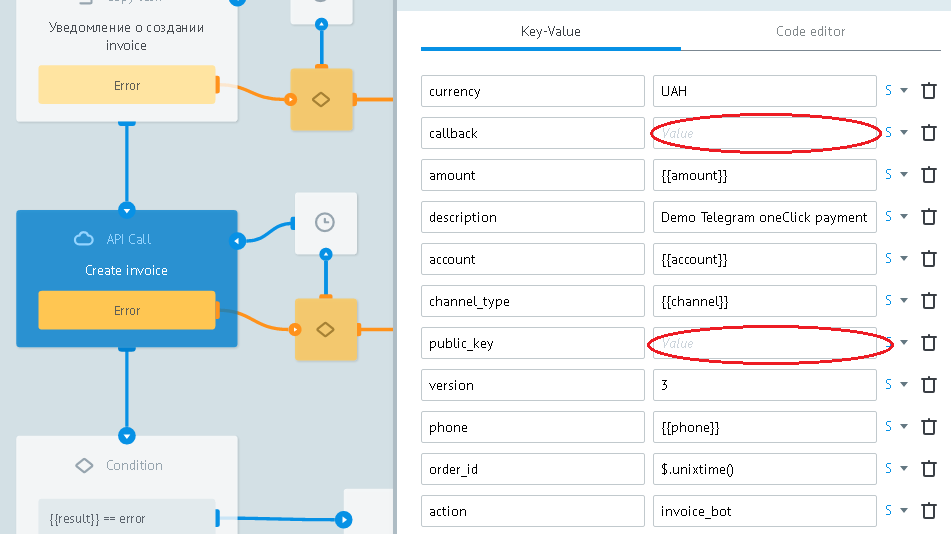

Чтобы получить callback URL кликните на узел `Ждем результат создания invoice` и скопируйте URL для Corezoid

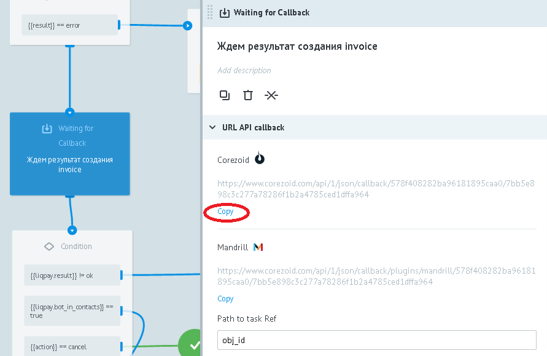

##Тексты сообщений {#text}

Процесс [**Send messages**](https://admin.corezoid.com/editor/98033/149193) хранит текстовые сообщения и сообщения с кнопками для общения с клиентами в Логике CODЕ узла `Тексты сообщений`.

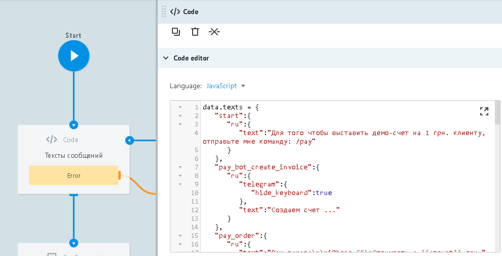

Объект `"texts"` содержит объекты с именами определяющие идентификаторы сообщений. Например, атрибуты стартового сообщения (привественного) содержатся в объекте `"start"`, атрибуты сообщения для создани ивойса - в объекте `pay_bot_create_invoice` и т.д.

Объекты с идентификаторами сообщений содержат объекты с именами определяющими язык общения клиента, например, `"ru"`.

В свою очередь, обекты определяющие язык общения клиента могут содержать параметры:

* `"text"` - текстовое сообщение. Может быь отправлено клиенту как с кнопками, так и без них
* `"telegram"` - объект, содержащий описание кнопок Telegram и значение callback параметра в случае активации одной из них
* `"facebook"` - массив, содержащий описание кнопок Facebook и значение callback параметра в случае активации одной из них
* `"viber"` - объект, содержащий описание кнопок Viber и значение callback параметра в случае активации одной из них
* `"photo"` - объект, содержащий идентификатор изображения товара для Telegram и URL изображения товара для Facebook

Хранение текстов таким способом позволляет легко управлять ими (редактировать, добавлять, удалять) и не дублировать для каждого нового канала.

##Изображение товара {#img}

В сообщении для выставления счета на оплату товара есть возможность добавить его фото

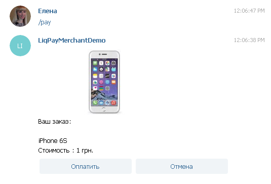

Чтобы отправлять фото товара в сообщения Facebook и Viber добавьте URL c его изображением в значение параметра `"facebook"` или `"viber"` соответственно объекта `"photo"` для сообщения с идентификатором `"pay_order"`

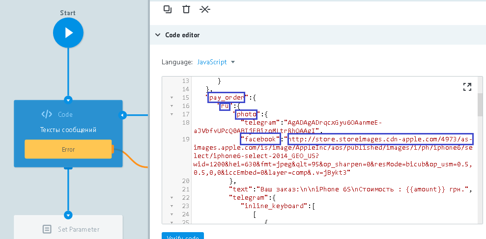

Чтобы отправлять фото товара в сообщения Telegram:

**1)** отправьте изображение товара в чат с Вашим ботом

**2)** перейдите режим View процесса [**Receiver & Route message**](https://admin.corezoid.com/editor/98033/149189) и кликните на узел `Final`

**3)** скопируйте значение полученного параметра `"file_id"`

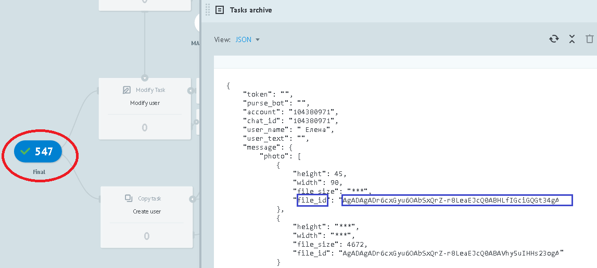

**4)** добавьте его в значение параметра `"telegram"` объекта `"photo"` для сообщения с идентификатором `"pay_order"`

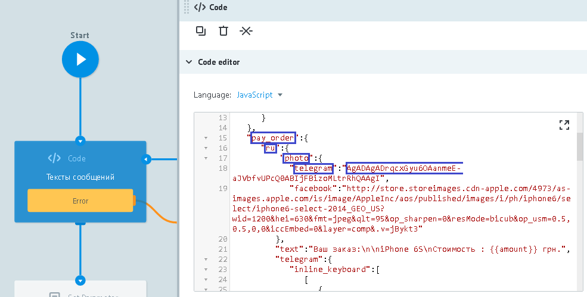

Если фото товара не нужно отправлять в сообщении клиенту, удалите объект `"photo"` из Логики CODE и нажмите `Deploy`

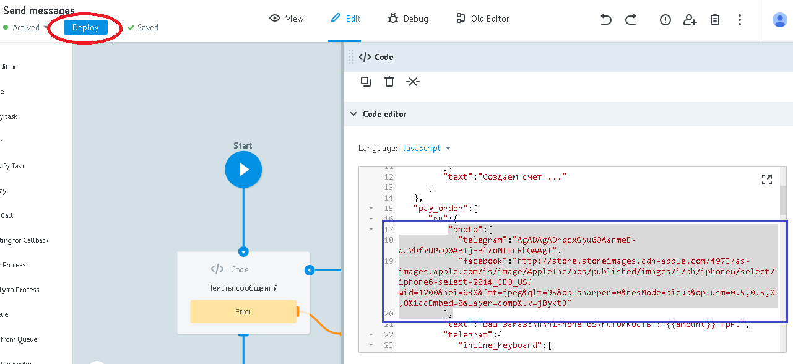

##Контроль Ботов {#bot}

Перейдите в режим `View` или `Debug`, например, главного процесса [**MAIN logic**](https://admin.corezoid.com/editor/98033/149183) или процесса [**Receiver & Route message**](https://admin.corezoid.com/editor/98033/149189)

чтобы увидеть поток заявок, их прохождение и распределение по узлам процесса.

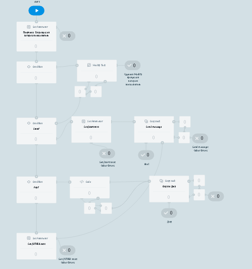
