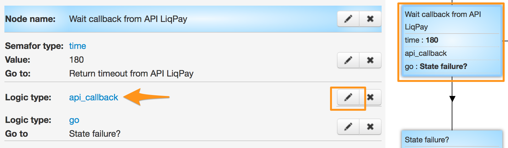
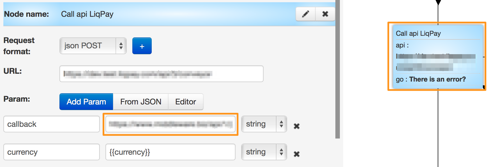

# Moto

*Списание средств с карты клиента*

Результатом выполнения запроса является списание средств с карты клиента.

Клонируйте [шаблон процесса](https://www.corezoid.com/admin/edit_conv/28236) для списания средств с карты клиента.

Вставьте Ваш `private key` из LiqPay в поле `Secret key`:

Сгенерируйте `callback URL` для возврата из LiqPay результатов платежа

нажав на кнопку "Create callback url"

Вы получаете URL и в поле `Path to task_id` нужно указать значение `obj_id`

После чего скопировать URL и вставить его в поле `callback` логики API, который находится в zoid'е `Call api LiqPay`.

Перейдите в режим `dashboard` и нажмите кнопку `Add task` - чтобы добавить  заявку.

В открывщейся форме укажите параметры и нажмите "Send task".

* `sandbox` **[optional]** - включает тестовый режим для разработчиков. Деньги на карту не зачисляются. Чтобы включить тестовый режим, необходимо передать значение 1. Все тестовые платежи будут иметь статус sandbox - успешный тестовый платеж.
* `prepare` **[optional]** - предподготовка платежа. Этот режим позволяет определить все ли данные заполнены, нужна ли 3DS проверка карты, не превышен ли лимит. Деньги с карты не списываются. Чтобы включить этот режим, необходимо передать значение 1.     
* `phone` **[required]** - телефон плательщика. На этот номер будет отправлен OTP пароль подтверждения платежа. Телефон указывается в международном формате (Украина +380, Россия +7 ) 
* `amount` **[required]** - сумма платежа. Например: 5, 7.34
* `public_key` **[required]** - Публичный ключ магазина 
* `currency` **[required]** - валюта платежа. Возможные значения: USD, EUR, RUB, UAH, GEL 
* `description` **[required]** - описание платежа. 
* `order_id` **[required]** - уникальный ID покупки в Вашем магазине. Максимальная длина - 255 символов. 
* `card` **[required]** - номер карты плательщика 
* `card_exp_month` **[required]** - месяц срока действия карты плательщика. Например: 08 
* `card_exp_year` **[required]** - год срока действия карты плательщика. Например: 19 
* `ip` **[required]** - ip клиента
* `product_url` **[optional]** - адрес страницы с товаром
* `server_url` **[optional]** - URL API в Вашем магазине для уведомлений о изменении статуса платежа (сервер->сервер). Максимальная длина - 510 символов.
* `sender_first_name` **[optional]** - имя отправителя
* `sender_last_name` **[optional]** - фамилия отправителя
* `sender_country_code` **[optional]** - страна отправителя. Цифровой ISO 3166-1 код
* `sender_city` **[optional]** - город отправителя     
* `sender_address` **[optional]** - адрес отправителя
* `sender_postal_code` **[optional]** - почтовый индекс отправителя 

Далее нажмите кнопку `Send task` - отправить заявку.

**В случае успеха** в заявку будут добавлены параметры:
* **status**  - cтатус платежа:
 * `success` - успешный платеж
 * `failure` - неуспешный платеж
 * `otp_verify` - требуется OTP подтверждение клиента. OTP пароль
   отправлен на номер телефона Клиента.
 * `3ds_verify` - требуется 3DS верификация. Необходимо
   перенаправить Клиента по ссылке redirect_to
 * `wait_secure` - платеж на проверке
 * `wait_accept` - деньги с клиента списаны, но магазин еще не
   прошел проверку
 * `wait_lc` - аккредитив. Деньги с клиента списаны, ожидается
   подтверждение доставки товара
 * `processing` - платеж обрабатывается
 * `subscribed` - подписка успешно оформлена
 * `unsubscribed` - подписка успешно деактивирована
 * `sandbox` - тестовый платеж
 * `error` - неуспешный платеж. Некорректно заполнены данные
* **token** - token, требуется для завершения платежа при OTP верификации Клиента
* **otp** - одноразовый OTP пароль, который Клиент получил на свой телефон, после запроса инициализации      

**В случае ошибки** заявка перейдет в узел эскалации с параметром:
* **err_code** - Код ошибки.     
* **err_description** - Описание ошибки   

