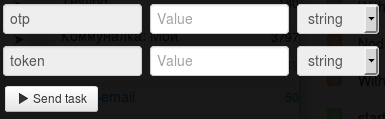

# Подтверждение операций с помощью OTP пароля

Клонируйте [папку "Transaction confirmation using OTP password"](https://admin.corezoid.com/folder/conv/1923) для получения процесса и дашборда.

Перейдите в процесс.

**Сгенерируйте ссылку для получения callback от LiqPay** - в узле с Логикой Callback `"Receive Callback"` нажмите на значок "Corezoid" и ссылка будет скопирована в буфер обмена.
В поле `Path to task_id` нужно указать `obj_id`.

Полученный URL нужно вставить в значение параметра `callback` логики API, который находится в узле `Calling API`.

В узле `Calling API` в поле `Secret key` вставьте Ваш `private key` из LiqPay:

Для тестирования процесса перейдите в режим `dashboard` и нажмите кнопку `Add task` - чтобы добавить  заявку.

В открывщейся форме укажите обязательные параметры и нажмите "Send task":

* `public_key` - Публичный ключ магазина
* `token` - token полученый в ответ на запрос инициализации
* `otp` - Одноразовый OTP пароль, который Клиент получил на свой телефон, после запроса инициализации

Далее нажмите кнопку `Send task` - отправить заявку.

**В случае успешной операции для карт без 3-D Secure** в заявку будут добавлены параметры:
* **status** - ID платежа в LiqPay
 * `success` - успешный платеж
* **payment_id** - id платежа в LiqPay

**В случае успешного создания магазина в системе LiqPay** в заявку будут добавлены параметры:
* **public_key**  - публичный ключ - идентификатор магазина
* **private_key**  - приватный ключ - ключ доступа к магазину

**В случае ошибки** заявка перейдет в узел эскалации с параметром:
* **err_code** - код ошибки
* **err_description** - описание ошибки

