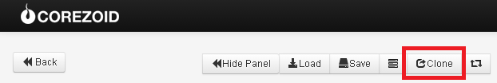
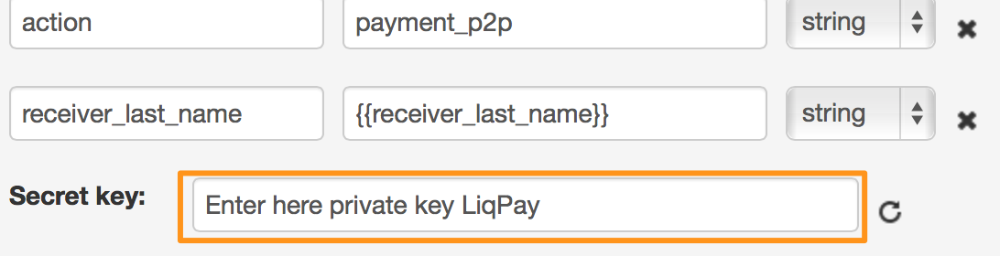
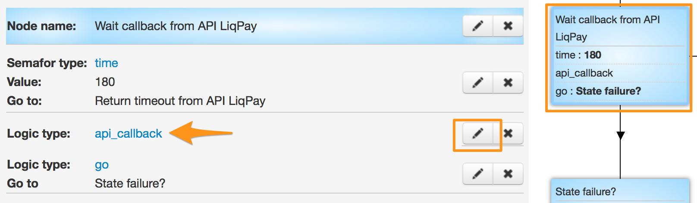
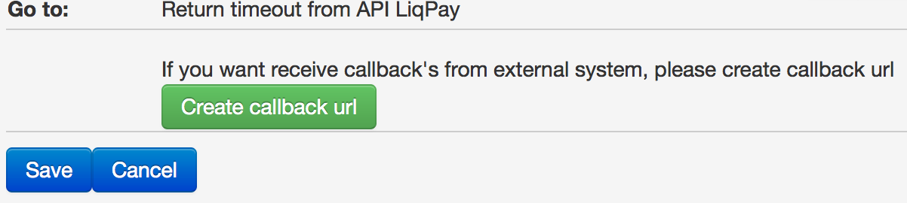
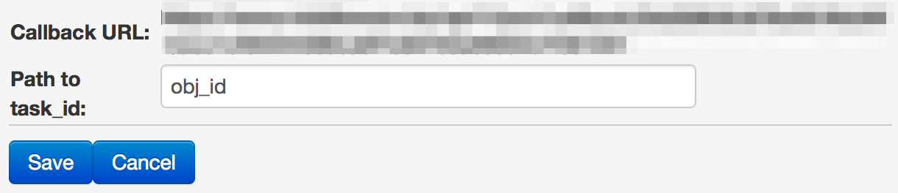
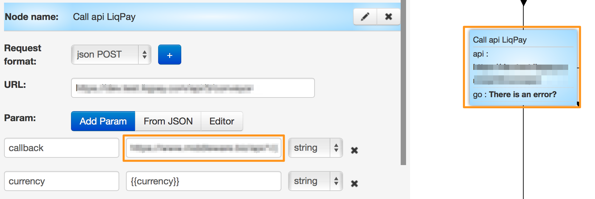

# p2p

Шаблон процесса p2p - [Процесс 11719](https://www.corezoid.com/admin/edit_conv/11719)

Он доступн у Вас в папке `"Examples - LiqPay - p2p"`.

Для того чтобы начать работу с ним, клонируйте шаблон следующим образом

Вставьте Ваш `private key` из LiqPay в поле `Secret key`:

Сгенерируйте callback URL для возврата из LiqPay результатов платежа

нажав на кнопку "Create callback url"

Вы получаете URL и в поле `Path to task_id` нужно указать значение `obj_id`

После чего скопировать URL и вставить его в поле `callback` логики API, который находится в zoid'е `Call api LiqPay`.

Перейдите в режим `dashboard` и нажмите кнопку `Add task` - чтобы добавить тестовую заявку.

В открывщейся форме укажите параметры платежа и нажмите "Send task".

Процесс подготовлен к использованию из других процессов через логику RPC. Список исходящих параметров:
*   В случае ошибки
    *   `err_description` - описание ошибки
    *   `err_code` - код ошибки
*   В случае успеха
    *   `result` - будет содержать значение `success`

