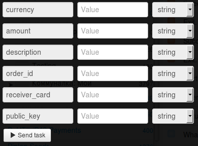

# Перевод со счета магазина на карту получателя

Клонируйте [папку "Transfer from shop account to receiver’s card"](https://admin.corezoid.com/folder/conv/1923) для получения процесса и дашборда.

Перейдите в процесс.

**Сгенерируйте ссылку для получения callback от LiqPay** - в узле с Логикой Callback `"Receive Callback"` нажмите на значок "Corezoid" и ссылка будет скопирована в буфер обмена.
В поле `Path to task_id` нужно указать `obj_id`.

Полученный URL нужно вставить в значение параметра `callback` логики API, который находится в узле `Calling API`.

В узле `Calling API` в поле `Secret key` вставьте Ваш `private key` из LiqPay:

Для тестирования процесса перейдите в режим `dashboard` и нажмите кнопку `Add task` - чтобы добавить  заявку.

В открывщейся форме укажите обязательные параметры и нажмите "Send task":

* `amount` - сумма платежа. Например: 5, 7.34
* `public_key` - Публичный ключ магазина
* `currency` - валюта платежа. Возможные значения: USD, EUR, RUB, UAH, GEL
* `description` - описание платежа.
* `order_id` - уникальный ID покупки в Вашем магазине. Максимальная длина - 255 символов.
* `receiver_card` - номер карты получателя

При необходимости можно использовать дополнительные параметры:

* `sandbox` - включает тестовый режим для разработчиков. Деньги на карту не зачисляются. Чтобы включить тестовый режим, необходимо передать значение 1. Все тестовые платежи будут иметь статус sandbox - успешный тестовый платеж.
* `server_url` - URL API в Вашем магазине для уведомлений о изменении статуса платежа (сервер->сервер). Максимальная длина - 510 символов.
* `receiver_last_name` - фамилия получателя
* `receiver_first_name` - имя получателя

Далее нажмите кнопку `Send task` - отправить заявку.

**В случае успеха** в заявку будут добавлены параметры:
* **status**  - cтатус платежа:
 * `success` - успешный платеж
* **payment_id** - id платежа в LiqPay

**В случае ошибки** заявка перейдет в узел эскалации с параметром:
* **err_code** - Код ошибки.
* **err_description** - Описание ошибки

