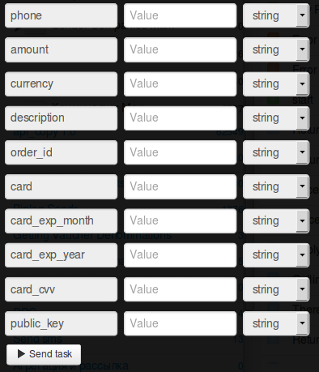

# Покупка в магазине по карте

Клонируйте [папку "Buying in the shop with the card"](https://admin.corezoid.com/folder/conv/1923) для получения процесса и дашборда.

Перейдите в процесс.

**Сгенерируйте ссылку для получения callback от LiqPay** - в узле с Логикой Callback `"Receive Callback"` нажмите на значок "Corezoid" и ссылка будет скопирована в буфер обмена.
В поле `Path to task_id` нужно указать `obj_id`.

Полученный URL нужно вставить в значение параметра `callback` логики API, который находится в узле `Calling API`.

В узле `Calling API` в поле `Secret key` вставьте Ваш `private key` из LiqPay:

Для тестирования процесса перейдите в режим `dashboard` и нажмите кнопку `Add task` - чтобы добавить  заявку.

В открывщейся форме укажите обязательные параметры и нажмите "Send task":

* `phone` - телефон плательщика. На этот номер будет отправлен OTP пароль подтверждения платежа. Телефон указывается в международном формате (Украина +380, Россия +7 )
* `amount` - сумма платежа. Например: 5, 7.34
* `public_key` - публичный ключ магазина
* `currency` - валюта платежа. Возможные значения: USD, EUR, RUB, UAH, GEL
* `description` - описание платежа.
* `order_id` - уникальный ID покупки в Вашем магазине. Максимальная длина - 255 символов.
* `recurringbytoken` - этот параметр позволяет генерировать card_token плательщика, который вы получите в callback запросе на server_url. card_token позволяет проводить платежи в offline используя метод payment/paytoken. Услуга активируется через менеджера LiqPay. Возможные значения: 1
* `card` - номер карты плательщика
* `card_exp_month` - месяц срока действия карты плательщика. Например: 08
* `card_exp_year` - год срока действия карты плательщика. Например: 19
* `card_cvv` - CVV/CVV2

При необходимости можно использовать дополнительные параметры:

* `sandbox` - включает тестовый режим для разработчиков. Деньги на карту не зачисляются. Чтобы включить тестовый режим, необходимо передать значение 1. Все тестовые платежи будут иметь статус sandbox - успешный тестовый платеж.
* `prepare` - предподготовка платежа. Этот режим позволяет определить все ли данные заполнены, нужна ли 3DS проверка карты, не превышен ли лимит. Деньги с карты не списываются. Чтобы включить этот режим, необходимо передать значение 1.
* `type` - тип платежа. Возможные значения: buy - покупка;
* `server_url` - URL API в Вашем магазине для уведомлений о изменении статуса платежа (сервер->сервер). Максимальная длина - 510 символов.
* `result_url` - URL в Вашем магазине на который покупатель будет переадресован после завершения покупки. Максимальная длина - 510 символов.
* `sender_first_name` - имя отправителя
* `sender_last_name` - фамилия отправителя
* `sender_country_code` - страна отправителя. Цифровой ISO 3166-1 код
* `sender_city` - город отправителя
* `sender_address` - адрес отправителя
* `sender_postal_code` - почтовый индекс отправителя
* `letter_of_credit` - чтобы включить прием платежей по аккредитиву передайте параметр со значением 1
* `letter_of_credit_date` - дата окончания срока аккредитива. Передается в формате 2015-04-24 00:00:00

Далее нажмите кнопку `Send task` - отправить заявку.

**В случае успеха для карт без 3-D Secure** в заявку будут добавлены параметры:
* **status**  - cтатус платежа:
 * `otp_verify` - требуется OTP подтверждение клиента. OTP пароль
* **payment_id** - ID платежа в LiqPay
* **token** - token, требуется для завершения платежа при OTP верификации Клиента

Также, в случае успешного вызова процесса, на телефон клиента поступит **ОТР-пароль** - одноразовый пароль, которым клиент подтверждает выполнение операции.
ОТР-пароль используется, как обязательный входящий параметр в процессе [Transaction confirmation using OTP password](https://www.corezoid.com/admin/edit_conv/28246)

**В случае успеха для карт с 3-D Secure** в заявку будут добавлены параметры:
* **status**  - cтатус платежа:
 * `3ds_verify` - требуется 3DS верификация. Необходимо перенаправить Клиента по ссылке redirect_to
* **payment_id** - ID платежа в LiqPay 
* **redirect_to** - ссылка на которую необходимо перенаправить клиента для прохождения 3DS верификации

**В случае ошибки** заявка перейдет в узел эскалации с параметром:
* **err_code** - Код ошибки.
* **err_description** - Описание ошибки

