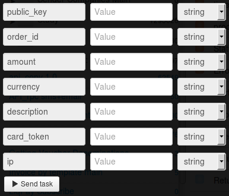

# Покупка в магазине по card_token

Клонируйте [папку "Buying in the shop on card_token"](https://admin.corezoid.com/folder/conv/1923) для получения процесса и дашборда.

Перейдите в процесс.

**Сгенерируйте ссылку для получения callback от LiqPay** - в узле с Логикой Callback `"Receive Callback"` нажмите на значок "Corezoid" и ссылка будет скопирована в буфер обмена.
В поле `Path to task_id` нужно указать `obj_id`.

Полученный URL нужно вставить в значение параметра `callback` логики API, который находится в узле `Calling API`.

В узле `Calling API` в поле `Secret key` вставьте Ваш `private key` из LiqPay:

Для тестирования процесса перейдите в режим `dashboard` и нажмите кнопку `Add task` - чтобы добавить  заявку.

В открывщейся форме укажите обязательные параметры и нажмите "Send task":

* `amount` - сумма платежа. Например: 5, 7.34
* `public_key` - публичный ключ магазина
* `currency` - валюта платежа. Возможные значения: USD, EUR, RUB, UAH, GEL
* `description` - описание платежа.
* `order_id` - уникальный ID покупки в Вашем магазине. Максимальная длина - 255 символов.
* `card_token` - token карты плательщика
* `ip` - ip клиента

При необходимости можно использовать дополнительные параметры:

* `product_url` - адрес страницы с товаром
* `server_url` - URL API в Вашем магазине для уведомлений о изменении статуса платежа (сервер->сервер). Максимальная длина - 510 символов.

Далее нажмите кнопку `Send task` - отправить заявку.

**В случае успеха** в заявку будут добавлены параметры:
* **status**  - cтатус платежа:
 * `success` - успешный платеж
 * `failure` - неуспешный платеж
 * `otp_verify` - требуется OTP подтверждение клиента. OTP пароль
   отправлен на номер телефона Клиента.
 * `3ds_verify` - требуется 3DS верификация. Необходимо
   перенаправить Клиента по ссылке redirect_to
 * `wait_secure` - платеж на проверке
 * `wait_accept` - деньги с клиента списаны, но магазин еще не
   прошел проверку
 * `wait_lc` - аккредитив. Деньги с клиента списаны, ожидается
   подтверждение доставки товара
 * `processing` - платеж обрабатывается
 * `subscribed` - подписка успешно оформлена
 * `unsubscribed` - подписка успешно деактивирована
 * `sandbox` - тестовый платеж
 * `error` - неуспешный платеж. Некорректно заполнены данные
* **payment_id** - ID платежа в LiqPay

**В случае ошибки** заявка перейдет в узел эскалации с параметром:
* **err_code** - Код ошибки.
* **err_description** - Описание ошибки

