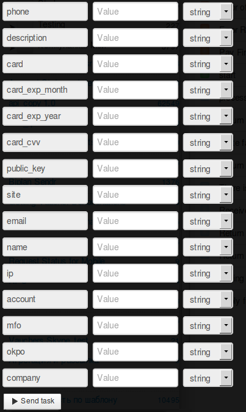

# Регистрация нового магазина

Клонируйте [папку "New shop registration"](https://admin.corezoid.com/folder/conv/1923) для получения процесса и дашборда.

Перейдите в процесс.

**Сгенерируйте ссылку для получения callback от LiqPay** - в узле с Логикой Callback `"Receive Callback"` нажмите на значок "Corezoid" и ссылка будет скопирована в буфер обмена.
В поле `Path to task_id` нужно указать `obj_id`.

Полученный URL нужно вставить в значение параметра `callback` логики API, который находится в узле `Calling API`.

В поле `Secret key` вставьте Ваш `private key` из LiqPay:

Для тестирования процесса перейдите в режим `dashboard` и нажмите кнопку `Add task` - чтобы добавить  заявку.

В открывщейся форме укажите обязательные параметры и нажмите "Send task":

* `email` - E-mail магазина
* `public_key` - Публичный ключ магазина
* `description` - описание платежа.
* `name` - Название магазина
* `card` - номер карты плательщика
* `card_exp_month` - месяц срока действия карты плательщика. Например: 08
* `card_exp_year` - год срока действия карты плательщика. Например: 19
* `card_cvv` - CVV/CVV2
* `phone` - Номер телефона владельца магазина
* `site` - URL сайта магазина

При необходимости можно использовать дополнительные параметры:

* `ip` - IP клиента
* `account` - Номер счета для приема платежей в этом магазине
* `mfo` - МФО счета
* `okpo` - ОКПО счета
* `company` - Наименование счета

Далее нажмите кнопку `Send task` - отправить заявку.

**В случае успеха** в заявку будут добавлены параметры:
* **status**  - cтатус платежа:
 * `otp_verify` - требуется OTP подтверждение клиента. OTP пароль
* **token** - token, требуется для завершения платежа при OTP верификации Клиента

Также, в случае успешного вызова процесса, на телефон клиента поступит **ОТР-пароль** - одноразовый пароль, которым клиент подтверждает выполнение операции.
ОТР-пароль используется, как обязательный входящий параметр в процессе [Transaction confirmation using OTP password](https://www.corezoid.com/admin/edit_conv/28246). 
**В случае успешного подтверждения** в заявку будут добавлены параметры:
* **public_key**  - публичный ключ - идентификатор магазина
* **private_key**  - приватный ключ - ключ доступа к магазину

**В случае ошибки** заявка перейдет в узел эскалации с параметрами:
* **err_code** - Код ошибки.
* **err_description** - Описание ошибки

