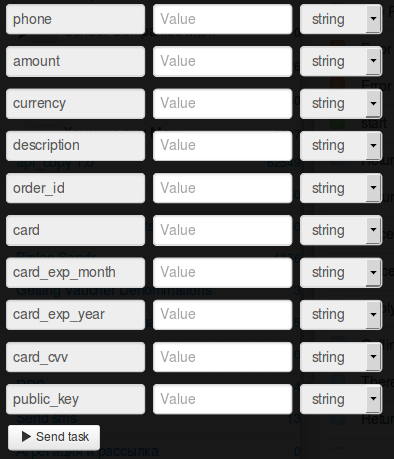

# Подписка в магазине (регулярные платежи)

Клонируйте [папку "Подписка в магазине"](https://admin.corezoid.com/folder/conv/1923) для получения процесса и дашборда.

Перейдите в процесс.

**Сгенерируйте ссылку для получения callback от LiqPay** - в узле с Логикой Callback `"Receive Callback"` нажмите на значок "Corezoid" и ссылка будет скопирована в буфер обмена.
В поле `Path to task_id` нужно указать `obj_id`.

Полученный URL нужно вставить в значение параметра `callback` логики API, который находится в узле `Calling API`.

В узле `Calling API` в поле `Secret key` вставьте Ваш `private key` из LiqPay:

Для тестирования процесса перейдите в режим `dashboard` и нажмите кнопку `Add task` - чтобы добавить  заявку.

В открывщейся форме укажите обязательные параметры и нажмите "Send task":

* `phone` - телефон плательщика. На этот номер будет отправлен OTP пароль подтверждения платежа. Телефон указывается в международном формате (Украина +380, Россия +7 ) 
* `amount` - сумма платежа. Например: 5, 7.34
* `public_key` - Публичный ключ магазина 
* `currency` - валюта платежа. Возможные значения: USD, EUR, RUB, UAH, GEL 
* `description` - описание платежа. 
* `order_id` - уникальный ID покупки в Вашем магазине. Максимальная длина - 255 символов. 
* `subscribe` - регулярный платеж. Возможные значения: 1 
* `subscribe_date_start` - дата первого платежа 
* `subscribe_periodicity` - периодичность списания средств. 
* `card` - номер карты плательщика 
* `card_exp_month` - месяц срока действия карты плательщика. Например: 08 
* `card_exp_year` - год срока действия карты плательщика. Например: 19 
* `card_cvv` - CVV/CVV2 
* `ip` - IP клиента 
* `product_url` - адрес страницы с товаром  
    
При необходимости можно использовать дополнительные параметры:

* `sandbox` - включает тестовый режим для разработчиков. Деньги на карту не зачисляются. Чтобы включить тестовый режим, необходимо передать значение 1. Все тестовые платежи будут иметь статус sandbox - успешный тестовый платеж.
* `prepare` - предподготовка платежа. Этот режим позволяет определить все ли данные заполнены, нужна ли 3DS проверка карты, не превышен ли лимит. Деньги с карты не списываются. Чтобы включить этот режим, необходимо передать значение 1.
* `server_url` - URL API в Вашем магазине для уведомлений о изменении статуса платежа (сервер->сервер). Максимальная длина - 510 символов.
* `result_url` - URL в Вашем магазине на который покупатель будет переадресован после завершения покупки. Максимальная длина - 510 символов.
* `sender_first_name` - имя отправителя
* `sender_last_name` - фамилия отправителя
* `sender_country_code` - страна отправителя. Цифровой ISO 3166-1 код
* `sender_city` - город отправителя     
* `sender_address` - адрес отправителя
* `sender_postal_code` - почтовый индекс отправителя 
* `type` - тип платежа. Возможные значения: buy - покупка; 

Далее нажмите кнопку `Send task` - отправить заявку.

**В случае успеха** в заявку будут добавлены параметры:
* **status**  - cтатус платежа:
 * `success` - успешный платеж
 * `failure` - неуспешный платеж
 * `otp_verify` - требуется OTP подтверждение клиента. OTP пароль
   отправлен на номер телефона Клиента.
 * `3ds_verify` - требуется 3DS верификация. Необходимо
   перенаправить Клиента по ссылке redirect_to
 * `wait_secure` - платеж на проверке
 * `wait_accept` - деньги с клиента списаны, но магазин еще не
   прошел проверку
 * `wait_lc` - аккредитив. Деньги с клиента списаны, ожидается
   подтверждение доставки товара
 * `processing` - платеж обрабатывается
 * `subscribed` - подписка успешно оформлена
 * `unsubscribed` - подписка успешно деактивирована
 * `sandbox` - тестовый платеж
 * `error` - неуспешный платеж. Некорректно заполнены данные
* **token** - token, требуется для завершения платежа при OTP верификации Клиента
* **otp** - одноразовый OTP пароль, который Клиент получил на свой телефон, после запроса инициализации      

**В случае ошибки** заявка перейдет в узел эскалации с параметром:
* **err_code** - Код ошибки.     
* **err_description** - Описание ошибки   

