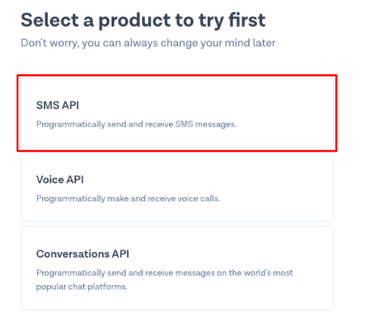
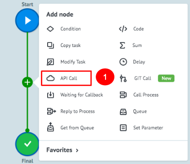
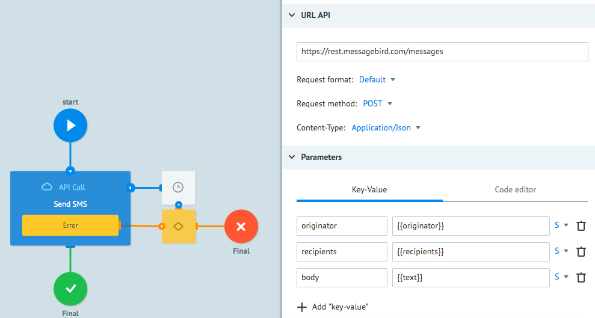
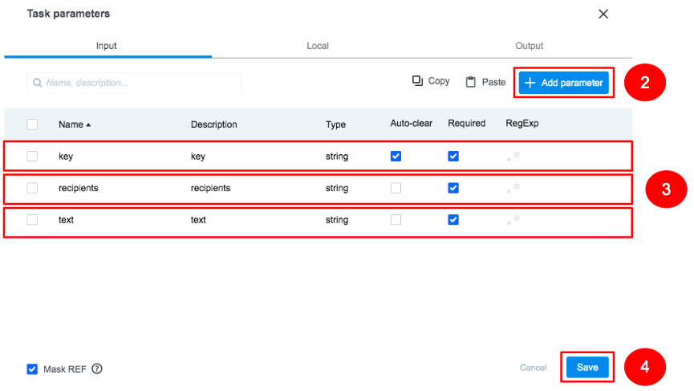
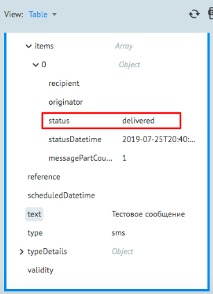
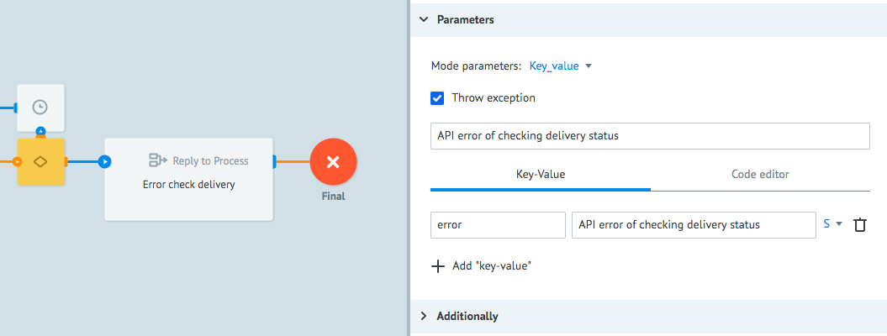
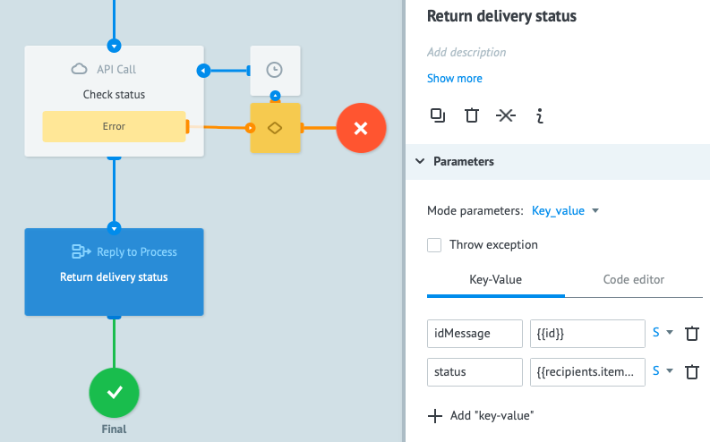

# MessageBird

**MessageBird** - это облачный сервис, позволяющий интегрировать различные коммуникационные методы: звонки, SMS, email, двухфакторная аутентификация.

В этом туториале Вы научитесь строить процесс с вызовом **MessageBird API** для отправки SMS с последующей проверкой статуса его доставки. 

Перед настройкой процесса рекомендуем изучить документацию** **MessageBird** по ссылке [https://developers.messagebird.com/#messaging-send](https://developers.messagebird.com/#messaging-send)

Прежде чем мы начнем, давайте зарегистрируемся в сервисе **MessageBird** для получения ключей **API** и возможности бесплатной отправки тестовых SMS. 

### Получение ключа к API

1. Для регистрации перейдите на [https://dashboard.messagebird.com/en/sign-up/](https://dashboard.messagebird.com/en/sign-up/), заполнените форму и нажмите кнопку **Sign up with email**.

    
    
    При успешной регистрации Вы увидите форму с предложением выбора между ***REST APIs*** и ***Dashboard solutions***

    1.1. Выберите ***REST APIs***
    
    

    1.2. Для использования **API** отправки SMS выберите **SMS APIs**
    
     

    1.3. Для завершения регистрации авторизуйтесь на сайте с помощью Вашего номера мобильного телефона
    
     

    1.4. После успешной авторизации по номеру мобильного телефона перед Вами появится окно с запросом для отправки SMS. Если Вы выберите чекбокс ***Show Live API Key***, то увидите ключ для вызова **MessageBird API**. 
    
     

    Далее Вы настроите процесс в Corezoid для отправки и получения статуса отправки SMS посредством **MessageBird API**
    
### Отправка SMS

1. Для удобства работы с проектами создайте папку c названием **MessageBird**

    

2. Зайдите в папку **MessageBird** и создайте процесс **Send & check SMS**, который будет отправлять SMS и проверять статус его доставки.

    

3. В созданном процессе добавьте узел **API Call**, который будет вызывать **MessageBird API** для отправки SMS на номер мобильного телефона.

    

    3.1 После того, как вы добавили узел **API Call**, кликните на него и заполните поле ***URL API***: 

    [https://rest.messagebird.com/messages](https://rest.messagebird.com/messages)
    
    ```
    Request format: Default
    Request method: POST
    Content-Type: Application/X-Www-Form-Urlencoded
    ```
    В разделе ***Parameters*** добавьте:
   
    ```  
    {
        "originator": "{{originator}}",
        "recipients": "{{recipients}}",
        "body": "{{text}}"
    }
    ```
    где:
    - originator - номер мобильного телефона отправителя (для теста можете указать Ваш номер)
    - recipients - номера телефона получателя
    - body - текст SMS
      
   
    3.2. В разделе  ***Additionally*** поставьте чекбокс напротив ***Header parameters***
   
    3.3. Для авторизации с помощью ключа из шага 1.4 раздела [Получение ключа](#получение-ключа-к-api) добавьте: 
    ``` 
    {
        "Authorization": "AccessKey {{key}}"
    }
    ```
    

    3.4. Для того, чтобы параметры автоматически подставлялись при ручном создании заявки для отправки SMS, нажмите на иконку **Task parameters**
     
    

    3.5. В появившемся окне добавьте 3 параметра: ***“key”, “recipients”, “text”***.
    
     

    Настроенный Вами **API Call** из п. 3 раздела [Получение ключа](#получение-ключа-к-api) готов для отправки SMS.
    
4. Для отправки SMS в процессе **Send & check SMS** перейдите в режим View 

    4.1. Нажмите кнопку **New task** 
    
    4.2. В окне **Task** заполните указанные ниже поля и нажмите **Add task**:
    - **key** - ключ, который Вы получили на шаге 1.4 раздела [Получение ключа](#получение-ключа-к-api)
    - **recipients** - ваш номер мобильного телефона
    - **text** - текст SMS

    В случае успешного вызова **API** Ваша заявка будет находиться в узле **Final**. Нажав на него Вы увидите содержимое заявки, одним из параметров которой является ***href***. В этом параметре указан ***URL*** сервиса, по которому можно проверить статус доставки SMS.
 
### Проверка статуса доставки SMS

1. Для того, чтобы проверить факт доставки SMS Вам нужно подключить еще один узел **API Call**, но т.к. на доставку сообщения понадобится несколько секунд, то перед вызовом добавьте узел **Delay** c минимальным временем ожидания 30 секунд

    

2. После узла **Delay** добавьте узел **API Call** с именем **Check status**, который будет вызывать **MessageBird API** для получения статуса доставки SMS.
 
    2.1. Кликните на узел **API Call** и в поле ***URL API*** укажите переменную: ```{{href}}```
    
    2.2. Установите следующие значения в настройках раздела ***URL API***
     ``` 
    Request format: Default
    Request method: GET
    Content-Type: Application/Json
    ```
 
     

    2.3. В раздел ***Additionally*** отметьте чекбокс ***Header parameters***
 
    и добавьте:
    ```
    {
        "Authorization": "AccessKey {{key}}"
    }
    ```
 
     

3. Для проверки работы логики **Check status** создайте еще одну заявку.

    3.1 Перейдите в режим **View** 
    
    3.2 Нажмите кнопку **New task** 
    
    3.3. В окне **Task** заполните указанные ниже поля и нажмите **Add task**:
    
    - `key` - ключ, который Вы получили на шаге 1.4 раздела [Получение ключа](#получение-ключа-к-api)
    - `recipients` - ваш номер мобильного телефона
    - `text` - текст SMS
    
    3.4. Нажмите на узел **Final**, в котором Вы увидите содержимое заявки с ответом о статусе доставки в параметре ***status***.

    

    Ваш процесс готов к вызову **API** для отправки SMS и проверки статуса его доставки. Теперь давайте сделаем этот процесс универсальным, чтобы его можно было переиспользовать в рамках других бизнес-процессов. Для этого необходимо использовать узел **Reply to Process**, который будет возвращать в вызывающий процесс результата вызова **API MessageBird**. 
 
### Создание универсального процесса

1. В универсальном процессе логика **Reply to Process** должна быть добавлена перед каждым конечным узлом для информирования об успехе или ошибке выполнения 

    Давайте начнем с обработки ошибок. Для этого добавим узел **Reply to Process** между узлом **Condition** для обработки ошибок от вызова API и **финальным узлом**, в который попадают все неуспешные вызова API. Пример показан на скриншоте ниже:

    

    1.1. Кликните на узел **Reply to Process** и отметьте чекбокс напротив **Throw exception**  
    
    1.2 В появившемся поле напишите текст ошибки **SMS was not sent via API**.

    1.3 Текст ошибки от **API MessageBird** будет находиться в первом объекте массива **errors**, который мы получаем от API MessageBird, поэтому в разделе ***Parameters*** добавьте передачу параметра c информацией об ошибке в таком формате:  
    
    ```
    {
        "error": "{{errors[0]}}"
    }
    ```
    
     

    Теперь если вы вызовите этото процесс из другого процесса с помощью узла **Call Process** и API MessageBird ответит ошибкой, то вызывающий процесс получит ответ с текстом ошибки “**SMS was not sent via API”** и расшифровкой ошибки от API.
 
2. Для информирования об ошибках узла API **Call **Check status** добавьте между узлами **Condition** и **Final** узел **Reply** **to Process**.

    2.1. Кликните на узел **Reply to Process** и отметьте чекбокс напротив **Throw exception**  
    
    2.2. В появившемся поле напишите текст ошибки **API error of checking delivery status**
 
     

3. Добавьте **Reply to Process** с именем Return delivery status перед финальным узлом, в который поступает заявка с информацией о статусе доставки SMS.

    При успешной проверке статуса доставки SMS в узле **Final** Вы получите объект вида:
        
    ```    
    {
        "body": " ",
        "createdDatetime": "2019-07-25T20:39:57+00:00",
        "datacoding": "plain",
        "direction": "mt",
        "gateway": 10,
        "href": "https://rest.messagebird.com/messages/72fd97fa48e7444b946b7972c0b8d6f1",
        "id": "72fd97fa48e7444b946b7972c0b8d6f1",
        "key": "***",
        "mclass": 1,
        "originator": "+380xxxxxxxxx",
        "recipients": {
            "totalCount": 1,
            "totalSentCount": 1,
            "totalDeliveredCount": 1,
            "totalDeliveryFailedCount": 0,
            "items": [
                {
                    "recipient": 380xxxxxxxxx,
                    "originator": null,
                    "status": "delivered",
                    "statusDatetime": "2019-07-25T20:40:00+00:00",
                    "messagePartCount": 1
                }
            ]
        },
        "reference": null,
        "scheduledDatetime": null,
        "text": "test sms",
        "type": "sms",
        "typeDetails": {
            
        },
        "validity": null
    ```
     
   Из ответа видно, что **ID** сообщения передается в параметре **id**.
    При этом текст статуса доставки находится в параметре **status нулевого объекта массива **items**, который обернут объектом **recipients.**
 
    3.1. Для того, чтобы передать **ID** сообщения и его статус, в разделе ***Parameters*** добавьте параметры с информацией о статусе доставки:
    ```    
    {
        "idMessage": "{{id}}",
        "status": "{{recipients.items[0].status}}"
    }
    ```
     
  
    На изображении ниже Вы можете видеть взаимодействие узлов в построенном процессе **Send & check SMS** 

     

    3.2. Для тестирования работы всего процесса повторите [шаг 4](4.) В случае успешного вызова API Ваша заявка будет находиться в узле Final. 
    
    3.3. Нажмите на узел **Final**, чтобы увидите содержимое заявки c информацией по отправке статусе доставки SMS
 
**Поздравляем! Вы научились создавать универсальный процесс с использованием MessageBird API для отправки и проверки статуса доставки SMS**
 


