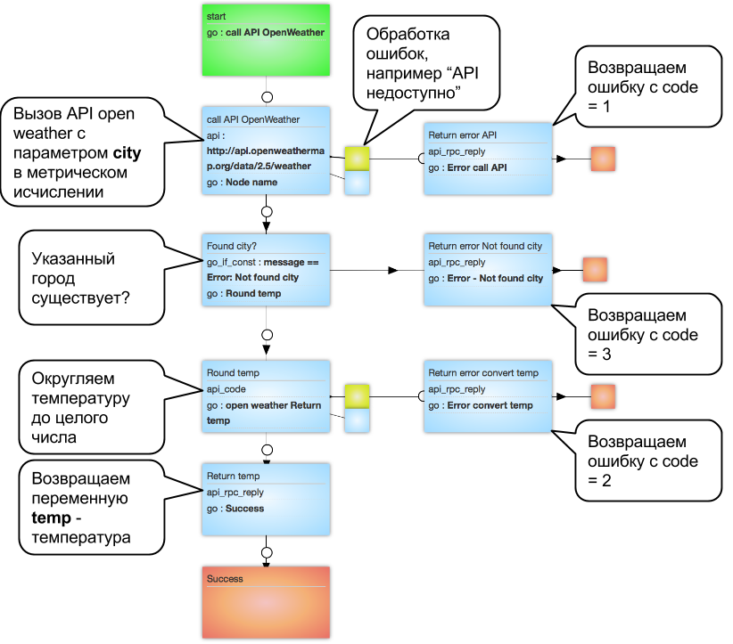

#Получение температуры по названию города

http://openweathermap.org/api - полное описание возможностей API.

[Шаблон процесса](https://www.corezoid.com/admin/edit_conv/136510/92753) получения температуры воздуха по названию города доступен в папке `"Examples - Open Weather"`.

###Описание процесса

###Получение ключа доступа к сервису

Чтобы получить ключ доступа к API OpenWeatherMap перейдите по [ссылке](http://openweathermap.org/register) и зарегистрируйтесь.

###Тестирование процесса
Для того чтобы начать работу с процессом, клонируйте шаблон следующим образом

Перейдите в режим `dashboard` и нажмите кнопку `Add task` - добавить заявку.

В появившемся окне укажите обязательный параметр:
*   `city` - город, латинскими буквами. Например london
*   `key` - Ваш ключ доступа к API OpenWeatherMap (API key),  полученный на [сайте](http://openweathermap.org/register).

После того как параметры заявки указаны, нажмите кнопку `Send task`.

Результатом работы процесса, будет прохождение заявки по процессу и переход в одно из конечных состояний (узел красного цвета):

|Состояние|Описание|Возвращаемые переменные|
|-|-|-|
|Success|Успешно получили температуру по названию города|`temp` - температура|
|Error call API|Ошибка вызова API OpenWeather|`code` = 1 и текст ошибки|
|Error convert temp |Не смогли преобразовать полученную температуру в число|`code` = 2 и текст ошибки|
|Error - Not found city |Указанный город не найден|`code` = 3 и текст ошибки|

