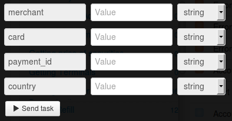

# Текущий баланс по счёту мерчанта

Для получения баланса по счёту мерчанта нужно [зарегистрировать мерчант](https://api.privatbank.ua/#p24/registration) в системе Приват24.

**Мерчант Приват24** - дополнительный аккаунт Приват24, который позволяет в автоматическом режиме осуществлять интернет-платежи.

В результате регистрации вы получите `id мерчанта` и `пароль мерчанта`, что даст вам возможность интеграции платежных и информационных сервисов Приват24 на ваш сайт.

Клонируйте [папку "Current balance on merchant account"](https://admin.corezoid.com/folder/conv/6081) для получения процесса и дашборда.

Перейдите в процесс.

В узел "Calling API" добавьте пароль мерчанта в поле "Secret key"

Для тестирования процесса перейдите в режим `dashboard` и нажмите кнопку `Add task` - добавить заявку

В открывщейся форме укажите параметры запроса и нажмите "Send task".

* `merchant` - id мерчанта
* `card` - номер карты
* `payment_id` - уникальный идентификатор платежа, присвоенный мерчантом
* `country` - страна мерчанта

Далее нажмите кнопку `Send task` - отправить заявку.

**В случае успеха** в заявку будут добавлены параметры:
* `Currency`  - Валюта
* `Date` - Дата и время обновления баланса
* `Fin_Limit`  - Кредитный лимит
* `Card` - Номер карты
* `Type`  - Тип счета
* `Balance` - Баланс

**В случае ошибки** заявка перейдет в узел эскалации с параметром:
* `Error` - описание ошибки.