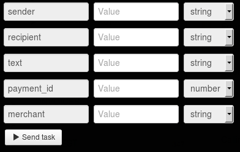

# Отправка sms

Для отправки sms нужно зарегистрировать мерчант в системе Приват24 согласно [описанию](https://api.privatbank.ua/#p24/registration).

**Мерчант Приват24** - дополнительный аккаунт П24, который позволяет в автоматическом режиме осуществлять интернет-платежи.

**Регистрация мерчанта** — это пошаговый процесс, в результате которого происходит интеграция платежного модуля на сайт.

В результате регистрации вы получите `id мерчанта` и `пароль мерчанта`, что даст вам возможность интеграции платежных и информационных сервисов Приват24 на ваш сайт.

Стоимость отправки одного sms для мерчанта составляет **0,2 грн**.

Клонируйте [папку "Sms sending"](https://admin.corezoid.com/folder/conv/6081) для получения процесса и дашборда.

Перейдите в процесс.

В узел "Calling API" добавьте пароль мерчанта в поле "Secret key"

Для тестирования процесса перейдите в режим `dashboard` и нажмите кнопку `Add task` - чтобы добавить  заявку.

В открывщейся форме укажите параметры запроса и нажмите "Send task".

* `merchant` - id мерчанта
* `sender` - номер телефона отправителя
* `recipient` - номер телефона получателя
* `payment_id` - уникальный идентификатор платежа, присвоенный мерчантом
* `text` - текст сообщения

Далее нажмите кнопку `Send task` - отправить заявку.

**В случае успеха** в заявку будут добавлены параметры:
* `currency`  - валюта операции
* `commission` - сумма комиссии банка по данному типу платежа
* `message`  - расширенное сообщение о состоянии платежа
* `amount` - сумма платежа (без комиссии)
* `state`  - состояние платежа (1 - проведён, 0 - забракован)
* `ref` - внутренний референс платежа в приват24

**В случае ошибки** заявка перейдет в узел эскалации с параметром:
* `Error` - описание ошибки.

