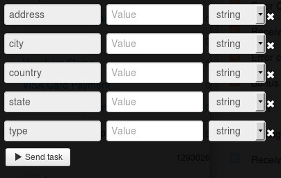

# Партнеры программы Бонус+

Клонируйте [папку "Partners of Bonus+ Program"](https://admin.corezoid.com/folder/conv/6081) для получения процесса и дашборда.

Перейдите в процесс.

Для тестирования процесса перейдите в режим `dashboard` и нажмите кнопку `Add task` - добавить заявку

В появившемся окне укажите:
*   `country` - страна, где находится партнер программы Бонус+. Принимает два значения: UA (Украина) , RU (Россия)
*   `state` - область, где находится партнер программы Бонус+
*   `city` - город, где находится партнер программы Бонус+
*   `address` - адрес, где находится партнер программы Бонус+
*   `type` - тип продукции, который реализуют партнеры программы Бонус+

Далее нажмите кнопку `Send task` - отправить заявку.

**В случае успеха** в заявку будет добавлен параметр:

* `Partners`- список адресов отделений ПриватБанка

**В случае ошибки** заявка перейдет в узел эскалации с параметром:
* `Error` - описание ошибки
