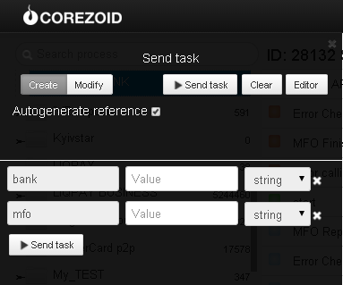

# Поиск банка по названию или МФО

Клонируйте [папку "Searching for bank by its name of MFO"](https://admin.corezoid.com/folder/conv/6081) для получения процесса и дашборда.

Перейдите в процесс.

Для тестирования процесса перейдите в режим `dashboard` и нажмите кнопку `Add task` - добавить заявку

В появившемся окне укажите оба или один из параметров:
*   `bank` - название банка
*   `mfo` - код МФО банка

Далее нажмите кнопку `Send task` - отправить заявку.

**В случае успеха** в заявку будет добавлен параметр:

* `Result`- список адресов отделений ПриватБанка

**В случае ошибки** заявка перейдет в узел эскалации с параметром:
* `Error` - описание ошибки
