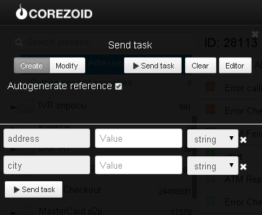

# Получение адресов терминалов самообслуживания

Клонируйте [папку "Getting addresses of self-service terminals"](https://admin.corezoid.com/folder/conv/6081) для получения процесса и дашборда.

Перейдите в процесс.

Для тестирования процесса перейдите в режим `dashboard` и нажмите кнопку `Add task` - добавить заявку

В появившемся окне укажите:
*   `city` - город
*   `address` - улица

Далее нажмите кнопку `Send task` - отправить заявку.

**В случае успеха** в заявку будет добавлен параметр:

* `Addresses`- список адресов терминалов самообслуживания ПриватБанка

**В случае ошибки** заявка перейдет в узел эскалации с параметром:
* `Error` - описание ошибки

