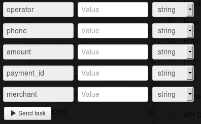

# Пополнение мобильной связи на свободную сумму

Для пополнение мобильной связи на свободную сумму нужно зарегистрировать мерчант в системе Приват24 согласно [описанию](https://api.privatbank.ua/#p24/registration).

**Мерчант Приват24** - дополнительный аккаунт П24, который позволяет в автоматическом режиме осуществлять интернет-платежи.

**Регистрация мерчанта** — это пошаговый процесс, в результате которого происходит интеграция платежного модуля на сайт.

В результате регистрации вы получите `id мерчанта` и `пароль мерчанта`, что даст вам возможность интеграции платежных и информационных сервисов Приват24 на ваш сайт.

Клонируйте [папку "Recharging mobile communication account with free amount"](https://admin.corezoid.com/folder/conv/6081) для получения процесса и дашборда.

Перейдите в процесс.

В узел "Calling API" добавьте пароль мерчанта в поле "Secret key"

Для тестирования процесса перейдите в режим `dashboard` и нажмите кнопку `Add task` - добавить заявку

В появившемся окне укажите:
*   `amount` - сумма платежа
*   `operator` - услуга (оператор).
 * Beeline Украина - `RPBLUA`
 * Киевстар - `RPKSTR`
 * life :) - `RPLIFE`
 * МТС Украина - `RPMTSU`
 * PEOPLEnet - `PPNET`
 * Utel - `RPUTEL`
 * Интернет Киевстар - `RPKSIN`
*   `phone` - Номер телефона
*   `merchant` - id мерчанта
*   `payment_id` - уникальный идентификатор платежа, присвоенный мерчантом. Повторяется в ответе на запрос, сохраняется в базе Приват24, служит для однозначного сопоставления операций на стороне партнера платежей с операциями в приват24.

Далее нажмите кнопку `Send task` - отправить заявку.

**В случае успеха** в заявку будут добавлены параметры:

* `state`- состояние платежа (1 - проведён, 0- забракован)
* `ref` - внутренний референс платежа в Приват24. Присваивается в банковской системе. Идентификатор платежа в Приват24. (Если платёж забракован - пустое поле)
* `message` - расширенное сообщение о состоянии платежа, может содержать описание причины, из-за которой платёж был забракован
* `commission` - сумма комиссии банка
* `currency` - валюта операции

**В случае ошибки** заявка перейдет в узел эскалации с параметром:
* `Error` - описание ошибки

