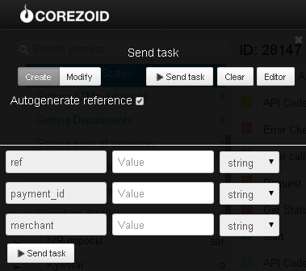

# Проверка статуса платежа на карту Приватбанка

Клонируйте [папку "Checking status of payment on PrivatBank card"](https://admin.corezoid.com/folder/conv/6081) для получения процесса и дашборда.

Перейдите в процесс.

В узел "Calling API" добавьте пароль мерчанта в поле "Secret key"

Для тестирования процесса перейдите в режим `dashboard` и нажмите кнопку `Add task` - добавить заявку

В появившемся окне укажите:
*   `ref` - внутренний референс платежа в Приват24
*   `merchant` - id мерчанта
*   `payment_id` - уникальный идентификатор платежа, присвоенный мерчантом

Далее нажмите кнопку `Send task` - отправить заявку.

**В случае успеха** в заявку будут добавлены параметры:

* **state** - статус платежа:

`not found` - не найден платеж; `ok` - успешный; `err` - забракован; `snd` - в обработке

* **message** - расширенное сообщение о состоянии платежа, может

**В случае ошибки** заявка перейдет в узел эскалации с параметром:
* `Error` - описание ошибки

