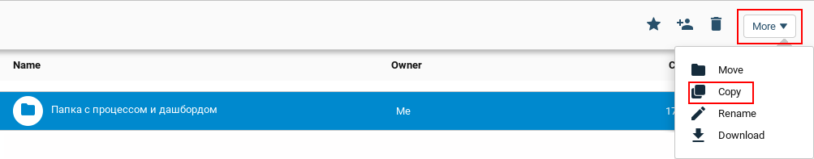

# Проверка платежа/получение ваучера

Клонируйте [папку "Payment check/getting a voucher"](https://admin.corezoid.com/folder/conv/6081) для получения процесса и дашборда.

Перейдите в процесс.

В узел "Calling API" добавьте пароль мерчанта в поле "Secret key"

Для тестирования процесса перейдите в режим `dashboard` и нажмите кнопку `Add task` - добавить заявку

В появившемся окне укажите:
*   `merchant` - id мерчанта
*   `payment_id` - уникальный идентификатор платежа, присвоенный мерчантом

Далее нажмите кнопку `Send task` - отправить заявку.

**В случае успеха** в заявку будут добавлены параметры:

*   `state` - статус платежа. `1` - проведён; `0` - забракован;
*   `message` - расширенное сообщение о состоянии платежа, может содержать описание причины, из-за которой платёж был забракован
*   `voucherSerial` - серийный номер ваучера Skype
*   `voucherCode` - лод пополнения Skype

**В случае ошибки** заявка перейдет в узел эскалации с параметром:
* `Error` - описание ошибки

