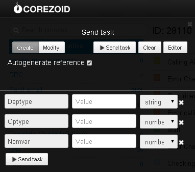

# Расчет стоимости операций с ценными бумагами

**Расчет осуществляется по таким операциям:**

* Операция перечисления бумаг между счетами в ценных бумагах, открытыми в Депозитарном учреждении, исходя из номинальной стоимости пакета;
* Операция зачисления бумаг на счет в ценных бумагах, открытый в Депозитарном учреждении, исходя из номинальной стоимости пакета;
* Операция списания бумаг со счета в ценных бумагах, открытого в Депозитарном учреждении, исходя из номинальной стоимости пакета;
* Учет бумаг на счету в ценных бумагах, исходя из номинальной стоимости пакета;

Клонируйте [папку "Calculating the cost of operations with securities"](https://admin.corezoid.com/folder/conv/6081) для получения процесса и дашборда.

Перейдите в процесс.

Для тестирования процесса перейдите в режим `dashboard` и нажмите кнопку `Add task` - добавить заявку

В появившемся окне укажите:
*   `Deptype` - тип депонента:

**ЮЛ** – Юридическое лицо;
**ФЛ** – Физическое лицо

*   `Optype` - тип операции:

**1** - операция перечисления; **2** - операция зачисления; **3** - операция списания; **4** - учет бумаг

*   `Nomvar` - номинальная стоимость

Далее нажмите кнопку `Send task` - отправить заявку.

**В случае успеха** в заявку будет добавлен параметр:

* `Res`- стоимость операции

**В случае ошибки** заявка перейдет в узел эскалации с параметром:
* `Error` - описание ошибки
