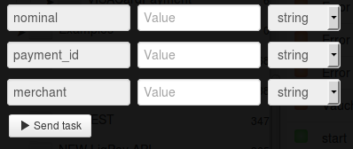

# Создание платежа за ваучер Skype

Для создания платежа нужно зарегистрировать мерчант в системе Приват24 согласно [описанию](https://api.privatbank.ua/#p24/registration).

**Мерчант Приват24** - дополнительный аккаунт П24, который позволяет в автоматическом режиме осуществлять интернет-платежи.

**Регистрация мерчанта** — это пошаговый процесс, в результате которого происходит интеграция платежного модуля на сайт.

В результате регистрации вы получите `id мерчанта` и `пароль мерчанта`, что даст вам возможность интеграции платежных и информационных сервисов Приват24 на ваш сайт.

Клонируйте [папку "Creation of payment for Skype voucher"](https://admin.corezoid.com/folder/conv/6081) для получения процесса и дашборда.

Перейдите в процесс.

В узел "Calling API" добавьте пароль мерчанта в поле "Secret key"

Для тестирования процесса перейдите в режим `dashboard` и нажмите кнопку `Add task` - добавить заявку

В появившемся окне укажите:
*   `merchant` - id мерчанта
*   `payment_id` - уникальный идентификатор платежа, присвоенный мерчантом
*   `nominal` - номиналы ваучеров skype (USD)

Далее нажмите кнопку `Send task` - отправить заявку.

**В случае успеха** в заявку будут добавлены параметры:

* `currency`- валюта операции
* `state` - статус платежа.`1` - проведён; `0` - забракован;
* `message`- засширенное сообщение о состоянии платежа, может содержать описание причины, из-за которой платёж был забракован
* `ref`- внутренний референс платежа в Приват24. Присваивается в банковской системе. Идентификатор платежа в Приват24. (Если платёж забракован - пустое поле)
* `amount`- валюта операции

**В случае ошибки** заявка перейдет в узел эскалации с параметром:
* `Error` - описание ошибки

