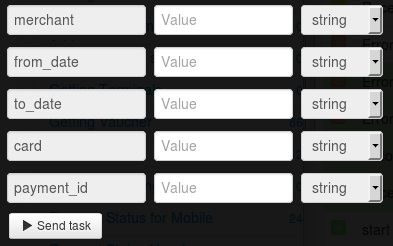

# Выписки по счёту мерчанта - физлица

Для получения выписки нужно [зарегистрировать мерчант](https://api.privatbank.ua/api-privat24/p24registration.html) в системе Приват24.

**Мерчант Приват24** - дополнительный аккаунт Приват24, который позволяет в автоматическом режиме осуществлять интернет-платежи.

В результате регистрации вы получите `id мерчанта` и `пароль мерчанта`, что даст вам возможность интеграции платежных и информационных сервисов Приват24 на ваш сайт.

Клонируйте [папку "Individual merchant account statements"](https://admin.corezoid.com/folder/conv/6081) для получения процесса и дашборда.

Перейдите в процесс.

В узел "Calling API" добавьте пароль мерчанта в поле "Secret key"

Для тестирования процесса перейдите в режим `dashboard` и нажмите кнопку `Add task` - добавить заявку

В появившемся окне укажите:
*   `from_date` - Начало периода. Формат дд.мм.гггг
*   `to_date` - Конец периода. Формат дд.мм.гггг
*   `card` - Номер карты
*   `merchant` - id мерчанта
*   `payment_id` - уникальный идентификатор платежа, присвоенный мерчантом.

Далее нажмите кнопку `Send task` - отправить заявку.

**В случае успеха** в заявку будут добавлены параметры:

* `Result`- выписки по счету мерчанта

**В случае ошибки** заявка перейдет в узел эскалации с параметром:
* `Error` - описание ошибки
