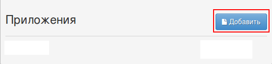
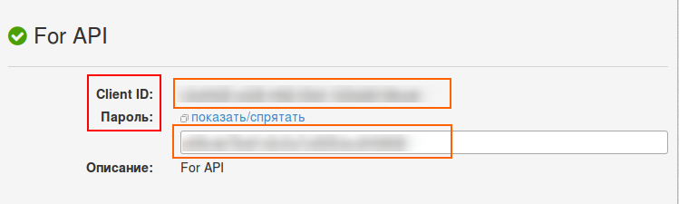
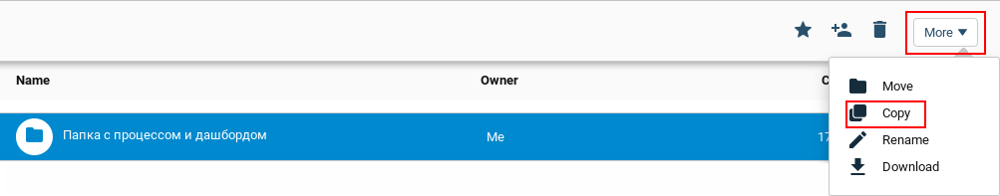
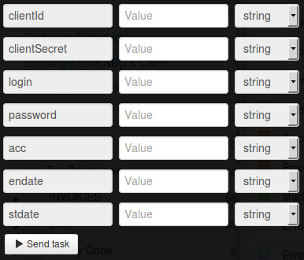

# Выписки по счёту мерчанта - юрлица

Для получения доступа к сервису Вам необходимо авторизоваться на странице https://link.privatbank.ua/console/auth/p24business/start.

Добавить новое приложение:

и получить **clientId** и **clientSecret**. 

Клонируйте [папку "Merchant legal entity account statements"](https://admin.corezoid.com/folder/conv/6081) для получения процесса и дашборда.

Для тестирования процесса перейдите в режим `dashboard` и нажмите кнопку `Add task` - добавить заявку

В появившемся окне укажите:
*   `clientId` - id Клиента, полученный после добавления приложения
*   `clientSecret` - пароль Клиента, полученный после добавления приложения
*   `login` - логин в Приват24 для бизнеса
*   `password` - пароль в Приват24 для бизнеса
*   `acc` - номер счета
*   `stdate` - начальная дата (пример: 04.04.2013)
*   `endate` - конечная дата (пример: 04.04.2013)

Далее нажмите кнопку `Send task` - отправить заявку.

**В случае успеха** в заявку будут добавлены параметры:

* `Result`- выписки по счету мерчанта

**В случае ошибки** заявка перейдет в узел эскалации с параметром:
* `Error` - описание ошибки
32718