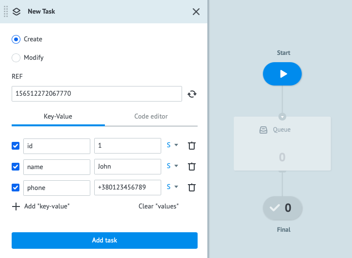
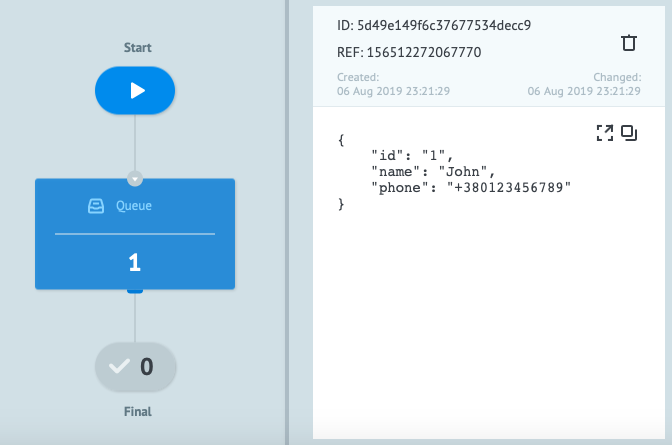
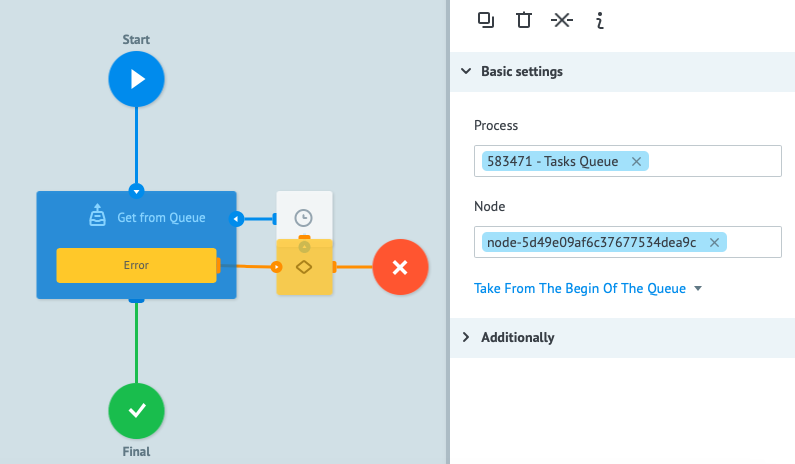
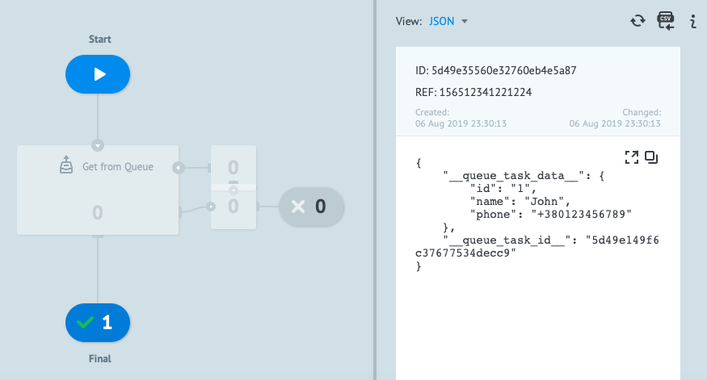
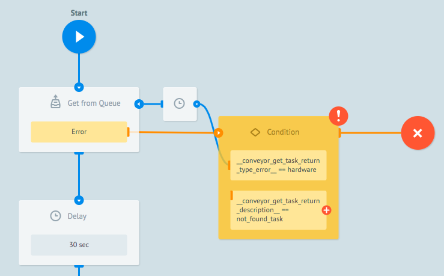
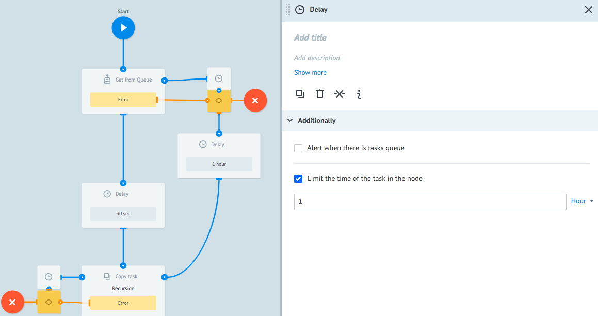

# Работа с очередью заявок

Corezoid позволяет создавать очередь из заявок и настраивать ее обработку.

Очередь заявок может являться связующим звеном между различными процессами в ваших приложениях. 

Как это может быть использовано на практике?
Представим, что у вас случился сбой платежного API, но вы не хотите отказывать клиентам в проведении платежей. В таких случаях вы можете накопить очередь из заявок в Corezoid и после восстановления работы API отправить их из очереди на обработку.

Для работы с очередями в Corezoid предусмотрено 2 узла: **Queue** и **Get from Queue**.
1. Узел **Queue** позволяет создавать очередь из заявок.
2. Узел **Get from Queue** позволяет вычитывать заявки из очереди.

В рамках этого туториала мы построим 2 процесса:
1. **Tasks Queue** - процесс, который будет получать заявки и сохранять их в очередь.
2. **Get tasks from Queue** - процесс, который будет вычитывать заявки из очереди процесса **Tasks Queue**.

### Прием и очередь заказов

1. Cоздайте папку **Queue**

    

    1.1. Зайдите в папку **Queue** и создайте процесс с именем **Tasks Queue**, который будет собирать очередь заявок.
    
    

    1.2. В созданном процессе добавьте узел **Queue**, который будет создавать очередь из 
заявок.

    

    После подключения логики **Queue** Ваш процесс может накапливать заявки для последующей их обработки из других процессов.

   

    1.3. Для тестирования работы узла **Queue** перейдите в режим **View** 
 
    1.4. Нажмите кнопку **New task**
 
    1.5. Для примера отправьте заявку с параметрами:
    ```    
    {
        "id": "1",
        "name": "John",
        "phone": "+3801234567"
    }
    ```
    1.6. Нажмите кнопку **Add task**
    
    

    1.7. После отправки заявки кликните на **Queue**, чтобы увидеть содержимое узла

    

    1.8. Создайте больше тестовых заявок, чтобы наглядно видеть скопление очереди. Например, 15 штук.
    
     

У Вас готов процесс получения заявок в очередь (узел **Queue**).
 
### Получение заявки из очереди в работу

1. Теперь, когда у вас есть процесс с узлом накапливания очереди, нужно настроить процесс для ее вычитки. Для этого создайте процесс с именем **Get tasks from Queue** 
   
    1.1 В созданном процессе добавьте узел **Get from Queue**, который будет забирать заявки из очереди
    
     

    1.2. После того, как вы добавили узел, кликните на него и в разделе **Basic settings** в поле ***Process*** выберите процесс, в котором хранится ваша очередь. В нашем случае этот процесс называется **Tasks Queue**. 
 
    1.3. Кликните на поле **Node**. В появившемся окне выберите узел **Queue**, в котором находится очередь. 
 
    
 
2. Протестируйте работу процесса по вычитке заявок из очереди. Для этого перейдите в режиме **View** 
 
    2.1. Нажмите кнопку **New task**
 
    2.2. В окне **Task** нажмите кнопку **Add task**
 
    2.3. Если работа с очередью заявок подключена правильно, то Вы сможете увидеть заявку из логики **Queue**, если кликните на узел **Final**

    

3. Тем самым Вы обработали 1 заявку из очереди. Но в процессе **Tasks Queue** осталось еще 14 заявок очереди. Для обработки всей очереди заявок необходимо настроить цикл в процессе **Get tasks from Queue**.
 
    3.1. Для настройки цикла, после узла **Get from Queue** добавьте узел **Delay** и установите таймер на 30 секунд. Тем самым Вы зададите регламент обработке по 1 заявке каждые 30 секунд.
 
    3.2. После узла **Delay** добавьте узел **Copy task** с именем **Recursion**
 
    3.3. В поле ***Process*** раздела ***Basic settings*** подключите процесс **Get from Queue** для того, чтобы при попадании заявки в узел **Final** создавалась новая заявка в процесс. При каждом создании новой заявки, узел **Get from Queue** будет обращаться в процесс **Tasks Queue** и забирать по 1 заявке из очереди.

     

    3.4. Для запуска цикла по вычитке заявок из очереди перейдите в режим **View**
 
    3.5. Нажмите **New task**
 
    3.6. Нажмите **Add task**
 
    3.7. После того, как вся очередь будет обработана, Вы увидите наполнение заявками финального узла и заявку с ошибкой в узле **Get from Queue**

    

    3.8. Кликните на узел с ошибкой, в котором Вы увидите в параметре ```__conveyor_get_task_return_description__``` сообщение ```not_found_task``` , которое показывает, что в процессе с очередью закончились заявки.
 
4. Для того, чтобы Ваш цикл обработки очереди не останавливался и при появлении новой заявки Вы ее обрабатывали, необходимо в ***Condition*** добавить условие, если ```__conveyor_get_task_return_description__ == not_found_task```, то заявка должна идти не в узел **Error**.
 
    
 
    4.1. Подключите к новому условию узел **Delay**
 
    4.2. В узле **Delay** установите таймер для следующей вычитки очереди. Например, 1 час.
 
    4.3. Подключите узел **Delay** к узлу **Copy task**

     

**Поздравляем! Вы настроили процесс с циклической проверкой наличия заявок в очереди и их вычиткой**. 
 
 


