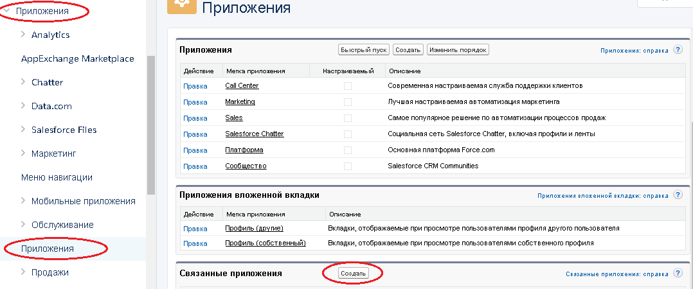

# OAuth 2.0

Зарегистрируйтесь в [сообществе разработчиков Force.com](https://developer.salesforce.com/signup).

Перейдите на начальную страницу настройки


Создайте связанное приложение:



* Заполните поля `Имя связанного приложения`, `Адрес эл. почты контакта`
* Возле `Включить параметры OAuth добавьте` "галочку"
* В поле `URL-адрес обратного вызова` добавьте callback URL Вашего приложения
* В `Выбранные области OAuth` добавьте все доступные
* Нажмите `Сохранить`

Вы получите **client_id** (ключ пользователя) и **client_secret** (секрет пользователя).


##Получение кода авторизации

Чтобы получить код авторизации в адрессную строку браузера добавьте запрос и перейдите по ссылке

```
https://login.salesforce.com/services/oauth2/authorize?response_type=code&client_id={{client_id}}&redirect_uri={{callback_url}}
```

где,

`{{client_id}}` - ключ пользователя Вашего приложения

`{{callback_url}}` - callback URL Вашего приложения

Например,

```
https://login.salesforce.com/services/oauth2/authorize?response_type=code&client_id=
3MVG9lKcPoNINVBIPJjdw1J9LLM82HnFVVX19KY1uA5mu0QqEWhqKpoW3svG3XHrXDiCQjK1mdgAvhCscA
9GE&redirect_uri=https://www.mysite.com
```

Пользователь, подтвердивший доступ, перенаправляется на URL, указанный в параметре redirect_url со значением кода авторизации в строке запроса.

Например,

```
https://www.mysite.com/code_callback.jsp?code=aPrxsmIEeqM9&state=mystate
```

Пользователю, подтвердившему право на доступ хотя бы один раз, не придется подтверждать это право повторно.


##Получение access_token OAuth 2.0

**Клонируйте [папку "OAuth 2.0"](https://admin.corezoid.com/folder/conv/94689)**


**Запустите процесс [Get token](https://admin.corezoid.com/editor/94690/140896)**

Для этого:

 - перейдите в режим `Debug`

 - нажмите кнопку `Add task` - добавить заявку.

 - в появившемся окне укажите обязательные параметры:
*   **callback_url** - callback URL Вашего приложения
*   **client_id** - ключ пользователя Вашего приложения
*   **client_secret** - секрет пользователя Вашего приложения
*   **code** - полученный в браузере код авторизации

 - после того как все параметры указаны, нажмите кнопку `Send task`.


##Использование access_token OAuth 2.0

В [папке "OAuth 2.0"](https://admin.corezoid.com/folder/conv/94689) размещен процесс [Get token](https://admin.corezoid.com/editor/94690/140896) и диаграмма состояний [Token storage](https://admin.corezoid.com/editor/94690/140897).

`Get token` получает access_token и передает его в диаграмму состояний Token storage.

`Token storage` хранит access_token, что позволяет получать его из других процессов через конструкцию:

        {{conv[{{diag_id}}].ref[token].token}}

где,
**diag_id** - id Вашей диаграммы состояний. Например,

        {{conv[140897].ref[token].token}}


Для получения id диаграммы состояний кликните на ее стартовый узел.

На правой боковой панели будет доступна вся системная информация.


Чтобы убедится, что access_token получен, перейдите в режим `Debug` диаграммы состояний [Token storage](https://admin.corezoid.com/editor/94690/140897)

Нажмите `Tasks archive` узла `token`


Внутри заявки Вы увидите полученный token


