# BitcoinBot

* [App ID и Webhook](#appid)
* [Создание BitcoinBot](#bitcoinbot)
* [Установка Webhook](#webhook)
* [Что делает BitcoinBot](#do)
* [Тестирование и запуск](#test)

### App ID и Webhook {#appid}

1. Создайте  приложение в [Microsoft Bot Framework](https://dev.botframework.com/).
2. Перейдите на вкаладку **"Register a bot"** и зарегестрируйте своего бота. Дополнительные сведения по регистрации бота вы можете получить перейдя по вкладке [Documentation](https://docs.botframework.com/en-us/skype/getting-started/#navtitle).
3. Получите свой персональный код приложения **Microsoft App ID** и пароль **client_secret**.
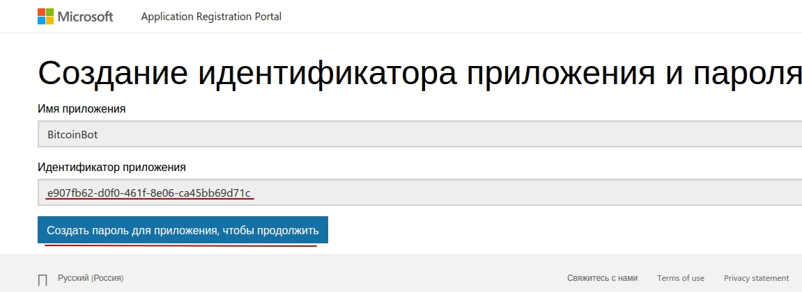

4. На вкладке **"My bots"** в поле **Messaging endpoint** вставьте полученный url процесса WeatherBot. Инструкция по получению webhook-url [здесь](#webhook).
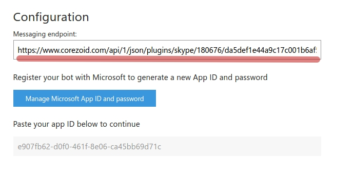

5. Опубликуйте Бота нажав кнопку Publish.

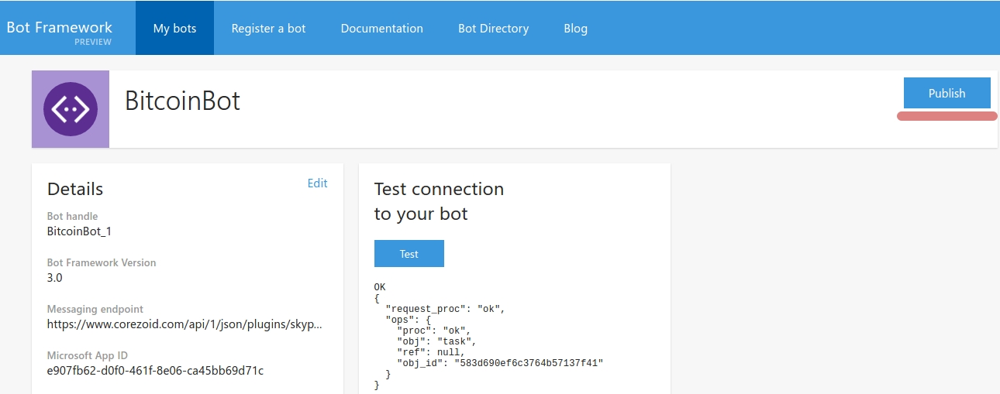

После создания бота нужно его опубликовать, так как без публикаци количество пользователей бота ограниченно.

Обратите внимание, что для публикации бота надо отключить использование бота в групповых чатах.


### Создание BitcoinBot {#bitcoinbot}

Клонируйте [папку с процессами "BitcoinBot"](https://admin.corezoid.com/folder/conv/121755).
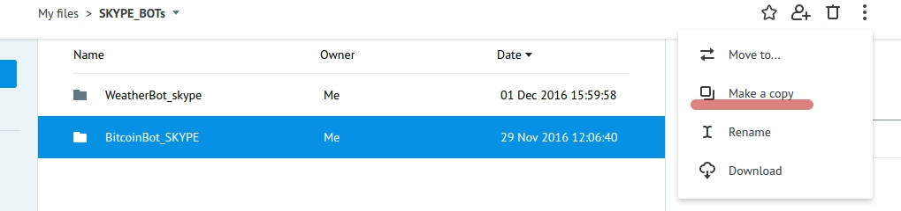

В ```процессе "Skype_sender"``` в узле ```Set skype_authorization``` в значении переменной 
**skype_authorization** - введите такую конструкцию 

```
{{conv[{{process_id}}].ref[{{ref}}].ID_параметра}}
```

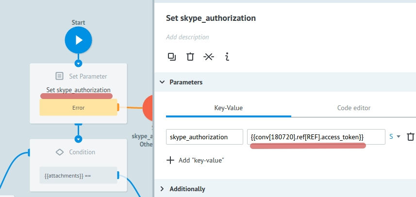

```Процесс "Skype authorization"``` предназначен для получения **access_token** для Skype API и так как срок годности ключа составляет 3600 сек, то по истечению этого срока жизни процесс обновляет его и передает валидный access_token в ```диаграмму состояний "Skype storage"```.

 Через конструкцию 
 ```
 {{conv[{{process_id}}].ref[{{ref}}].ID_параметра}}
 ```
 мы обращаемся к диаграмме состояний "Skype storage"  и получаем access_token.
 
 ```Процесс Main_skype```
 получает все сообщения, поступающие в чат Бота и первым шагом определяет какое-то действие пользователя. Например, если пользователь добавил Бота себе в контакты, то процесс отправляет пользователю приветственное сообщение
 Также процесс определяет действие по удалению Бота и отправляет в узел ```Bot removed.```
 
 Далее при отправке пользователем сообщения, процесс Main_skype пытается обновить заявку в процессе BitcoinBot_SKYPE и если такой заявки нет, то создает новую с референсом равным id чата (```{{skype_msgs.conversation.id}}```).

Таким образом мы продолжаем чат с пользователем в рамках уникального id чата - ```{{skype_msgs.conversation.id}}```.

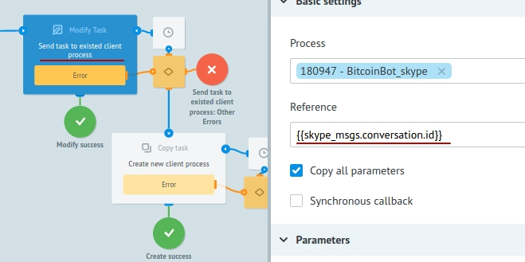
  
В ```Процесс BitcoinBot_SKYPE``` поступают заявки из Main_skype процесса (с референсом равным id чата). Если пользователь отправил команду start, то ему первым шагом отправляется сообщение с предложением выбрать валюту.

Это позволяет получать обновления (новые команды или сообщения от пользователя в чат Бота) из Main_skype процесса, когда заявка находится в узле с [Логикой CALLBACK](https://doc.corezoid.com/ru/interface/nodes/callback.html).

Итак, после отправки сообщения с предложением выбрать валюту заявка переходит в ожидание этого выбора.

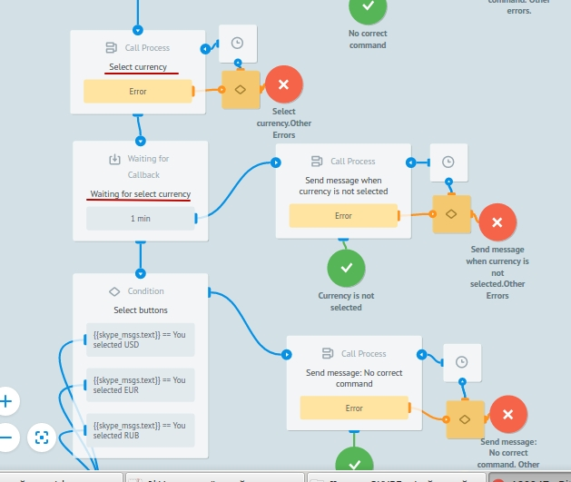

Если через 1 минуту выбор не будет сделан (заявка не обновится из Main_skype процесса), то отправим сообщение об истечении времени ожидания - "Time expired. Try again. Please write start".

Если же выбор валюты сделан, предлагаем пользователю выбрать какой курс показать - покупки или продажи и опять ждем в узле с CALLBACK.
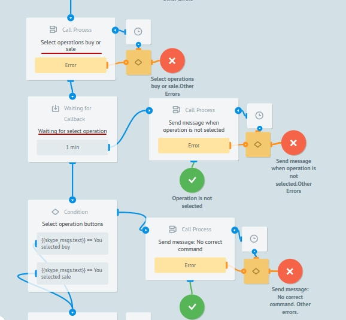

Точно так же, если нет соответвующего выбора, отправим сообщение об истечении времени ожидания.

Если выбор сделан, получим курсы и отправим в сообщении.

А ```Процесс "Skype_sender"``` отправляет сообщения в Skype.

Оба процесса (Main_skype и BitcoinBot_SKYPE) обращаются к нему через [Логику RPC](https://doc.corezoid.com/ru/interface/nodes/rpc/logic_rpc.html).


 
## Установка Webhook {#webhook}

Подключите ```процесс Main_skype``` к Skype с помощью webhook-url. Для получения webhook-url процесса Main_skype выберите "Connect to messenger":

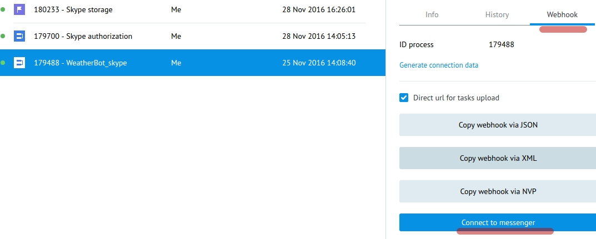

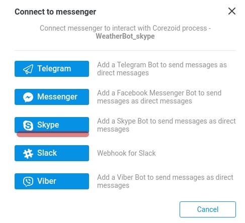

Получите webhook-url процесса BitcoinBot для SKYPE.

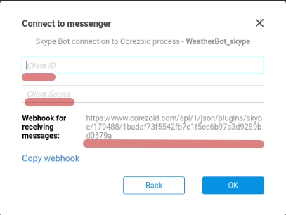

В пустое поле **Client ID** введите свой персональный код приложения **Microsoft App ID**, полученный вами при создании Бота.
В поле **Client Secret** введите свой пароль к приложению.

Укажите полученный webhook-url процесса в настройках вашего бота на вкладке **"My bots"** в поле **Messaging endpoint**,более подробно описано [здесь](#appid).


## Что делает BitcoinBot {#do}

BitcoinBot для новых контактов отправляет информацию о Боте в узел ```Send info about bot.```

По команде start отправляет сообщение выбора валюты.

После выбора валюты для получения курсов конвертации BitcoinBot делает запрос к API blockchain и отправляет сообщение с курсом покупки и продажи в выбранной валюте.

BitcoinBot отправляет соответсвующее сообщение, в случае получения неопределенной команды и в случае возникновения ошибки в процессе.


## Тестирование и запуск {#test}

Просто добавьте своего Бота в Skype по [ссылке]( https://join.skype.com/bot/e907fb62-d0f0-461f-8e06-ca45bb69d71c) или из [каталога ботов](https://bots.botframework.com/) (если бот опубликован) и начните чат.
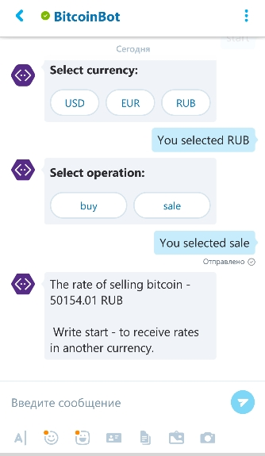

Перейдите в режим **View** или **Debug**,чтобы увидеть поток заявок, их прохождение и распределение по узлам процессса.
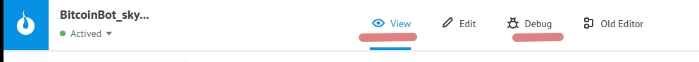


