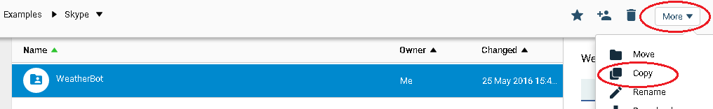
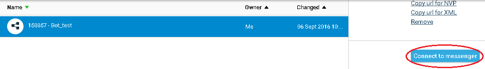
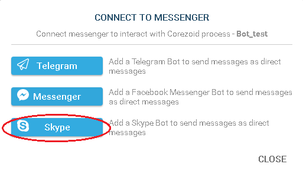
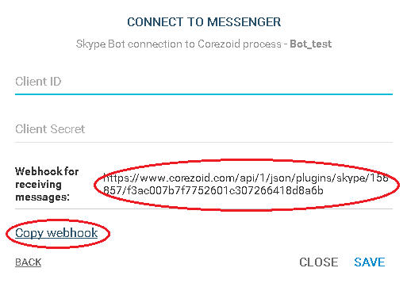
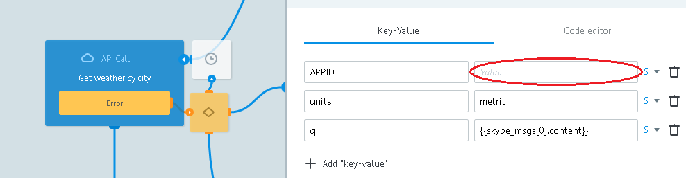
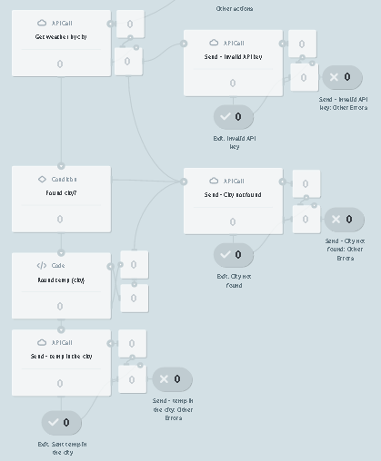

# WeatherBot

Клонируйте [папку "WeatherBot"](https://admin.corezoid.com/folder/conv/94465)

В папке расположен процесс [WeatherBot](https://admin.corezoid.com/editor/94465/140307). Он принимает webhook-и.

Новому контакту отправляет информацию о Боте.

По названию города получает температуру воздуха и отправляет сообщение.

В случае, если сообщение не содержит название города или город указан некорректно, а также если в процессе возникла ошибка, отправляет соответсвующее сообщение.

Также отпределяет действие по удалению Бота и отправляет в узел `Bot removed`.

##Установка Webhook

**1)** [Создайте приложение](https://apps.dev.microsoft.com/#/appList). Получите `AppID` и  `AppSECRET`.

**2)** Подключите процесс WeatherBot к Skype Ботe, указав `AppID` и  `AppSECRET` Вашего приложения

**2)** Получите url процесса WeatherBot для Skype Бота

(если `AppID` и  `AppSECRET` указаны корректно) в Ваш аккаунт Corezoid автоматически добавляется папка `Skype token` с двумя процессами - `Get token` и `Get token`

> После успешного подключения 

> `Get token` - получает access_token для Skype API и по истечению срока жизни обновляет его, передает валидный access_token в диаграмму состояний Token storage.

> `Skype Token` - диаграмма состояний предназначена для получения access_token через конструкцию:

        {{conv[{{diag_id}}].ref[{{ref}}].ID_параметра}}

**3)** [Создайте Бота](https://dev.botframework.com/bots)

В поле `Microsoft App ID` укажите  `AppID`.

В поле `Messaging endpoint` - полученный url процесса WeatherBot.

**4)** Опубликуйте Бота (кнопка `Publish`)

> Чтобы сделать Бота публичным, нужно соблюдать [guideline](https://developer.microsoft.com/en-us/skype/bots/docs/review-guidelines) и [соглашение](https://developer.microsoft.com/en-us/skype/agreement).
А также указать ссылки на свои `Privacy statement` и `Terms of service`.

##Интеграция с OpenWeatherMap

Для удобства пользователей в [шаблон WeatherBot](https://admin.corezoid.com/editor/94465/140307) добавлен тестовый ключ доступа к API OpenWeatherMap.

Чтобы получить свой ключ доступа к API OpenWeatherMap перейдите по [ссылке](http://openweathermap.org/register) и зарегистрируйтесь.

В узле `Get weather by city` замените тестовый ключ на полученный Вами в значении параметра `APPID`.

##Тестирование и запуск

Просто добавьте своего Бота в Skype и начните чат

Перейдите в режим `View` или `Debug` [WeatherBot](https://admin.corezoid.com/editor/94465/140307)

чтобы увидеть поток заявок, их прохождение и распределение по узлам процессса.

>Пока Ваш Бот не опубликован (Status = In review), его функциональность доступна ограниченному количеству пользователей.

