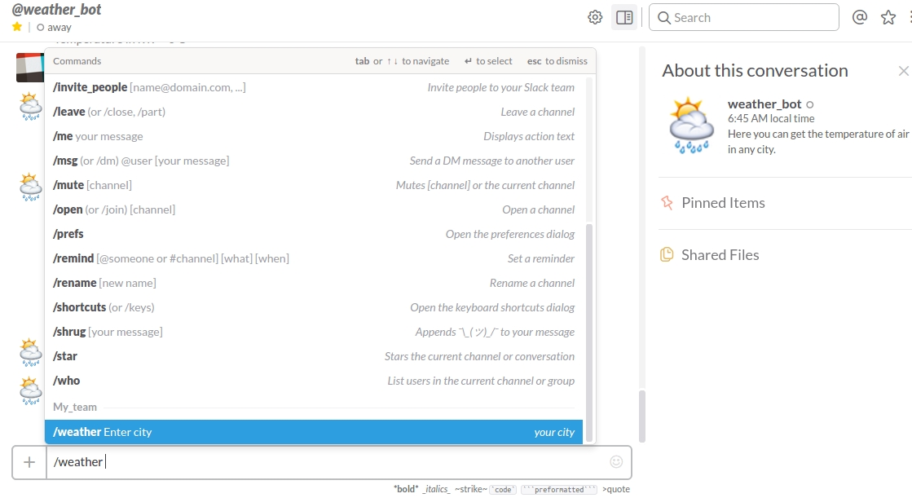

# WeatherBot в Slack

* [Авторизация в SLACK](#auth)
* [Url, Slash commands и Webhook](#url) 
* [Создание WeatherBot](#weatherbot)
* [Установка Webhook](#webhook)
* [Что делает WeatherBot](#do)
* [Интеграция с OpenWeatherMap](#map)
* [Тестирование и запуск](#test)


###  Авторизация в SLACK {#auth}

1. Создайте свою команду Slack Team перейдя по **[ссылке](https://slack.com/).**
2. Введите свой email и нажмите **Create New Team**. На указанный Вами адрес email вы получите Код подтверждения.
3. После этого следуйте дальнейшим инструкциям и вы создадите свой **Team domain.** 


  Далее вы можете выслать приглашение по введенному email адресу тем, с кем вы хотите общаться в своей команде или пригласить их нажав **+Invite people** в приложении.
 

###  Url, Slash commands и Webhook {#url}
 
1.Далее заходим на [Slack API](https://api.slack.com/) - выбираем **Start building custom integration:**


Далее выбираем **Set up an incoming webhook** **-** **Add Configuration**

2.Создаем новый **Channel** или выбираем из списка предложенных (по умолчанию есть два канала - #general и #random):

3.Вы получаете **Webhook URL**, с помощью которого вы можете отправлять сообщения в Slack с любого сервиса. 

4.Выбираем **Set up a slash command** **-** **Add Configuration** и вводим в поле название команды, начинающуюся с / , например /weather


Когда пользователь вводит команду /weather
, Slack отправляет запрос на настроенный URL-адрес  и ждет ответа из сервиса по этому URL.

5.Далее в форму вводим полученный нами webhook -url [здесь](#webhook), заполняем остальные поля и нажимаем **Save Integration**.

Slack также позволяет создать своего Бота **Set up a bot user** **- Add Configuration** и заполнить его имя:


Заполнить **Integration Settings** для Бота- его краткое описание, что он может делать, icon и т.д. Далее вы можете в настройках пригласить Вашего бота в channel:


Но в данном примере мы использовали **Slash commands** для создания нашего Бота. Его можно будет использовать в разговоре с другом или в любом канале #channel.


### Создание WeatherBot {#weatherbot}

Клонируйте [процесс "WeatherBot"](https://admin.corezoid.com/folder/conv/121879)


В ```процессе "WeatherBot_SLACK"``` в узле ```Set APPID_key``` в значении переменной:
* **APPID**- введите тестовый ключ доступа к API OpenWeatherMap.


  
 
### Установка Webhook{#webhook}

Подключите процесс WeatherBot к SLACK с помощью webhook-url. Для получения webhook-url процесса WeatherBot выберите "Connect to messenger":


Вы получите webhook-url процесса WeatherBot для SLACK для Slash Commands или Event Subscriptions.В данном случае, мы выбираем webhook для Slash Commands:


Укажите полученный webhook-url процесса в **Integration Settings** для **Command** в поле **URL**,более подробно описано [здесь](#url).


### Что делает WeatherBot{#do}

WeatherBot - принимает webhook-и с названием города, получает по нему температуру воздуха и отправляет сообщение.

В случае, если сообщение не содержит название города или город указан некорректно, а также если в процессе возникла ошибка, отправляет соответсвующее сообщение.


### Интеграция с OpenWeatherMap{#map}

Для удобства пользователей в [шаблон "WeatherBot"](https://admin.corezoid.com/folder/conv/121879) добавлен тестовый ключ доступа к API OpenWeatherMap.Чтобы получить свой ключ доступа к API OpenWeatherMap перейдите по [ссылке](https://home.openweathermap.org/users/sign_in) и зарегистрируйтесь. 


В узле **"Set APPID_key"** замените тестовый ключ API OpenWeatherMap на полученный Вами в значении параметра **APPID**. 


### Тестирование и запуск{#test}

Просто добавьте своих друзей в Вашу команду в Slack и начните чат с любым другом или в любом #channel с команды /weather [имя города]



Вы также можете использовать Бота в мобильном приложении Slack:


Перейдите в режим **View** или **Debug**,чтобы увидеть поток заявок, их прохождение и распределение по узлам процессса.


