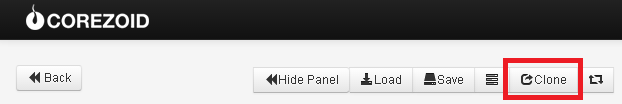

# MessageBird

[https://www.messagebird.com](https://www.messagebird.com)

Зарегистрируйтесь на сайте [https://www.messagebird.com/app/en/sign-up](https://www.messagebird.com/app/en/sign-up)

При регистрации нужно указать только:
-   email
-   логин
-   пароль

После регистрации, перейдите в раздел:
`Settings - Developers - API access` и через кнопку `Add access key` добавьте два ключа:
-   `live` для настоящей отправки SMS
-    `test` для тестирования. SMS отправляться при этом не будут.

[Клонируйте шаблон процесса](https://www.corezoid.com/admin/edit_conv/14546) для отправки SMS через API MessageBird.

Перейдите в режим `dashboard` и нажмите кнопку `Add task` - добавить заявку.

В появившемся окне укажите:
*   `key` ключ доступа к API, который мы сгенерировали выше
*   `recipients` номер(а) телефона получателя SMS
*   `text` текст SMS

После того как параметры заявки указаны, нажмите кнопку `Send task`.

С полным перечнем доступных параметров API MessageBird Вы можете ознакомится по ссылке - [https://www.messagebird.com/developers#messaging-send](https://www.messagebird.com/developers#messaging-send).
