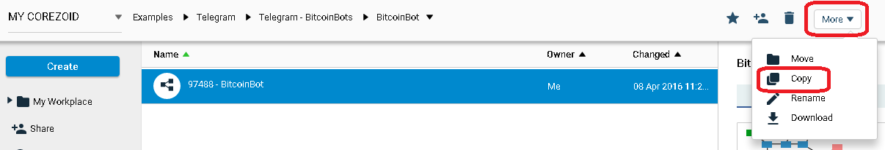
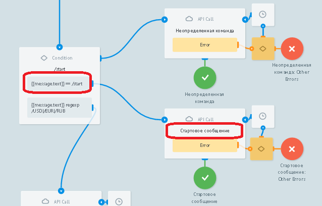
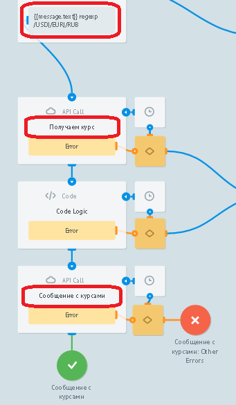
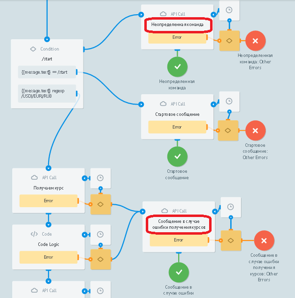
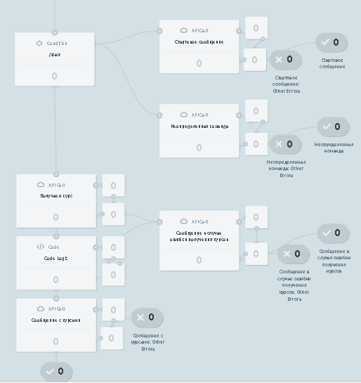

# BitcoinBot

Клонируйте [шаблон "BitcoinBot"](https://admin.corezoid.com/folder/conv/59749)

Подключите к Telegram, указав ключ Вашего Бота

Для получения ключа Бота нужно отправить команду `/newbot` в чат с BotFather. Далее указать имя и имя пользователя Бота. Вы получите:

##Что делает BitcoinBot

По команде `/start` в чат отправляет сообщение с информацией о Боте

После выбора валюты для получения курсов конвертации bitcoin делает запрос к API blockchain и отправляет сообщение с курсом покупки и продажи в выбранной валюте.

Отправляет соответствующее сообщение, в случае получения неопределенной команды и в случае возникновения ошибки в процессе.

##Тестирование и запуск

Просто добавьте своего Бота в Telegram и начните чат.

Перейдите в режим `View` или `Debug`,

чтобы увидеть поток заявок, их прохождение и распределение по узлам процесса.

