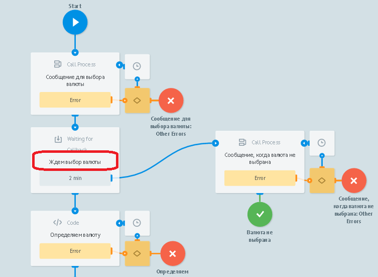

# BitcoinBot (multistage)

Клонируйте [папку "BitcoinBot (multistage)"](https://admin.corezoid.com/folder/conv/59748)

Подключите Main (главный) процесс к Telegram, указав ключ Вашего Бота

Для получения ключа Бота нужно отправить команду `/newbot` в чат с BotFather. Далее указать имя и имя пользователя Бота. Вы получите:

##Как работает многошаговый BitcoinBot

[**Main процесс**](https://admin.corezoid.com/editor/59750/97490)

Получает все сообщения, поступающие в чат Бота и первым шагом пытается обновить заявку в процессе BitcoinBot.

Обновить заявку в процессе BitcoinBot = продолжить чат с пользователем в рамках уникального id чата.

Это становится возможным багодаря созданию новой заявки в процессе BitcoinBot, когда пользователь отправляет команду `/curs`. Данная заявка создается с референсом равным id чата (`{{message.chat.id}}`).

Если при обновлении заявки по id чата таковая не была найдена, значит у нас еще нет открытого диалога в данном чате - нет заявки в процессе BitcoinBot. Тогда проверяем какая команда получена от пользователя.

В случае получния команды `/start`, отправляем сообщение с информацией о Боте. В случае, если получена `/curs` - создаем заявку в процессе BitcoinBot (как было описано выше).

Если же получено что-то отличное от `/start` или `/curs`, определяем команду и оповещаем об этом пользователя соответствующим сообщением.

[**Процесс "BitcoinBot"**](https://admin.corezoid.com/editor/59750/97491)

Сюда поступают заявки из Main процесса, если пользователь отправил команду `/curs` и первым шагом отправляется сообщение с предложением выбрать валюту.

>Напомним, референсом заявок в этом процессе является уникальный id чата (`message.chat.id`).

Это позволяет получать обновления (новые команды или сообщения от пользователя в чат Бота) из Main процесса, когда заявка находится в узле с [Логикой CALLBACK](https://doc.corezoid.com/ru/interface/nodes/callback.html).

Итак, после отправки сообщения с предложением выбрать валюту заявка переходит в ожидание этого выбора.

Если чрез 2 минуты выбор не будет сделан (заявка не обновится из Main процесса), то отправим сообщение об истечении времени ожидания.

Если же выбор валюты сделан, предлагаем пользователю выбрать какой курс показать - покупки или продажи и опять ждем в узле с CALLBACK.

Точно так же, если нет соответвующего выбора, отправим сообщение об истечении времени ожидания.

Если выбор сделан, получим курсы и отправим в сообщении.

[**Процесс "Send message"**](https://admin.corezoid.com/editor/59750/97489)

Отправляет сообщения в Telegram.

Оба процесса (Main и BitcoinBot) обращаются к нему через [Логику RPC](https://doc.corezoid.com/ru/interface/nodes/rpc/logic_rpc.html).

##Тестирование и запуск

Просто добавьте своего Бота в Telegram и начните чат.

Перейдите в режим `View` или `Debug`,

чтобы увидеть поток заявок, их прохождение и распределение по узлам процесса.

