# GoogleSpreadSheetBot

**GoogleSpreadSheetBot** в **Telegram** позволяет читать данные из ячеек или диапазона ячеек выбранного пользователем, также записывать различные данные в ячейки указанного Вами листа **Google Sheet.**

Клонируйте  [папку c процессами "Telegram_GoogleSpreadSheetBot"](https://admin.corezoid.com/folder/conv/124602).

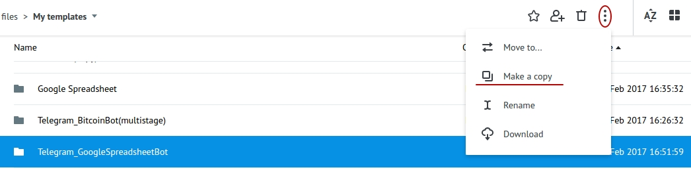

Подключите **Main** (главный) процесс к Telegram, указав ключ Вашего Бота:

Для получения ключа Бота нужно отправить команду `/newbot` в чат с **BotFather**. Далее указать имя и имя пользователя Бота. Вы получите:

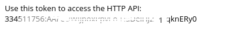

Необходимо указать ключ Вашего Бота  - **telegram_token** в процессе **Main** в узле "Set telegram_token and spreadsheetId".

## OAuth аутентификация

Все запросы к API Google поддерживают авторизацию только через OAuth 2.0.

Каждый запрос к API должен содержать в **Header**:

`Authorization : Bearer {{conv[ID_DIAGRAM].ref[REFERENCE].access_token}}`

где:

*   `ID_DIAGRAM` - ID диаграммы `State token`, где находится `access_token`

*   `REFERENCE` - Вы задаете, при генерации`access_token`.

Для получения **access_token** Вам необходимо следовать инструкциям, которые даны здесь - [OAuth аутентификация](https://doc.corezoid.com/ru/plugins/google/oauth.html).

После получения **access_token** в процессе **GoogleSpreadsheetBot** в узле "Set Authorization for API" указываем полученные нами параметры:

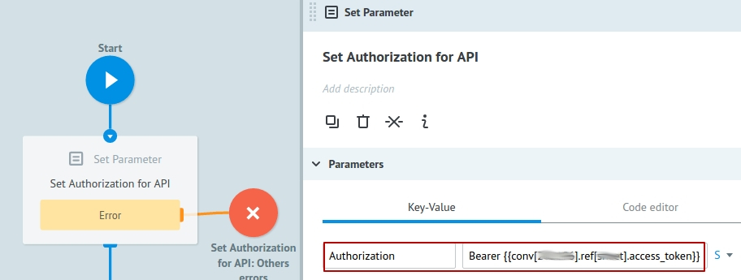

## Описание процессов

**Процесс Main**

Получает все сообщения, поступающие в чат Бота и первым шагом пытается обновить заявку в процессе **GoogleSpreadsheetBot**.

Обновить заявку в процессе **GoogleSpreadsheetBot** = продолжить чат с пользователем в рамках уникального id чата.

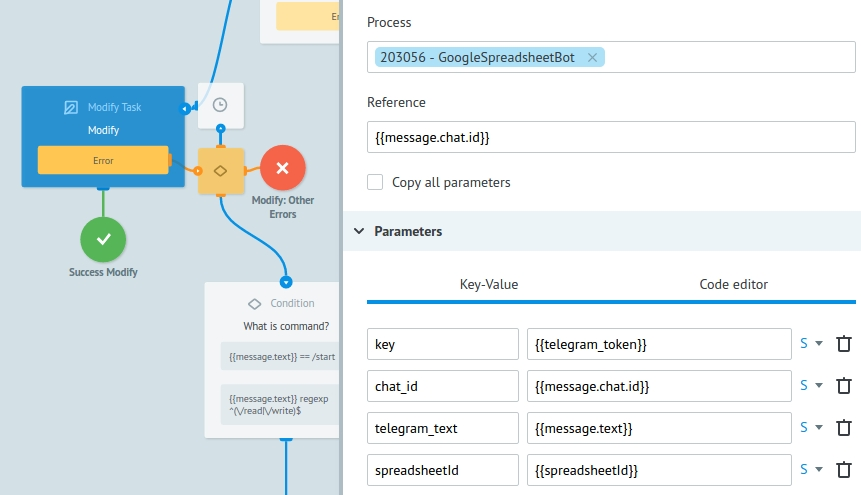

Это становится возможным благодаря созданию новой заявки в процессе **GoogleSpreadsheetBot**, когда пользователь отправляет команду`/read или /write`Данная заявка создается с референсом равным id чата (`{{message.chat.id}}`).

Если при обновлении заявки по id чата таковая не была найдена, значит у нас еще нет открытого диалога в данном чате - нет заявки в процессе **GoogleSpreadsheetBot**. Тогда проверяем какая команда получена от пользователя.

В случае получения команды`/start`, отправляем сообщение с информацией о Боте. В случае, если получена команда`/read или /write`- создаем заявку в процессе **GoogleSpreadsheetBot** (как было описано выше).

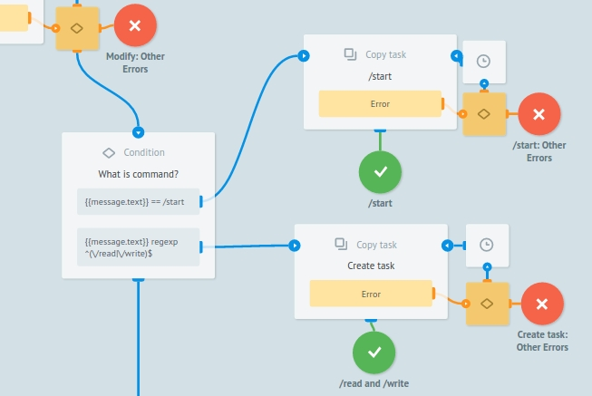

Если же получено что-то отличное от `/start, /read или /write`, определяем команду и оповещаем об этом пользователя соответствующим сообщением.

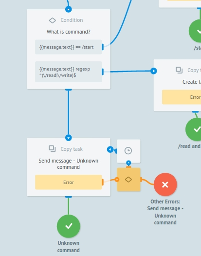

Для работы с уже созданной таблицей Google, нам необходимо указать ее **ID** `(spreadsheetId)`.

Для этого скопируем ID из URL Вашей таблицы (выделено желтым цветом)

Необходимо указать **ID** Вашей **Google Sheet**  - `spreadsheetId` в процессе **Main** в узле "Set telegram_token and spreadsheetId". 
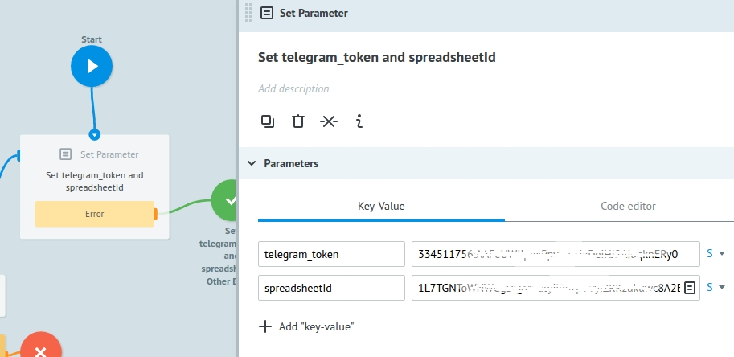

**Процесс GoogleSpreadsheetBot**

В этот процесс поступают заявки из **Main** процесса, если пользователь отправил команду `/read или /write`,и первым шагом отправляется сообщение с предложением выбрать операцию(чтение или запись в ячейку или диапазон).

Напомним, референсом заявок в этом процессе является уникальный id чата `{{message.chat.id}}`.

Это позволяет получать обновления (новые команды или сообщения от пользователя в чат Бота) из **Main** процесса, когда заявка находится в узле с [Логикой CALLBACK](https://doc.corezoid.com/ru/interface/nodes/callback.html).

Итак, после отправки сообщения с предложением выбрать операцию, заявка переходит в ожидание этого выбора.

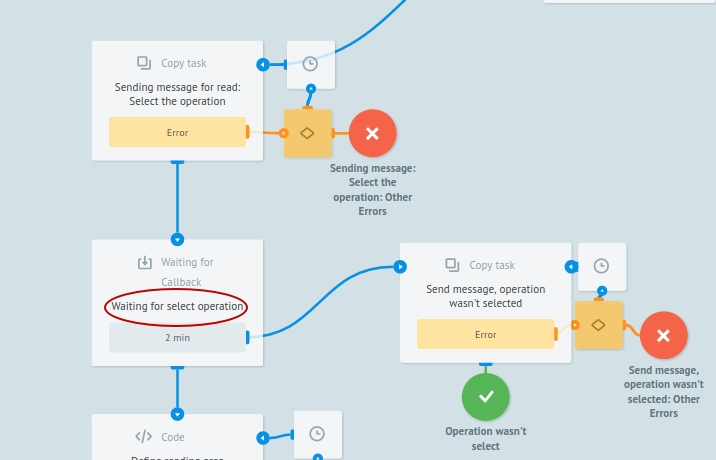

Если через 2 минуты выбор не будет сделан (заявка не обновится из **Main** процесса), то отправим сообщение об истечении времени ожидания.

Если же выбор операции сделан, предлагаем пользователю  ввести название листа таблицы Google, адрес ячейки или диапазона в указанном формате или ввести значение ячейки.

После каждого предложения пользователю, мы ждем в узлах с CALLBACK и точно так же, если нет соответствующего выбора, отправляем сообщение об истечении времени ожидания.

При неправильном вводе адреса ячейки,названия листа таблицы Google или значения ячейки, отправляем пользователю соответствующее сообщение.

Если была команда `/read` и выбор сделан, получаем значение указанной ячейки или диапазона и отправляем в сообщении. 

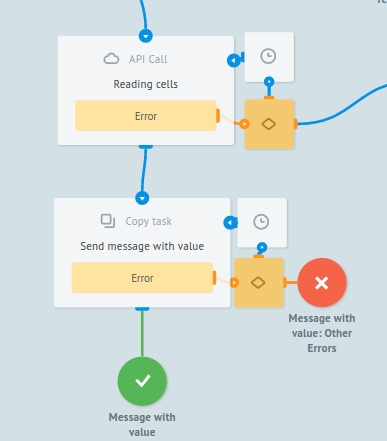

Если была команда `/write` и выбор сделан, записываем значение в указанную ячейку или диапазон и отправляем сообщение об удачной записи. 

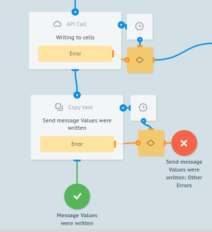

**Процесс Send message**

Отправляет сообщения в Telegram.

Оба процесса **Main** и **GoogleSpreadsheetBot** обращаются к нему через [Логику Copy task](https://doc.corezoid.com/ru/interface/nodes/copy.html).

## Тестирование и запуск

Просто добавьте своего Бота в Telegram и начните чат.

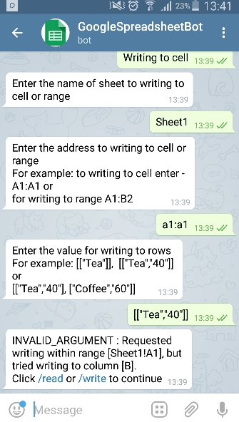

Перейдите в режим `View` или `Debug`,чтобы увидеть поток заявок, их прохождение и распределение по узлам процесса.

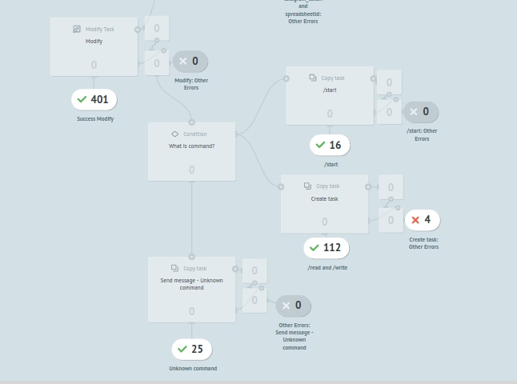

