# OrderFoodBot

**OrderFoodBot** в **Telegram** позволяет заказывать еду онлайн и просмотривать статистику по заказам в режиме реального времени.

Клонируйте  [папку c процессами "Telegram_OrderFoodBot"](https://admin.corezoid.com/folder/conv/5837).

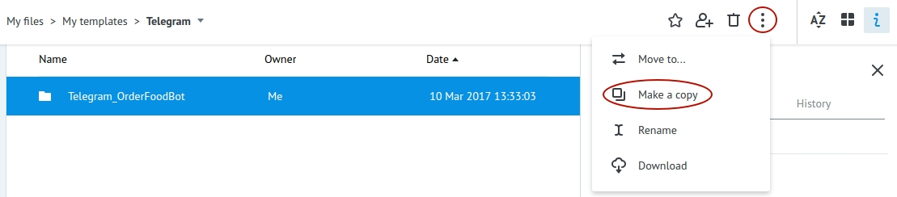

Подключите **Main** (главный) процесс к Telegram, указав ключ Вашего Бота:

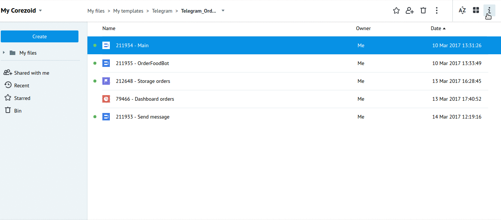

Для получения ключа Бота нужно отправить команду `/newbot` в чат с **BotFather**. Далее указать имя и имя пользователя Бота. Вы получите:

Необходимо указать ключ Вашего Бота  - **telegram_token** в процессе **Main** в узле `Set tokens`.

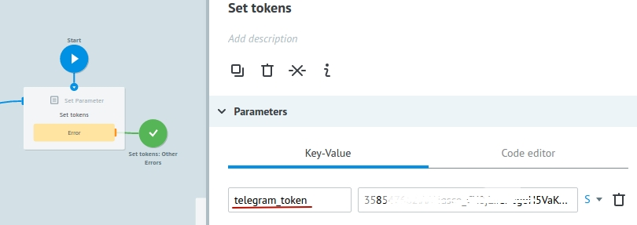

## Описание процессов

**Процесс Main**

Получает все сообщения, поступающие в чат Бота и первым шагом пытается обновить заявку в процессе **OrderFoodBot**.

Обновить заявку в процессе **OrderFoodBot** = продолжить чат с пользователем в рамках уникального id чата.

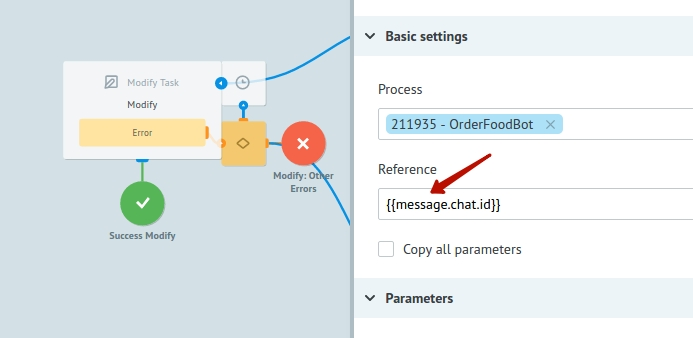

Это становится возможным благодаря созданию новой заявки в процессе **OrderFoodBot**, когда пользователь отправляет команду `/food` или нажатием кнопок `Start again`, `Continue to order`.

Данная заявка создается с референсом равным id чата (`{{message.chat.id}}`).

Если при обновлении заявки по id чата таковая не была найдена, значит у нас еще нет открытого диалога в данном чате - нет заявки в процессе **OrderFoodBot**. 

Тогда проверяем какая команда получена от пользователя:

* если получена команда `/start` - отправляем сообщение с информацией о Боте. 

* если получена команда `/food`, было нажатие на кнопку `Start again` или `Continue to order`- создаем заявку в процессе **OrderFoodBot** (как было описано выше).

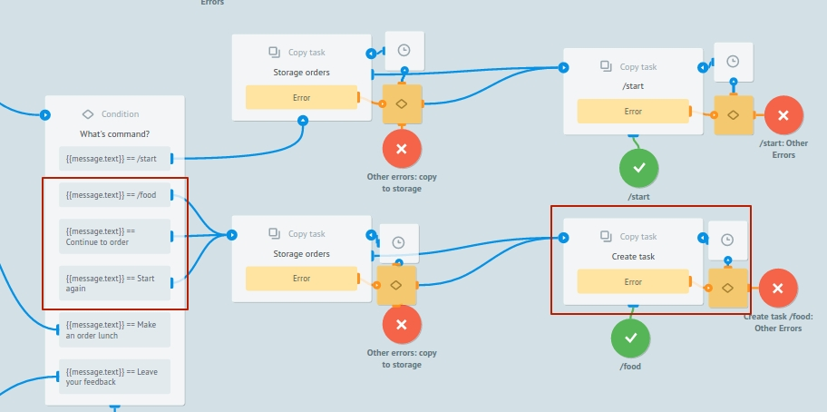

* если же получено что-то отличное от `/start`,`/food`, `Start again`, `Continue to order`, `Make an order lunch`, `Leave your feedback` определяем команду и оповещаем об этом пользователя соответствующим сообщением.

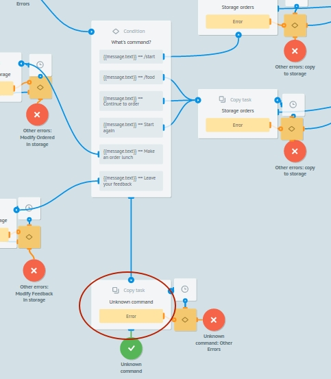

Успешный выбор pizza или sushi и оформленные заказы передает в Диаграмму состояний [**Storage orders**](https://admin.corezoid.com/editor/127302/213150) через [Логику Modify task](https://doc.corezoid.com/ru/interface/nodes/logika_modify_task.html) для получения статистики по заказам.

**Процесс OrderFoodBot**

В этот процесс поступают заявки из **Main** процесса, если пользователь отправил команду `/food`,и первым шагом отправляется сообщение с предложением выбрать еду(пиццу или суши).

Напомним, референсом заявок в этом процессе является уникальный id чата `{{message.chat.id}}`.

Это позволяет получать обновления (новые команды или сообщения от пользователя в чат Бота) из **Main** процесса, когда заявка находится в узле с [Логикой CALLBACK](https://doc.corezoid.com/ru/interface/nodes/callback.html).

Итак, после отправки сообщения с предложением выбрать еду, заявка переходит в ожидание этого выбора.

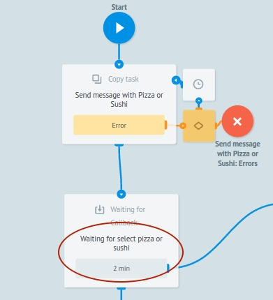

Если через 2 минуты выбор не будет сделан (заявка не обновится из **Main** процесса), то отправим сообщение об истечении времени ожидания.

Если же выбор операции сделан, предлагаем пользователю выбрать вид пиццы или суши.

После каждого предложения пользователю, мы ждем в узлах с CALLBACK и точно так же, если нет соответствующего выбора, отправляем сообщение об истечении времени ожидания.

Если была команда `/food` и выбор еды сделан, отправляем сообщение с предложением сделать заказ, начать заново, продолжить заказывать или оставить отзыв. 

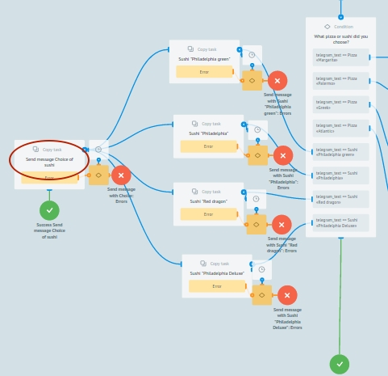

**Процесс Send message**

Отправляет сообщения и фотографии в Telegram.

Оба процесса **Main** и **OrderFoodBot** обращаются к нему через [Логику Copy task](https://doc.corezoid.com/ru/interface/nodes/copy.html).

**Диаграмма состояний** [**Storage orders**](https://admin.corezoid.com/editor/127302/213150)

Хранение и распределение заказов по состояниям:

* заказ выполнен -"ordered pizza","ordered sushi"
* ожидающие 2 мин подтверждения заказа - "waiting for ordering pizza","waiting for ordering sushi"
* заказ не был оформлен - "Pizza wasn't ordered for 2 min", "Sushi wasn't ordered for 2 min"
* получен отзыв от клиента - "feedback received"

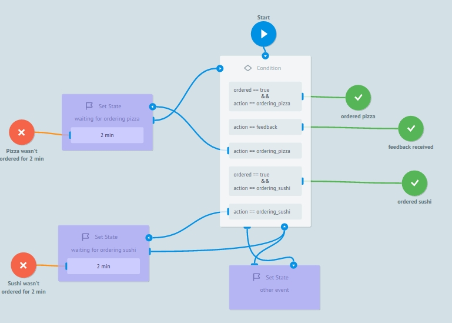

## Тестирование и запуск

Просто добавьте своего Бота в Telegram и начните чат с команды `/start`.

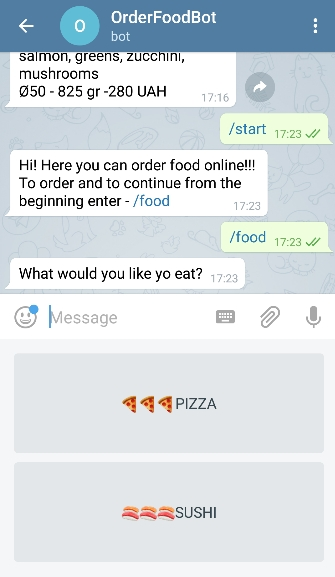

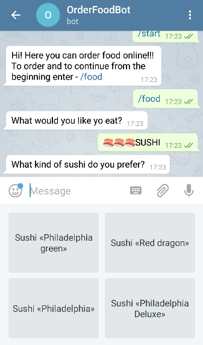

После выбора еды, Вам будет предложено Оформить заказ либо Продолжить заказ либо Начать оформление заказа сначала, а также Оставить отзыв:

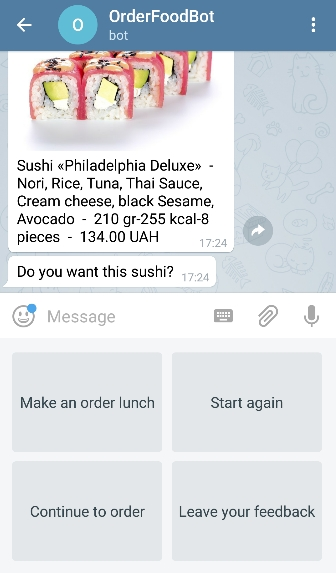

Перейдите в режим `View` процесса [**Main**](https://admin.corezoid.com/editor/127302/213149) или диаграмме состояний [**Storage orders**](https://admin.corezoid.com/editor/127302/213150),чтобы увидеть поток заявок, их прохождение и распределение по узлам процесса.

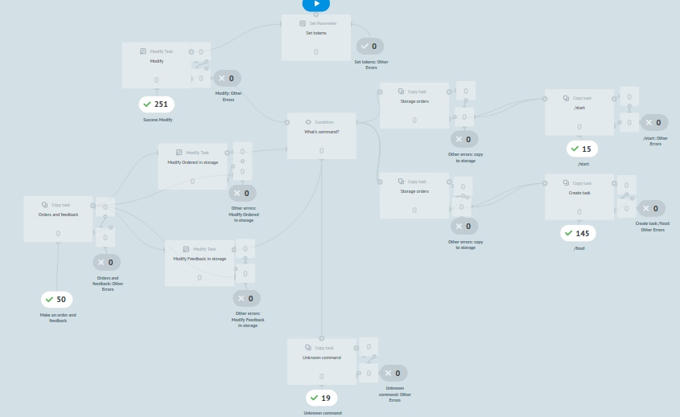

Перейдите в дашборд [**Dashboard orders**](https://www.corezoid.com/admin/view_dash/79533/127302) для просмотра статистики по заказам в режиме реального времени:

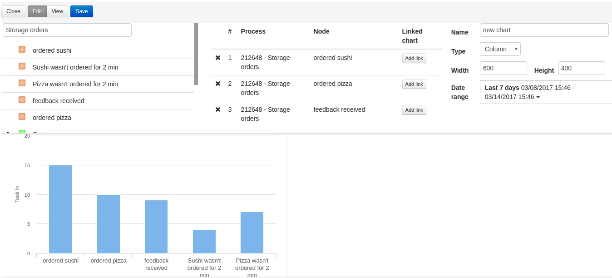

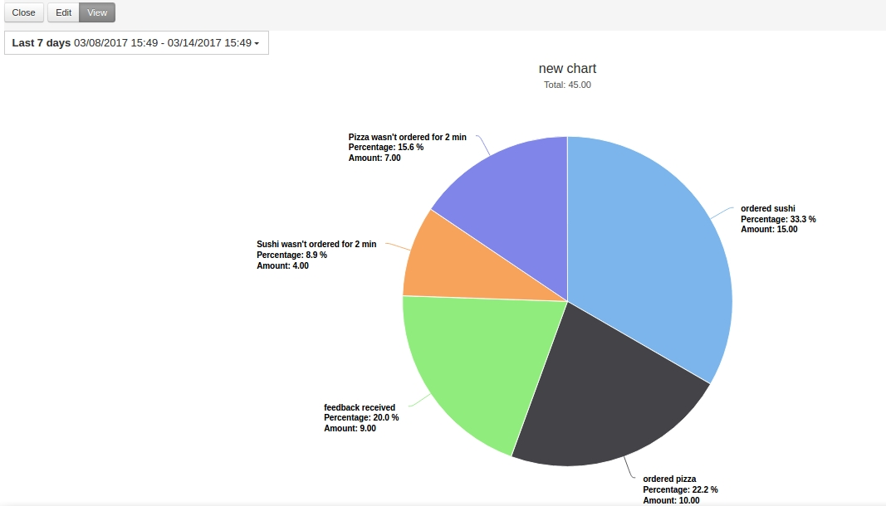
