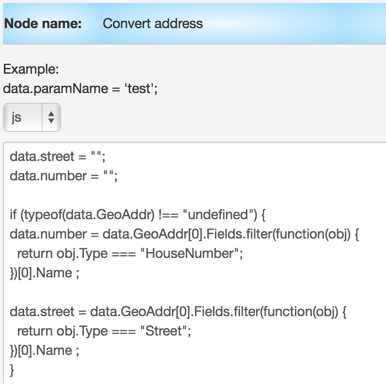

# taxiBot - шаблон процесса заказа такси

1.   Копирование бота в своей аккаунт
2.   Требования к API такси
    *   API Calculate the cost of travel & API Order
    *   API Cancellations
    *   API Current order status
3.  Ключ к API Яндекс SpeechKit Cloud
4.  Описание процесса "Geocoding service by Google"

Схема взаимодействия процессов


## Копирование бота в своей аккаунт

Шаблон бота доступен в папке ["Examples" / "Telegram" / "Telegram - TaxiBot"](https://admin.corezoid.com/folder/conv/5837).

Достаточно скопировать папку "Telegram - TaxiBot"


Выбрать процесс с именем "TaxiBot - MAIN" и подключить к Telegram указав ключ Вашего бота


Этого достаточно, чтобы сообщения из Telegram начали поступать в Corezoid.

Проверить их получение и обработку можно через dashboard:


Выбираем стартовый узел:


И наблюдаем онлайн за поступлением сообщений:


##Требования к API такси
Мапинг параметров производится через логику “Reply RPC”, в которой указывается какой параметр должен возвращаться и значение какого параметра необходимо подставлять из заявки.

Обратите внимание на параметр “Throw exception”, который генерирует ошибку из процесса и выводит в отдельную ветку обработки ошибок.

###API Calculate the cost of travel & API Order
Расчет стоимости поездки и заказ машины

Входящие параметры:
*   **cityCode** - Код города
*   **route** - массив объектов с указанием маршрута поездки. Структура объекта
    *   name* - улица
    *   number* - номер дома
    *   lng - долгота
    *   lat - широта

Знаком * отмечены обязательные параметры

Пример route
```
   "route":[
      {
         "name":"Улица Ленина",
         "number":"1"
      },
      {
         "name":"Улица Победы",
         "number":"2"
      }
   ]
```

Исходящие параметры в случае ошибки:
*   **code** - код ответа:
    *   01 - Ошибка при вызове API
    *   02 - Ошибка получения стоимости заказа

Исходящие параметры в случае успеха:
*   **currency** - валюта
*   **cost** - стоимость заказа
*   **uid** - ID заказа

###API Cancellations - отмена заказа


Входящие параметры:
*   **uid** - ID заказа
*   **cityCode** - Код города

Исходящие параметры:
*   **code** - код ответа:
    *   0 - Заказ не удалось отменить
    *   1 - Заказ отменен
    *   2 - Требует подтверждение клиентом отмены в диспетчерскую.

###API Current order status - статус заказа
Входящие параметры:
*   **uid** - ID заказа
*   **cityCode** - Код города

Исходящие параметры в случае ошибки:
*   **code** - код ответа:
    *   01 - Ошибка при вызове API
    *   02 - Ошибка получения статуса по uid

Исходящие параметры в случае успеха:
*   **driver_phone** - телефон водителя
*   **order_car_info** - информация о автомобиле
*   **required_time** - время подачи автомобиля

##Ключ к API Яндекс SpeechKit Cloud

В узле “API Yandex SpeechKit Cloud” укажите ключ доступа к API


Входящие параметры:
*   **text** - Текст введенный пользователем

Трансформация объекта от API Яндекс в поля street и number производится в узле “Convert address” с помощью логики CODE (JavaScript)



Исходящие параметры в случае ошибки:
*   **text** - текст ошибки
*   **code** - код ответа:
    *   01 - Ошибка при вызове API
    *   02 - Ошибка преобразования адреса

Исходящие параметры в случае успеха:
*   **route_point** - объект вида ```{ "name":"Улица Ленина", "number":"1" }```

##Описание процесса "Geocoding service by Google"

Получение адреса по заданным координатам (широте, долготе).

В узле "Get street and ID City" в значение массива `cityArray` добавьте перечень городов, где будет работать заказ.


Входящие параметры:
*   **location** - объект, содержащий координаты, по которым нужно получить адрес: ```{ "latitude":"48.410530", "longitude":"35.086102" }``
*   **key** - ключ бота Telegram
*   **chat_id** - id чата Telegram

Исходящие параметры в случае успеха:

* **city** - город
* **cityCode** - код города
* **route_point** - объект вида ```{ "name":"Улица Ленина", "number":"1" }```

Исходящие параметры в случае ошибки:
*   **text** - текст ошибки
*   **code** - код ответа:
    *   01 - Ошибка при вызове API
    *   02 - Ошибка преобразования адреса
    *   03 - Город не обслуживается

Все возникающие вопросы Вы можете задавать через [форму обратной связи](https://www.corezoid.com/ru/about#hcontact) или отправлять на email `support@corezoid.com`
