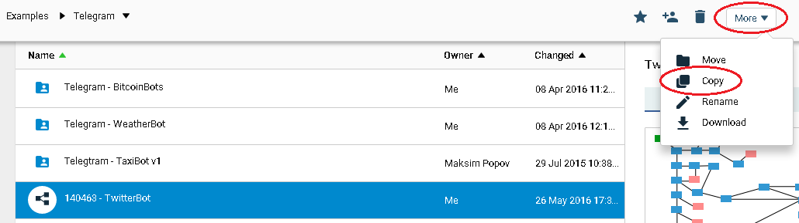
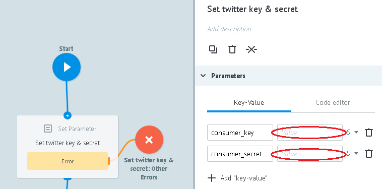
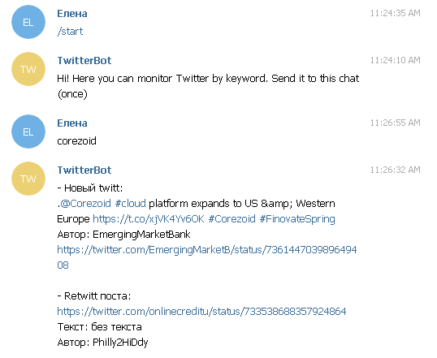
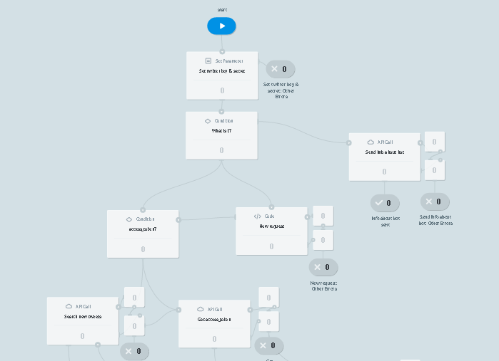

# TwitterBot

Клонируйте [шаблон "TwitterBot"](https://admin.corezoid.com/folder/conv/5837)

Подключите к Telegram, указав ключ Вашего Бота

Для получения ключа Бота нужно отправить команду `/newbot` в чат с @BotFather. Далее указать имя и имя пользователя Бота. Вы получите:

##Интеграция с Twitter

Создайте приложение Twitter на сайте [https://apps.twitter.com](https://apps.twitter.com)

После создания Вы получите ключ (`consumer_key`) и пароль (`consumer_secret`) Вашего приложения.

В узле `Set twitter key & secret` установите полученные значения `consumer_key` и `consumer_secret`.

##Что делает TwitterBot

- По команде `/start` отправляет в чат приветственное сообщение

- Принимает поисковой запрос, который нужно мониторить в Twitter и отправляет в чат все найденные твитты и ретвитты на момент запроса.

- Далее один раз в сутки ищет новые и отправляет их список в чат, если таковые найдены.

##Тестирование и запуск

Просто добавьте своего Бота в Telegram и начните чат.

Перейдите в режим `View` или `Debug`,

чтобы увидеть поток заявок, их прохождение и распределение по узлам процесса.

