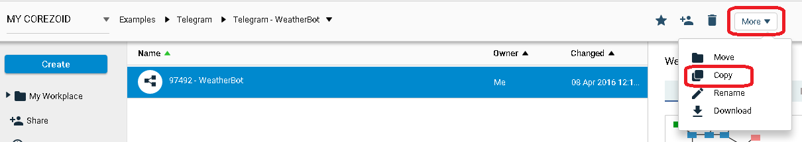
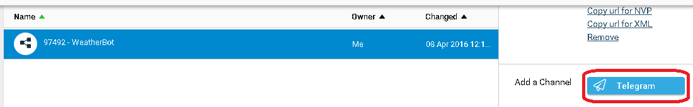
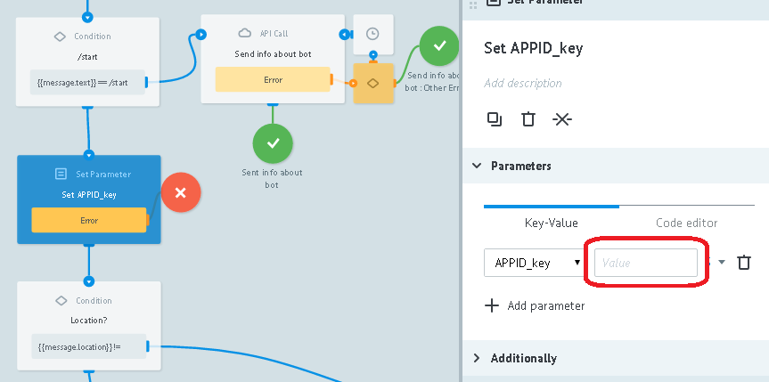
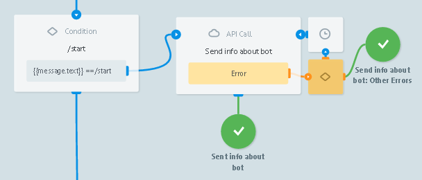
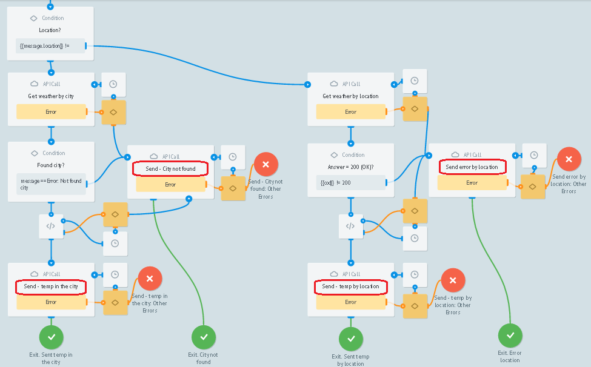
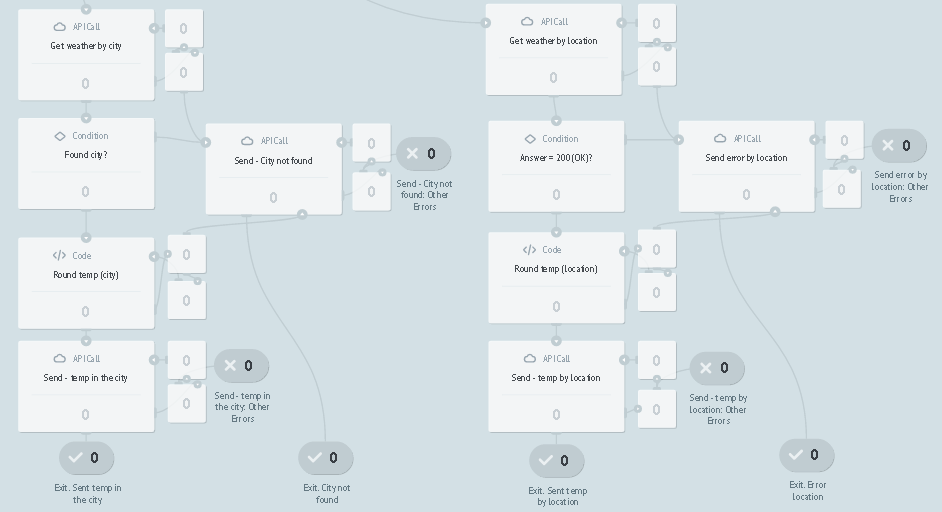

# WeatherBot

Клонируйте [шаблон "WeatherBot"](https://admin.corezoid.com/folder/conv/59753)

Подключите к Telegram, указав ключ Вашего Бота

Для получения ключа Бота нужно отправить команду `/newbot` в чат с @BotFather. Далее указать имя и имя пользователя Бота. Вы получите:

##Интеграция с OpenWeatherMap

Для удобства пользователей в [шаблон WeatherBot](https://admin.corezoid.com/folder/conv/59753) добавлен тестовый ключ доступа к API OpenWeatherMap.

Чтобы получить свой ключ доступа к API OpenWeatherMap перейдите по [ссылке](http://openweathermap.org/register) и зарегистрируйтесь.

В узле `Set APPID_key` замените тестовый ключ на полученный Вами в значении параметра `APPID_key`.

##Что делает WeatherBot

По команде `/start` в чат отправляет сообщение с информацией о Боте

Принимает название города или координаты пользователя, получает по ним температуру воздуха и отправляет сообщение.

В случае, если город или координаты указаны некорректно, а также если в процессе возникла ошибка, отправляет соответствующее сообщение.

##Тестирование и запуск

Просто добавьте своего Бота в Telegram и начните чат.

Перейдите в режим `View` или `Debug`,

чтобы увидеть поток заявок, их прохождение и распределение по узлам процесса.

