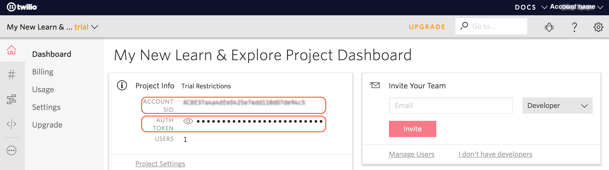
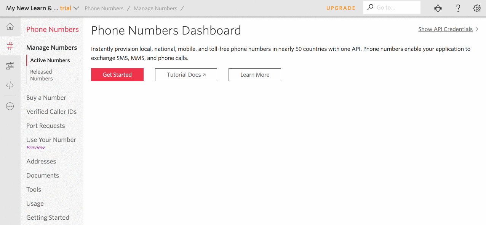

# Twilio

Зарегистрируйтесь на [Twilio](https://www.twilio.com/) и создайте новый проект.

Для использования API Twilio нужны **AccountSid** и **AuthToken**. Они отображаются в Dashboard в блоке **Project Info**:

Получите свой twilio номер:

