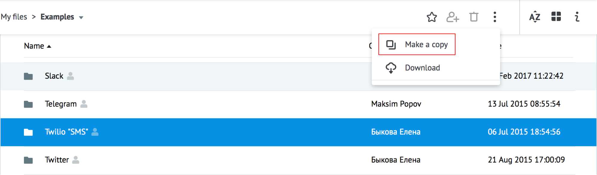
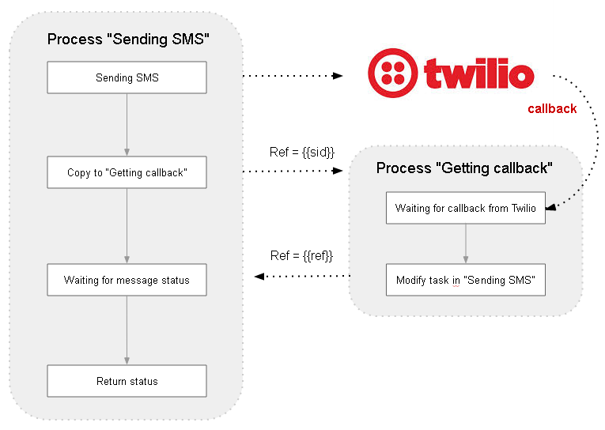
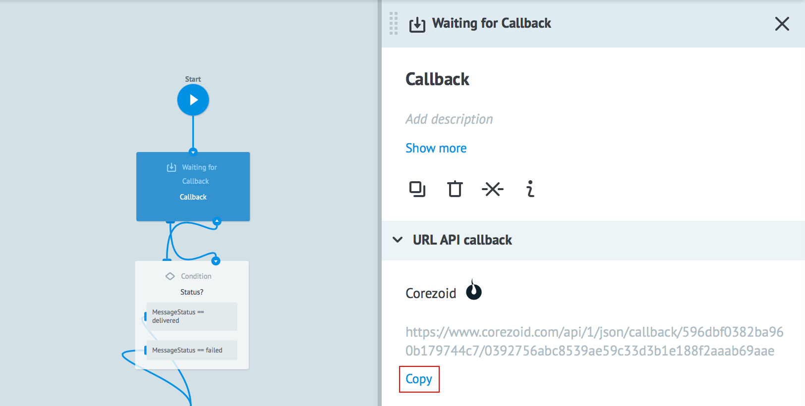
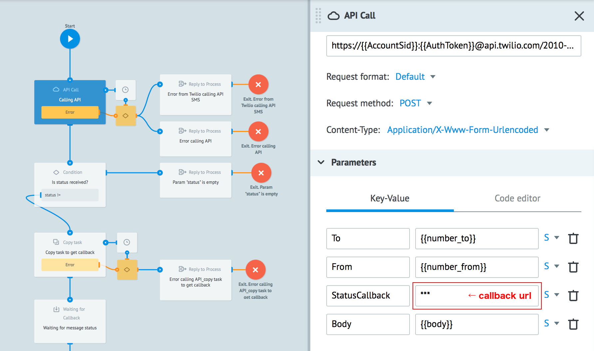
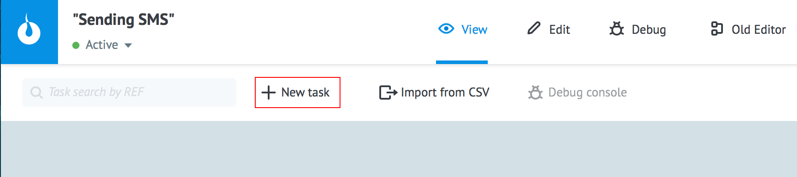
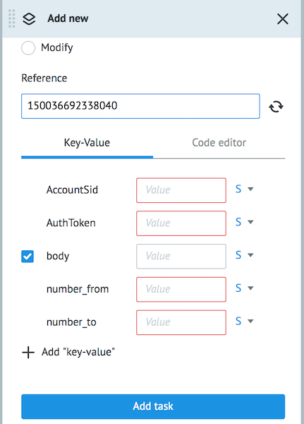

# SMS

Скопируйте [папку Twilio "SMS"](https://admin.corezoid.com/folder/conv/1833) в свое окружение.

В папке размещены два процесса:

1. **"Sending SMS"** - для отправки SMS через API Twilio

2. **"Getting callback"** - для получения callback по статусам отправленного SMS

## Как это работает

Первый процесс отправляет SMS и копирует заявку с новым референсом `{{sid}}` (id сообщения) во второй процесс для получения callback.

Второй процесс принимает callback от Twilio и обновляет заявку в первом, добавляя статус сообщения.

Для SMS через API Twilio и получения callback выполните следующие действия в своих клонированных процессах:

1) В процессе **"Getting callback"** получите callback url.

В режиме редактирования логики `Waiting for Callback` нажмите на кнопку **Copy** и url будет скопирован в буфер обмена.

2) В процессе **"Sending SMS"** нажмите на узел "Calling API". В панели настройки логики `API Call` добавьте полученный callback url в значение параметра `StatusCallback`

> **ВАЖНО:**
> В полученном url нужно заменить слово **"callback"** на **"plugins/twilio"**

Например, получен callback url -
https://corezoid.com/api/1/json/callback/559a817f4b8ff96bf5000b/cb9f670f5c223ec42e1

В значение параметра `StatusCallback` добавляем -
https://corezoid.com/api/1/json/plugins/twilio/CONV_ID/559a817f4b8ff96bf5000b/cb9f670f5c223ec42e1

где `CONV_ID - id процесса, которому принадлежит хеш.

Нажмите **Deploy**, чтобы изменения вступили в силу.

Для отправки SMS через API Twilio перейдите в режим **View** процесса **"Sending SMS"**.

Нажмите кнопку **+ New task** - добавить заявку.

В появившемся окне укажите:
*   `AuthToken` - Ваш AuthToken
*   `AccountSid` - Ваш AccountSid
*   `number_to` - номер телефона получателя с "+" и кодом страны
*   `number_from` - Ваш номер телефона Twilio
*   `body` - текст сообщения (до 1600 символов)

и нажмите **Add task** для отправки заявки.

Результатом будет прохождение заявки по процессу и переход в одно из конечных состояний (узел красного или зеленого цвета).
Процесс подготовлен к использованию из других процессов через логику [`Call Process`](https://doc.corezoid.com/ru/interface/nodes/rpc/logic_rpc.html).

В случае успеха в заявку будут добавлен параметры:

* `status` - статус сообщения
* `sid` - уникальный идентификатор сообщения

В случае, если API Twilio вернет ошибку, заявка уйдет в узел эскалации и будут добавлены следующие параметры:

* `code` - [код ошибки Twilio](https://www.twilio.com/docs/api/rest/message)
* `message` - текст ошибки Twilio
* `url_more_info` - ссылка на сайт Twilio, где подробно описана причина ошибки

В случае ошибки вызова API Twilio, заявка уйдет в узел эскалации и будут добавлены следующие параметры:

* `code` - код ошибки
* `message` - текст ошибки

**Полезые ссылки Twilio:**
* [Описание](https://www.twilio.com/docs/api/rest/sending-messages) входящих параметров API Twilio "Sending SMS"
