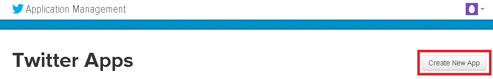
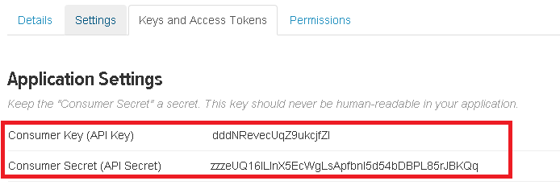
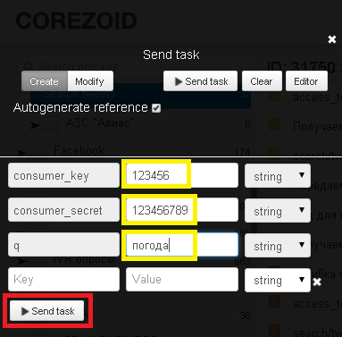

# Поиск и регулярный мониторинг твиттов

Создайте приложение Twitter на сайте [https://apps.twitter.com](https://apps.twitter.com)

После создания Вы получите ключ (`consumer_key`) и пароль (`consumer_secret`) Вашего приложения.

**Для поиска твиттов клонируйте [шаблон процесса "Search tweets"](https://www.corezoid.com/admin/edit_conv/31750/8494).**

## Описание входящих параметров процесса

* **consumer_key** - consumer_key приложения
* **consumer_secret** - consumer_secret приложения
* **q** - поисковой запрос

## Запуск процесса

**1)** Перейдите в режим `dashboard` и нажмите кнопку `Add task` - добавить заявку.

**2)** В появившемся окне укажите обязательные параметры:
*   consumer_key
*   consumer_secret
*   q

**3)** После того как все параметры указаны, нажмите кнопку `Send task`.

## Что нужно знать о процессе

**1)** Ключ авторизации Twitter ("access_token") не имеет срока действия.

Он действителен пока пользователь или администартор не удалит приложение или его ключи. Поэтому этот параметр в процессе получается при отправке первой заявки или в случае ошибки вызова API поиска, свзанной с устаревшим значением "access_token".

**2)** В узле процесса `"Получаем параметр "tweets"` добавлена Логика CODE, с помощью которой получаем новый параметр **"tweets"** - список искомых твиттов и имена их авторов.

 `"tweets": " - Погода в Киеве
(автор: Anatoliy) - Погода в Днепропетрвске
(автор: Филипп Полтавский)"`

Вы можете использовать параметр **"tweets"** для отпарвки сообщений с результатами поиска.

Сообщения можно отправлять через доступные шаблоны, используя [Логику PRC](../../interface/nodes/rpc/README.md):

- **SMS**: [Twilio](../twilio/sms.md), [MessageBird](../sms/messagebird.md), [UniSender](../email/send_sms_unisender.md)
- **Email**: [Mandrill](../email/mandrill_v2.md), [UniSender](../email/send_email_unisender.md)
- **Сообщение в [Telegram](../telegram/README.md)**

**3)** В случае ошибки получения "access_token" заявка перейдет в узел `"Ошибка получения access_token. Эскалация"`

В этом узле Вы также можете настроить эскалацию используя доступные шаблоны для отправки сообщений.

**4)** После вызова API поиска твиттов и отправки сообщения (если получен список новых твиттов) заявка переходит в узел `"Ждем 1 день перед повторным запросом"`.

Спустя сутки она попадет в узел `"Передаем заявку на вход"`, где с помощью [Логики COPY ](../../interface/nodes/copy.md) скопирует саму себя в этот же процесс и перейдет в конечный узел "Выход".

Такая логика позволяет мониторить твитты с периодичностью "раз в сутки".

