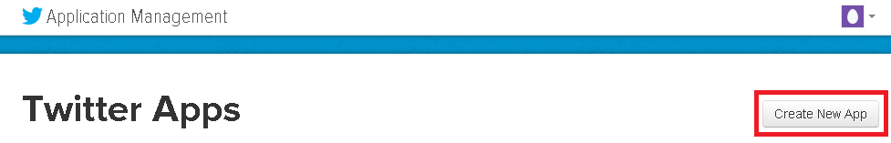
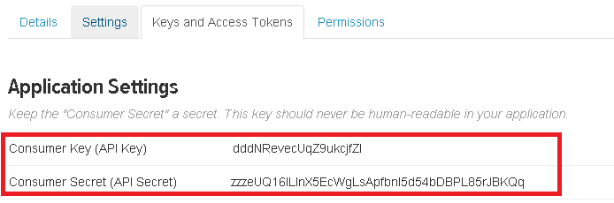
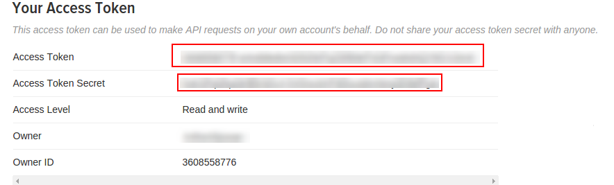
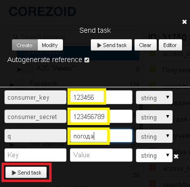
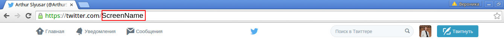
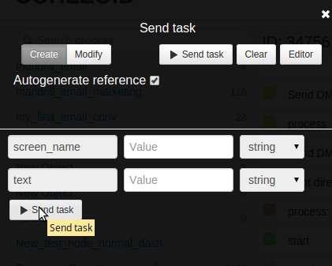
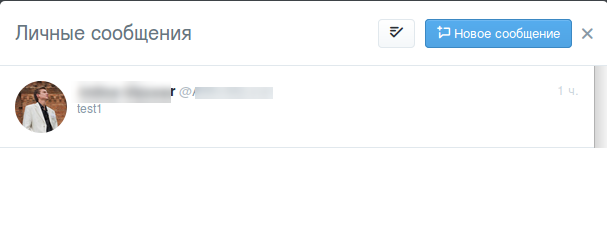
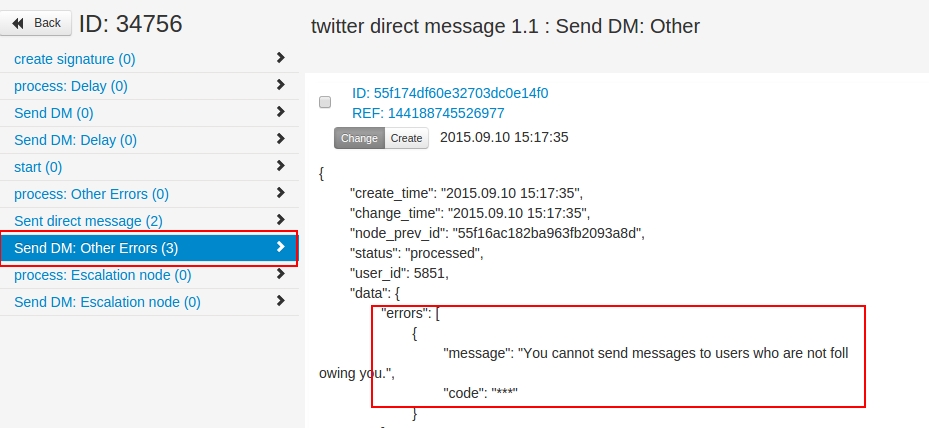

# Отправка личного сообщения подписчику в twitter

##[Шаблон в Corezoid](https://www.corezoid.com/admin/edit_conv/34756/8494)

Создайте приложение Twitter на сайте [https://apps.twitter.com](https://apps.twitter.com)

После создания Вы получите ключ (`consumer_key`) и пароль (`consumer_secret`) Вашего приложения.

Для отправки сообщения одному подписчику Вам необходимо использовать Acces Token и Acces Token Secret.

Получить ключи можно на вкладке Keys and Accesss Tokens.

## Тестирование процесса.

**1)** Клонyируйте [процесс отправки прямых сообщений в twitter](https://www.corezoid.com/admin/edit_conv/34756/8494).

**2)** Перейдите в процесс и выберите узел  create signature.

В логике code укажите Ваши параметры подписи.

* **ver consumerSecret** = это Ваш Consumer Secret (API Secret)
* **var tokenSecret** = это Ваш Access Token Secret
* **var oauth_consumer_key** = это Ваш Consumer Key (API Key)
* **var oauth_token** = это Ваш Access Token

После ввода данных, нажмите **“Save”**

**3)** Перейдите в режим dashboard

нажмите кнопку **Add task**, чтобы добавить заявку.

В появившемся окне укажите обязательные параметры:

* **screen_name** - это имя получателя Вашего сообщения;

(**Внимания!** получать личные сообщения от Вас могут только Ваши читатели.)

* **text**- текст сообщения для Вашего получателя;

После того как все поля будут указаны, нажмите на кнопку **Send task.**

В случае если все поля заполнены корректно, Ваш подписчик получит личное сообщение:

Если параметры или данные указаны не верно. Вы получите сообщение об ошибке в узле Send DM other Errors:

