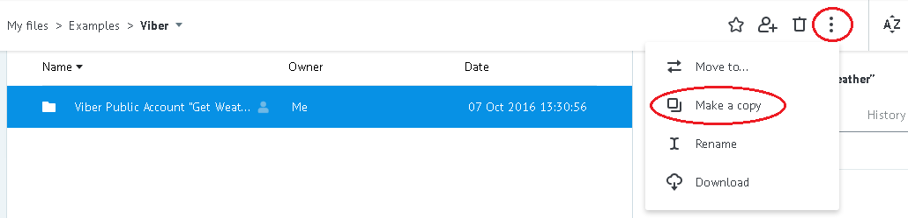
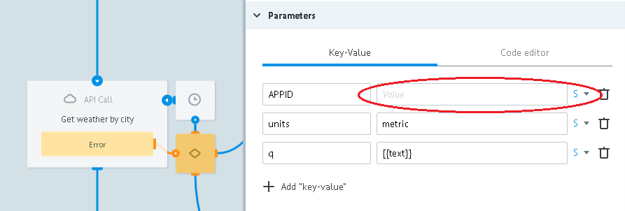
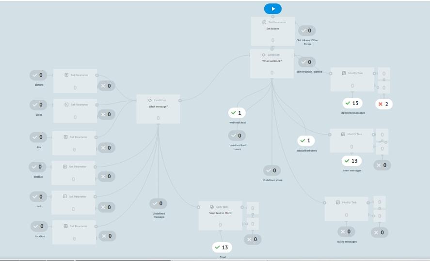

# Public Account "Get Weather"

Клонируйте [папку "Viber Public Account "Get Weather""](https://admin.corezoid.com/folder/conv/109250) в свое окружение

##Описание процессов

[**Resiver**](https://admin.corezoid.com/editor/106544/161790)

Получает вебхуки от Viber Public Account и распределяет их в зависимости от полученного значения параметра `"event"`

`"event": "message"` делит на типы: picture, video, file, contact, url, location, text.

Полученные сообщения с типом `text` передает в [**Main logic**]().

[**Main logic**](https://www.corezoid.com/admin/edit_conv/164960/106544)

Управляет логикой отправки сообщений.

Запрашивает погоду, шлет полученную температуру воздуха или сообщение о том, что город не определен.

[**Send message**](https://admin.corezoid.com/editor/106544/164958)

По токену Viber Public Account получает данные аккаунта (имя и линк на аватар) для отправки сообщений.

Отправляет сообщения, распределяет по статусам отправки.

Успешные запросы передает в [Message statuses](https://admin.corezoid.com/editor/106544/164967) для получения конечного статуса сообщений.

[**Message statuses**](https://admin.corezoid.com/editor/106544/164967)

Распределяет успешные запросы по состояниям:

"Отправлено", "Доставлено", "Просмотрено", "Не доставлено 14 дней", "Не просмотрено 14 дней", "failed - не доставлено Viber".

##Подготовка

####Webhook

Подключите [**Resiver**](https://admin.corezoid.com/editor/106544/161790) к Viber Webhook:

* перейдите на вкладку `Webhook`
* нажмите на `Connect to messenger`
* выберите `Viber`
* нажмите на кнопку `"Set Webhook"` и укажите токен Вашего Public Account

####Welcome message

В случае необходимости, установите приветственное сообщение для Вашего Public Account:

* после выбора `Viber` нажмите на кнопку `"Set Welcome message"`
* выберите тип приветственного сообщения - текст или картинка с текстом
* заполните нужные поля

Приветственное сообщение отправляется в ответ на полученный webhook, содержащий `"event": "conversation_started"`.

Это событие сигнализирует о том, что пользователь перешел в чат с Вашим Public Account первый раз (т.е. история отсутствует) или когда чат открыт через deep link.

`"conversation_started"` не считается подпиской и не позволяет Public Account отправлять сообщения пользователям.

Но разрешает отправить одно приветственное.

##Интеграция с OpenWeatherMap

Для удобства пользователей в [Main logic](https://www.corezoid.com/admin/edit_conv/164960/106544) добавлен тестовый ключ доступа к API OpenWeatherMap.

Чтобы получить свой ключ доступа к API OpenWeatherMap перейдите по [ссылке](http://openweathermap.org/register) и зарегистрируйтесь.

В узле `Get weather by city` замените тестовый ключ на полученный Вами в значении параметра `APPID`.

##Тестирование и запуск

Просто добавьте нужный Public Account и начните диалог.

Перейдите в режим `View`[**Resiver**](https://admin.corezoid.com/editor/106544/161790) или [**Main logic**](https://www.corezoid.com/admin/edit_conv/164960/106544), чтобы увидеть поток заявок, их прохождение и распределение по узлам процесса.

