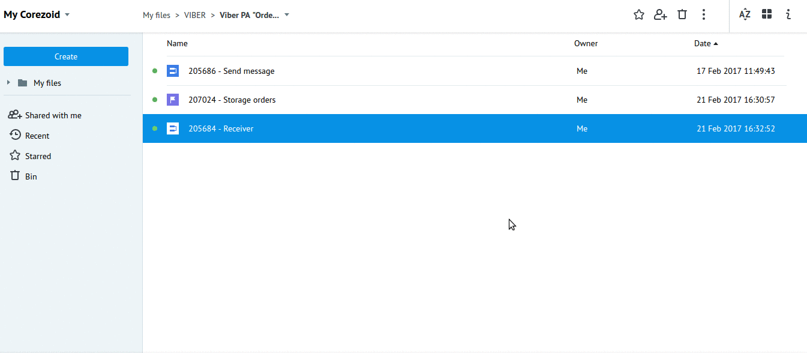

# Public Account "Order Lunch"

Клонируйте [папку "Viber PA "Order Lunch"](https://admin.corezoid.com/folder/conv/124601) в свое окружение

##Создание Public Account в Viber

1. Создайте Ваш **Public Account** в Viber, подробнее описано [здесь](https://www.viber.com/ru/public-accounts).

2. Получите Ваш `Public Account authentication token`. Это уникальный идентификатор, используемый для проверки вашего **Public Account**  во всех запросах к API. 

После того, как Public Account будет создан ваш **Account authentication token**  появится в настройках аккаунта **"Изменить информацию"**. 

В процессе [**Receiver**](https://admin.corezoid.com/editor/124601/207907) в узле `Set viber_token` замените тестовый ключ на полученный Вами в значении параметра `viber_token`:

##Подготовка

####Webhook

Подключите [**Receiver**](https://admin.corezoid.com/editor/124601/207907) к Viber Webhook:

* перейдите на вкладку `Webhook`
* нажмите на `Connect to messenger`
* выберите `Viber`
* нажмите на кнопку `"Set Webhook"` и укажите токен Вашего Public Account

####Welcome message

В случае необходимости, установите приветственное сообщение для Вашего Public Account:

* после выбора `Viber` нажмите на кнопку `"Set Welcome message"`
* выберите тип приветственного сообщения - текст или картинка с текстом
* заполните нужные поля

Приветственное сообщение отправляется в ответ на полученный webhook, содержащий `"event": "conversation_started"`.

Это событие сигнализирует о том, что пользователь перешел в чат с Вашим Public Account первый раз (т.е. история отсутствует) или когда чат открыт через deep link.

`"conversation_started"` не считается подпиской и не позволяет Public Account отправлять сообщения пользователям.

Но разрешает отправить одно приветственное.

##Описание процессов

[**Receiver**](https://admin.corezoid.com/editor/124601/207907)

Получает вебхуки от Viber Public Account и распределяет их в зависимости от полученного значения параметра `"event"`

`"event": "message"` делит на типы: picture, video, file, contact, url, location, text.

Полученные сообщения с типом `text` передает в [**Send message**](https://admin.corezoid.com/editor/124601/207908) с помощью [Логики Copy task](https://doc.corezoid.com/ru/interface/nodes/copy.html).

Успешный выбор pizza или sushi и оформленные заказы передает в Диаграмму состояний [**Storage orders**](https://admin.corezoid.com/editor/124601/207906) через [Логику Modify task](https://doc.corezoid.com/ru/interface/nodes/logika_modify_task.html) для получения статистики по заказам.

При получении какой-либо отличной команды от **start** отправляет соответствующее сообщение.

[**Send message**](https://admin.corezoid.com/editor/124601/207908)

По токену Viber Public Account получает данные аккаунта (статус сообщения, имя и линк на аватар) для отправки сообщений.

Отправляет сообщения, распределяет по статусам отправки (`status`).

**Диаграмма состояний** [**Storage orders**](https://admin.corezoid.com/editor/124601/207906)

Хранение и распределение заказов по состояниям:

* заказ выполнен -"ordered pizza","ordered sushi"
* ожидающие 2 мин подтверждения заказа - "waiting for ordering pizza","waiting for ordering sushi"
* заказ не был оформлен - "Pizza wasn't ordered for 2 min", "Sushi wasn't ordered for 2 min"
* получен отзыв от клиента - "feedback received"

##Тестирование и запуск

Просто добавьте нужный Public Account и начните диалог с команды **start**.

Далее Вы выбираете еду:

После выбора еды, Вам будет предложено Оформить заказ либо Продолжить заказ либо Начать оформление заказа сначала, а также Оставить отзыв:

Перейдите в режим `View` в процессе [**Receiver**](https://admin.corezoid.com/editor/124601/207907) или диаграмме состояний [**Storage orders**]((https://admin.corezoid.com/editor/124601/207906), чтобы увидеть поток заявок, их прохождение и распределение по узлам процесса.

  
  
Перейдите в дашборд **Dashboard View orders** для просмотра статистики по заказам в режиме реального времени:
  

  
Метриками для построения данного чарта выбраны конечные узлы из диаграммы состояний **Storage orders**:
  

