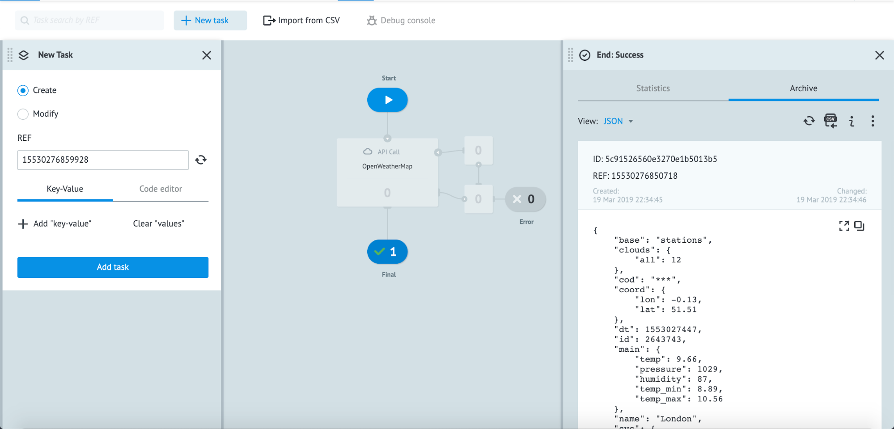
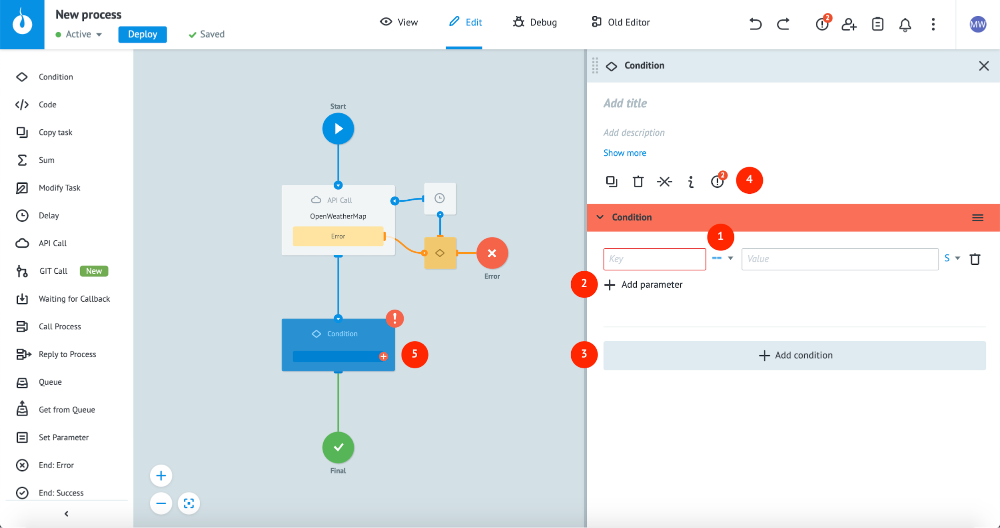
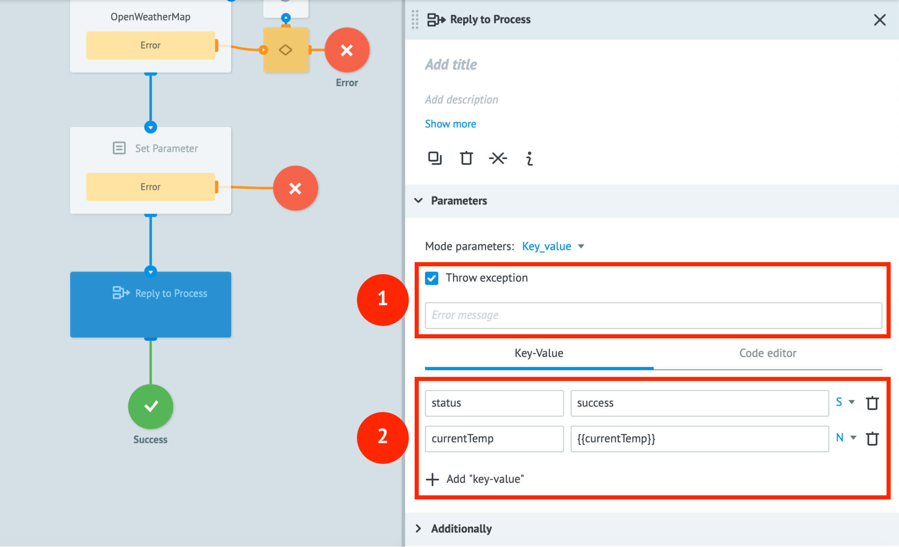
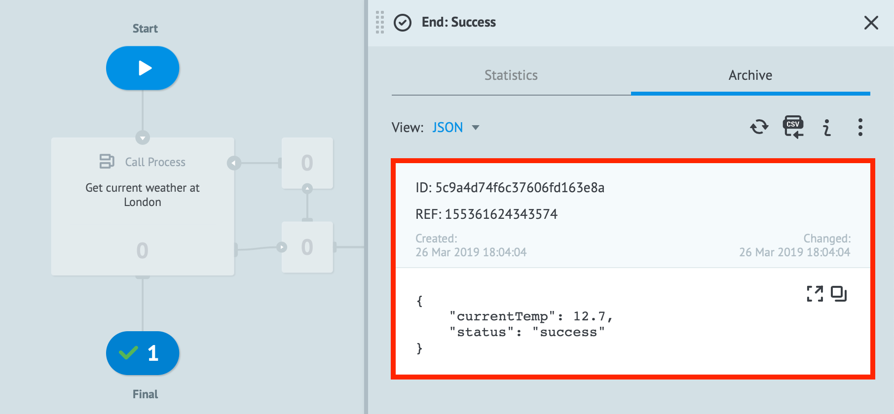

# Быстрый старт

---
  

## Содержание:

1. [Регистрация](#регистрация)
2. [Браузер процессов](#браузер-процессов)
3. [Создание процесса](#создание-процесса)
4. [Работа с логиками API Call, Condition, Set Parameter](#работа-с-узлами-api-call-condition-set-parameter)
6. [Работа с логиками Call Process/Reply to Process](#работа-с-логиками-call-processreply-to-process)
7. [Работа с логиками Copy Task, Waiting for Callback, Modify Task](#работа-с-логиками-copy-task-waiting-for-callback-modify-task)
8. [Работа со State Diagram](#state-diagram)

  

---  

## Регистрация


Для начала работы с Corezoid сперва необходимо [зарегистрироваться](https://admin.corezoid.com/signup).  
  


---

## Браузер процессов

После регистрации вы попадаете в браузер процессов, который состоит из 4 компонентов:


  

1.  **Activity Monitor** - учет вычислительных ресурсов, которые потребляют ваши процессы.
    
2.  **Workspace** - основное рабочее пространство для навигации по процессам.
    
3.  **Users & Groups** - управление доступами процессов. 
    
4.  **Profile** - информация о вашем профиле, активной подписке и истории платежей.
    

---

## Создание процесса


Для создания процесса нажмите в левом верхнем углу кнопку **“Create”** и выберите из выпадающего списка пункт **“Process”**.

 

  
В появившемся окне укажите произвольное название процесса и короткое описание (опционально), которое поможет понять предназначение и функциональность процесса. После этого нажмите кнопку “**OK**”.  
  


Поздравляем! Вы создали свой первый процесс на платформе Corezoid :)


---

##  Редактор процессов


Для того, чтобы разобраться как работает Corezoid, нужно понимать, что каждый процесс состоит из совокупности узлов.

**Узел** - это базовый вычислительный элемент Corezoid, с помощью которого производится обработка информации. Всего Corezoid имеет 15 узлов, каждый из которых отвечает за отдельный тип логики обработки информации. Комбинируя узлы пользователь строит процессы, которые будут обрабатывать входящие и исходящие заявки.

Подробнее о типах узлов можно прочитать [здесь](https://doc.corezoid.com/ru/interface/nodes/).

**Заявка** - это объект с данными, который поступает в процесс для обработки. Заявки могут быть загружены в процесс как из внешних систем, так и из процессов Corezoid.  
  
**По умолчанию каждый новый процесс состоит из 2 узлов:**

-   Синий - стартовый узел, в который поступают все входящие заявки;
-   Зеленый - финальный узел, в который поступают обработанные заявки.
    
Зеленая соединяющая узлы линия показывает направление движения заявки по процессу.

  

  
**Сверху расположено меню управления процессом:**  
  

1.  **View** — режим просмотра исполнения процесса в режиме реального времени;
    
2.  **Edit** — режим редактирования процессов;
    
3.  **Debug** — режим отладки процесса для проверки работоспособности или поиска уязвимостей;
    
4.  **Undo/Redo** <> — кнопки отмены или применения последнего изменения;
    
5.  **Process Errors** — информационное меню об ошибках процесса;
    
6.  **Share** — позволяет подключать пользователей Corezoid к просмотру, загрузке данных и редактированию процессов.
    

  

---

### Режим “Edit”


Изменение процесса производится путем перетягивания узлов из списка узлов (слева) на рабочее полотно процесса либо с помощью нажатия иконки “+”, которая появляется при наведении на соединяющую процессы линию.

Все изменения процесса применяются только после нажатия на кнопку **Deploy**.

Промежуточные изменения автоматически сохраняются каждые 10 секунд. К 20 последним изменениям можно применить кнопки Undo/Redo.

  

---

###  Режим “View”


Для отслеживания работы процесса в режиме реального времени перейдите во вкладку **View**.

При клике на любой узел в режиме **View** у вас появляется боковое меню с 2 вкладками:

1.  **Statistics** - статистика в разрезе количества обработанных заявок за выбранный период времени;
    
2.  **Archive** - это архив заявок, которые находятся сейчас в узле. В этой вкладке вы можете видеть список всех заявок и содержимое этих заявок.  
      


Также в этом режиме вы можете создавать новые заявки и смотреть как они обрабатываются вашим процессом.

---

### Заявки


Заявка - это набор данных, описанных в формате JSON ("ключ":"значение").

Максимальный размер заявки в процессе - **128 kb**.  
  

Пример заявки в процессе:


1.  **ID** - уникальный идентификатор, по которому можно найти и модифицировать заявку в рамках всей системы Corezoid.
    
2.  **Референс заявки (REF)** - уникальный идентификатор, по которому можно найти и модифицировать заявку в рамках одного процесса.
    
3.  **Created** - дата и время создания заявки.
    
4.  **Changed** - дата и время изменения заявки.
    
5.  **JSON объект**, содержащий описание параметров заявки.
    
---

###  Создание новой заявки вручную


**Рассмотрим процесс создания новой заявки на примере скриншота, где:**  
  

1.  **“+ New task”** - кнопка создания новой заявки. После клика на эту кнопку открывается боковое меню с параметрами создания новой заявки.
    
2.  Режимы создания новой заявки: **create** - создание новой уникальной заявки, которой еще нет в процессе, **modify** - изменение существующей в процессе заявки по REF.
    
3.  **“Key-Value”** - вкладка для описания данных заявки в формате “key-value” (JSON).
    
4.  **“Code editor”** - эта вкладка позволяет редактировать эти же параметры, но в формате текстового редактора кода.
    
5.  Выбор типа данных добавленного параметра (ниже подробнее описаны доступные типы данных).
    
6.  Кнопка удаления параметра.
    
7.  **+ Add parameter** - добавления нового параметра.
    
8.  **Add task** - добавления новой заявки в процесс.
 

**Типы данных:**
 
1.  **String** - текст. Пример: Иванов Иван Петрович.
    
2.  **Number** - число. Пример: 13, 0.4, 32.
    
3.  **Boolean** - логическое значение, могут иметь лишь одно из двух состояний — «истина» или «ложь». Пример: true, false.
    
4.  **Array** - массив данных. Пример: [“Антон”, “Денис”, 941, {“key”: “value”}, ...].
    
5.  **Object** - объект данных в формате JSON. Пример: {“objectName”: “objectValue”}.
    


При движении заявки из стартового узла в финальный, счетчик в финальном узле увеличивается на 1. Это означает, что заявка успешно прошла путь от создания до отработки в процессе.

Для того, чтобы просмотреть отработанную заявку, кликните на финальный узел. В появившемся окне вы увидите все отработанные заявки и их содержание.

---

### Режим “Debug”


Для тестирования процесса в режиме реального времени перейдите в режим Debug.  
  


Перед Вами открылся интерфейс тестирования. В этом режиме вы можете работать как с заявками, которые уже поступают в процесс из внешних систем, так и эмулировать создание новых заявок аналогично режиму “View”.

Если заявка попала в узел с красным крестиком, то кликнув на него Вы увидите текст ошибки, который позволит разобраться из-за чего заявка так повела себя.  

**Совет:**
Рекомендуем после каждого изменения процесса “прогонять” через процесс новую тестовую заявку, чтобы проверить корректность работы процесса. Это позволит избежать сбоев при “боевом” запуске процесса.

---  

## Работа с узлами: API Call, Condition, Set Parameter


У Вас уже есть готовый процесс, который состоит из стартового и финального узла. Давайте теперь добавим в него новый узел с логикой API Call.

Для добавления нового узла наведите на линию, которая соединяет стартовый и финальный узлы, нажмите иконку “+” и в появившемся списке выберите логику **API Call**.


---

### API Call


Логика API Call позволяет вызывать API в форматах: JSON, XML, SOAP.
При добавления логики API Call у вас появляется 4 узла: узел API Call + 3 узла, которые отвечают за обработку ошибок, возникающих при вызове API.
  


Теперь давайте настроим параметры вызова API. Для этого кликните на узел **API Call** и в появившемся боковом меню вы увидите параметры вызова API:


1.  **Add title** - поле для ввода названия узла. Мы настоятельно рекомендуем добавлять название всем узлам, чтобы пользователи могли без труда “прочитать” процесс и понимать, что в нем происходит без необходимости заходить в каждый узел и смотреть для чего используется та или иная логика. 
      
2.  **Add description** - поле для ввода описания узла. Если узел выполняет базовую логику, которая понятна из названия, то можно пренебречь этим полем. В противном случае, рекомендуем добавлять описание. 
      
3.  **URL** - ссылка для вызова API.
      
4.  **Request format** - формат запроса. Бывает 2 типов: *Default* - стандартный HTTP-вызов API; *Corezoid* - запрос к внутреннему [API Сorezoid](https://doc.corezoid.com/ru/interface/nodes/api/corezoid.html) (продвинутое использование Corezoid).  
      
5.  **Методы вызова API** - все стандартные HTTP-методы, необходимые для работы с API: [GET](https://doc.corezoid.com/ru/interface/nodes/api/get.html), [POST](https://doc.corezoid.com/ru/interface/nodes/api/post.html), [PUT, DELETE, HEAD, PATCH](https://doc.corezoid.com/ru/interface/nodes/api/put__delete__head.html). 
Подробнее об HTTP-методах можно прочитать [здесь](https://ru.wikipedia.org/wiki/HTTP#%D0%9C%D0%B5%D1%82%D0%BE%D0%B4%D1%8B).
    
6.  **Content-Type** - выбор типа формата данных при запросе к API: application/json, application/x-www-form-urlencoded, application/xml, text/xml, application/soap+xml. Подробнее о Content-type можно прочитать [здесь](https://developer.mozilla.org/ru/docs/Web/HTTP/%D0%97%D0%B0%D0%B3%D0%BE%D0%BB%D0%BE%D0%B2%D0%BA%D0%B8/Content-Type).  
      
7.  **Parameters** - описание параметров, которые будут переданы в API. Параметры описываются в формате “key-value”, по аналогии созданию новой заявки.  
    
8.  **Additionally** - дополнительные параметры вызова API, которые мы рассмотрим в рамках других уроков.
   
Давайте теперь вызовем реальный API сервиса погоды [OpenWeatherMap](https://openweathermap.org/current), который будет возвращать нам погоду в указанном городе на сегодня.


**Для этого нужно:**

1.  [Зарегистрироваться](https://home.openweathermap.org/users/sign_up) в сервисе погоды для получения доступа к API.

2.  Создать новый API Key  

    
    
Далее необходимо добавить следующий URL в узел **API Call**:  [http://api.openweathermap.org/data/2.5/weather?q=London&units=metric&APPID={APIKEY](http://api.openweathermap.org/data/2.5/weather?q=London&units=metric&APPID=%7BAPIKEY)}, где {APIKEY} - ключ, который вы создали.

И выбрать **Request method: GET**, т.к. мы хотим запросить данные у API.


Далее переходим в режим View, создаем новую пустую заявку, нажав на кнопку **“+ New task”**, и жмем кнопку **“Add task”**. 

После успешной обработки заявки, жмем на узел **“Final”** и справа появится боковое меню с описание параметров заявки, в которой содержится ответ API в формате JSON.



**Поздравляем! Вы успешно вызвали ваш первый API с помощью Corezoid.**

---

###  Condition


Теперь давайте научимся распределять поток заявок по процессу на основании данных, которые мы получили в заявке. Для этого мы будем использовать узел **Condition**, который отвечает за условные логические операторы “если …, то …”. 

Для начала нам необходимо освободить пространство для добавления нового узла **Condition** между узлами **API Call** и **Final**. Для этого нужно кликнуть на узел **Final** и перетащить его вниз. 

Далее наведите мышкой на соединительную линию между узлами **API Call** и **Final**, нажмите на иконку “+” и в появившемся списке выберите узел **Condition**. 

У вас должно получиться так, как на скриншоте ниже:


 

Теперь разберем элементы узла Condition:

1.  **Condition** - список доступных условных логических операторов:

	a.  **==** - равно
    
	b.  **=!** - неравно
    
	c.  **>** - больше
    
	d.  **<** - меньше
    
	e.  [RegExp](https://ru.wikipedia.org/wiki/%D0%A0%D0%B5%D0%B3%D1%83%D0%BB%D1%8F%D1%80%D0%BD%D1%8B%D0%B5_%D0%B2%D1%8B%D1%80%D0%B0%D0%B6%D0%B5%D0%BD%D0%B8%D1%8F)
    
2.  **+ Add parameter** - добавление нового параметра в условие
    
3.  **+ Add condition** - добавление нового условия
    
4.  Список ошибок, которые не позволяют применить изменения к процессу.
    
5.  **“+”** - добавления нового узла, переход к которому будет осуществляться при исполнении описанного условия.  
      
    
Давайте теперь добавим следующее условие: если текущая температура в Лондоне больше +20 градусов по Цельсию, то мы будем перенаправлять заявку в финальный узел под названием “Warm”, если в диапазоне от +5 до +20 - в узел “Normal”, а если на улице менее +5 градусов - в узел “Cold”.

Вспомним, что API отдает нам ответ виде вложенного объекта в формате JSON:

    "main": {
		    "temp": 9.66,
		    "pressure": 1029,
		    "humidity": 87,
		    "temp_min": 8.89,
		    "temp_max": 10.56
    },

где **temp** - текущая температура.


**Для добавления условий нам необходимо:**

1.  В поле “key” добавляем конструкцию `{{main.temp}}`, где:  
    ```{{test}}``` - конструкция для обращения к параметрам заявки, которые находятся во вложенных объектах или массивах;  
    `main` - первый уровень вложенности (название объекта);  
    `temp` - переменная, к которой мы хотим обратиться.  
      
    Подробнее о принципах работы с объектами можно прочитать [здесь](https://developer.mozilla.org/ru/docs/Web/JavaScript/Guide/Working_with_Objects).  
      
    
2.  Выбираем условный оператор больше (“>”)
3.  В поле “value” добавляем значение “20” - это значение нашей температуры
4.  Так как мы работаем с числами, выбираем тип значения “N”  
      
    У вас должна получиться следующая конструкция:  
     
5.  Нажимаем на кнопку “+ Add condition”
6.  Добавляем второе условие, которое состоит из 2 параметров:  
    
      
    Для добавления второго элемента, нажмите кнопку “+ Add parameter”
    

  

Теперь давайте добавим финальные узлы, в которое будут маршрутизироваться заявки в зависимости от текущей температуры:

1.  Нажмите на кнопку “+” возле каждого из условий и выберите узел “End: Success”  
     
2.  Добавьте в поле “title” название узла “Warm”.
3.  Повторите операцию со вторым условием, назвав узел “Normal”
4.  Переименуйте узел “Final” на “Cold”
    

  
Мы не добавляли третье условие, так как если ни одно из условий выше не будет выполнено, значит температура ниже 5 градусов и мы по безусловному переходу переведем заявку в узел “Cold”.


**Теперь давайте протестируем добавленные условия:**

1.  Нажмите кнопку **“Deploy”**
2.  Перейдите в режим **“View”**
3.  Cоздайте в процессе новую пустую заявку
4.  Посмотрите в какой из узлов она попадет

На момент написания этого текста в Лондоне было +8.46 градусов и заявка ожидаемо попала в узел “Normal”, так как температура находится в диапазоне от +5 до +20.

  

Поздравляем! Теперь вы умеете вызывать API и управлять заявками с помощью узла **Condition**.

---

### Set Parameter


Логика **Set Parameter** позволяет добавлять новые и изменять существующие параметры в заявке, а также применять разные функции к параметрам заявки.

Подробнее о функциях в узлах вы можете прочитать [здесь](https://doc.corezoid.com/ru/interface/functions/).

Давайте попробуем разобраться в каких случаях может быть полезен данный узел на примере нашего процесса с прогнозом погоды.  
  
Данные о погоде “спрятаны” в объекте **main**, который имеет 1 дополнительный уровень вложенности. Работать с параметрами типа **`{{main.temp}}`** - неудобно. Чтобы упростить работу с такими параметрами, мы рекомендуем создавать новый параметр и записывать в него значение температуры с помощью узла **Set Parameter**, чтобы в будущем работать напрямую с параметрами первого уровня вложенности.

  

**Для этого нам необходимо:**

1.  Добавить узел **Set Parameter** в наш процесс, расположив его между узлами **API Call** и **Condition**
2.  Добавить новый параметр с помощью кнопки **+ Add “key-value”**
3.  Добавить в поле **key** значение **currentTemp**
4.  Добавить в поле **value** значение **`{{main.temp}}`**
5.  Выберите тип данных **N** (number - числовое значение)  

В результате у вас должно получиться так, как на скриншоте ниже:  

  
  

Далее давайте изменим параметр **`{{main.temp}}`** на **currentTemp** в узле **Condition**:


  
Теперь нажмите **Deploy**, перейдите в режим **View** и запустите пустую заявку, чтобы проверить корректность работы процесса.


Если вы все сделали правильно, то у вас должен появиться новый параметр **currentTemp** в заявке и заявка должна пройти в один из узлов в соответствии с логикой узла **Condition**.

Поздравляем! Вы освоили еще 1 узел Corezoid.

---  

## Работа с логиками Call Process/Reply to Process


Corezoid позволяет создавать универсальные модульные процессы (подпроцессы), которые могут быть переиспользованы в будущем другими процессами или пользователями.

  

Суть модульного процесса заключается в том, чтобы использовать его как часть логики других процессов. Как правило, такие подпроцессы решают 1 узкую задачу, которая может быть переиспользована для разных бизнес-задач: получение погоды, отправка email и т.д.

  

Для работы с модульными процессами в Corezoid предусмотрено 2 узла: **Call Process** и **Reply to Process**.

---

### Call Process


Узел **Call Process** отправляет заявку в подпроцесс и останавливает выполнение основного процесса до тех пор, пока не получит результат обработки заявки из подпроцесса.


Узел **Call Process** состоит из следующих элементов:

1.  **Process** - поле выбора процесса, в который будет отправлена заявка
2.  **Send all parameters** - чекбокс для отправки всего содержимого заявки в подпроцесс
3.  Список параметров, которые будут отправлены в подпроцесс. При включенном чекбоксе **Send all parameters**, этот список может быть дополнен опциональными параметрами, которых нет в заявке.
    
---

### Reply to Process


Узел **Reply to Process** возвращает обработанную заявку в основной процесс, из которого был вызван подпроцесс.


  

Узел **Reply to Process** состоит из следующих элементов:

1.  **Throw exception** - если узел **Reply to Process** используется для обработки ошибки, то в данном поле указывается описание/код ошибки для последующей обработки.
2.  Список параметров, которые будут возвращены в основной процесс.
    

  

>**ВАЖНО!** Если в подпроцессе нет узла **Reply to Process**, то ваша заявка зависнет в узле **Call Process** основного процесса и ее необходимо будет удалять вручную в режиме **View**.

---  

### Создание модульного процесса получения погоды


Чтобы наш процесс **GET Current Weather** стал модульным, нам нужно:

1.  Удалить узел **Condition**

2.  Удалить 2 финальных узла (на ваше усмотрение), которые были соединены с узлом **Condition**

3.  Нажать “+” на узле **Set Parameter** и в выпадающем списке добавить узел **Reply to Process**.

4.  Добавить в узел **Reply to Process** 2 параметра:

    a. ```"status": "success"```, тип String
    
    b. ```"currentTemp": {{currentTemp}}```, тип Number  
    
    где: **status** и **currentTemp** - параметры, которые мы будем возвращать в основной процесс.
    
5.  Соединить узел **Reply to Process** с финальным узлом.

6.  Переименовать финальный узел в Success
    
Поздравляем! Модульный процесс успешно создан.


Теперь давайте протестируем его:

1.  Создайте новый процесс, назовите его “Main Process”
2.  Добавьте узел **Call Process**
3.  Выберите в боковом меню созданный ранее подпроцесс **GET Current Weather**.
4.  Отметьте чекбокс **Send all parameters**  

5.  Задеплойте процесс и перейдите в режим **View**
6.  Отправьте новую пустую заявку в процесс
7.  Кликните на финальный узел и посмотрите содержимое заявки  

      

Если вы все верно выполнили, то вам должен вернуться набор параметров, указанный выше.
Поздравляем!

Вы научились создавать и вызывать модульные процессы.

---  

## Динамические параметры при вызове API


Теперь давайте усложним задачу и попробуем получить текущую погоду в указанном нами городе.

  

Для этого нам необходимо:

1.  Изменить настройки узла **API Call**, заменив в поле URL API название города “London” на переменную **`{{city}}`**, значение которой мы будем передавать из основного процесса.  

2.  Добавить в узле **Reply to Process** параметр **city: `{{city}}`**, для того, чтобы понимать в основном процессе погоду какого города вернул модульный подпроцесс.


Дальше задеплойте подпроцесс, перейдите в основной процесс и создайте в режиме **View** новую заявку с параметром **city: Berlin**.  
  
Если все выполнено верно, вам должна вернуться заявка с температурой в Берлине, как показано на скриншоте ниже:  


  

---

## Параметры процесса


Для упрощения работы с модульными процессами мы рекомендуем описывать весь набор входящих и исходящих параметров в меню **Task parameters**.

Подробнее о возможностях меню **Task parameters** вы можете прочитать [здесь](https://doc.corezoid.com/ru/interface/tasks/task_parameters.html).

В случае с процессом **GET Current Weather**, будет уместно описать 1 обязательный входящий параметр: **city (string)**. 


---  

## Работа с логиками Copy Task, Waiting for Callback, Modify Task


### Copy Task


Узел **Copy Task** позволяет скопировать заявку из одного процесса в другой, не останавливая выполнение процесса из которого была скопирована заявка.
  
  
Также обратите внимание, что в узле **Copy Task** появилось дополнительное поле **Reference** (что такое референс мы подробно рассматривали в разделе **Заявки**), которое позволяет явно задать референс заявки в другом процессе.  
  

На данном этапе рекомендуем добавить системную конструкцию ```{{root.ref}}```, которая позволяет передать значение референса текущей заявки, чтобы в рамках нашего тестового кейса иметь возможность изменять заявки по референсу. 

При работе с узлом **Modify Task** мы более подробно рассмотрим принципы изменения заявки с помощью референса.

---  

### Waiting for Callback


Узел **Waiting for Callback** предназначен для приостановления обработки заявки до получения сигнала от внешней системы или процесса Corezoid о модификации заявки.  
  
Если вы хотите отправить заявку в подпроцесс для параллельной обработки и остановить выполнение основного процесса до получения результатов обработки или на определенный период времени, тогда вам необходимо после узла **Copy Task** добавить узел **Waiting for Callback**.

Анатомия узла **Waiting for Callback:**
  
  

1.  URL для модификации заявки, которая находится в узле **Waiting for Callback** из внешней системы.  
      
2.  URL для модификации заявки из сервиса [Mandrill](https://mandrillapp.com).  
      
3.  **Synchronous** - синхронная модификация заявки. При попытке провести модификацию заявки из внешней системы в синхронном режиме, вы сможете получить обратную связь о статусе выполнения модификации. При асинхронном режиме, запрос на модификацию заявки будет принят в работу, но вы не узнаете о результате.  
    
4.  **Alert when there is tasks queue** - используется для управления очередью заявок, которые накапливаются в узле. Если кол-во заявок в узле превысило установленный лимит, можно настроить логику обработки таких заявок.  
      
5.  **Limit the time of the task in the node** - используется для ограничения времени нахождения заявки в узле. Если заявка не изменяется в течение заданного периода времени, можно настроить логику обработки таких заявок.  
      
    

---

### Modify Task


Узел **Modify Task** позволяет изменить заявку в другом процессе по референсу. Концептуально узел **Modify Task** похож на **Reply to Process** и практически всегда используется вместе с узлами **Copy Task** и **Waiting for Callback** для того, чтобы вернуть в основной процесс результат параллельной обработки заявки в подпроцессе.

Возврат результата обработки заявки в подпроцессе происходит путем изменения заявки в основном процессе по референсу.

При использовании узла **Modify Task** необходимо обязательно указывать поле **Reference**, чтобы Corezoid понимал какую заявку необходимо модифицировать.  

Для применения узлов **Copy Task**, **Waiting for Callback** и **Modify Task** для организации взаимодействия между основным процессом и подпроцессом на примере созданных нами ранее процессов **Main Process** и **GET Current Weather**, нам необходимо сделать следующее:


1.  В процессе **Main Process** заменить узел **Call Process** на 2 узла: **Copy Task + Waiting for Callback**.
  
2.  В узле **Copy Task** выбрать вызов процесса **GET Current Weather**
    
3.  В поле **Reference** указать конструкцию **`{{root.ref}}`**, которая будет копировать в подпроцесс заявку с референсом, который равен референсу заявки в основном процессе.  

      
4.  В процессе **GET Current Weather** заменить узел **Reply to Process** на узел **Modify Task**
    
5.  В списке вызываемых процессов выбрать **Main Process**
    
6.  Добавить в поле **Reference** такую же конструкцию **`{{root.ref}}`** - это позволит вернуть результат выполнения подпроцесса в основной процесс путем обновления заявки с таким же референсом.
    

>ВАЖНО: После изменения процесса GET Current Weather, он перестал быть универсальным, т.к. в узле Modify Task мы явно указали в какой процесс возвращать заявку.  
Если вы хотите сделать его универсальным, то необходимо добавить в поле Process переменную типа `{{callback_process_id}}`, которая будет содержать ID процесса, в который необходимо вернуть заявку. Эта переменная должна поступать в подпроцесс в теле заявки из основного процесса.


  

---

### State Diagram


Помимо процессов, Corezoid позволяет создавать State Diagram (диаграммы состояний).

  
На практике диаграмма состояний используется для:
1.  Учета состояний объектов
2.  Хранения данных  
      
>Сразу оговоримся, что хранение данных - побочная функция диаграммы состояний и хранить большой объем заявок и данных в диаграмме состояний нельзя.  
  
Максимальный размер заявки в диаграмме состояний - 5 KB.

---

#### Учет состояний объектов


Концепция Corezoid гласит, что процессы рождают состояния, а состояния - процессы.
С точки зрения бизнеса, диаграмма состояний может быть использована для описания всех состояний жизненного цикла клиента и реакций в случае изменения или отсутствия изменения состояний.

Для примера приведем классический кейс реактивации клиента: у бизнеса есть задача отслеживать активных клиентов и, если клиент не пользовался услугами компании в течение 30 дней, перевести его в состояние “неактивный” и отправить напоминание с приглашением воспользоваться услугами компании со скидкой. Если клиент воспользуется услугами, то снова перевести его в состояние “активный”  
  
В терминах диаграммы состояний, описанная выше логика работает с 2 состояниями клиента (“активный” и “неактивный”) и запускает подпроцесс отправки уведомлений в случае отсутствия изменения состояния “активный” в течение 30 дней.  
  
На практике, подобная логика будет иметь следующую довольно простую реализацию:


  

1.  **Active users** - узел [Set State](https://doc.corezoid.com/ru/interface/nodes/setstate.html), который отвечает за учет клиентов в состоянии “активный” с условием выхода из состояния в случае отсутствия активности в течение 30 дней.  
      
2.  **Send reactivation notification** - узел Copy Task, который вызывает подпроцесс отправки уведомлений с приглашением воспользоваться услугами компании.  
      
3.  **Inactive users** - узел [Set State](https://doc.corezoid.com/ru/interface/nodes/setstate.html), который отвечает за учет клиентов в состоянии “неактивный” и в случае обновления состояния, переводит клиента в состояние “активный”.
    

---

#### Хранение данных


Довольно часто для реализации проектов требуется хранить оперативную информацию для обеспечения работы процесса. В подобных случаях Corezoid позволяет использовать диаграмму состояний для хранения оперативных и конфигурационных данных.

  

Например, Bot Platform 2.0 (наш инструмент для быстрого создания ботов во всех популярных мессенджерах) использует диаграммы состояний для хранения профилей пользователей; ключей от API мессенджеров; текстов, клавиатур и кнопк ботов; связи между командами и процессами; и т.д.


Подробнее о функциях логики Set State вы можете прочитать [здесь](https://doc.corezoid.com/ru/interface/nodes/setstate.html).

---
  
### State Diagram на практике


Теперь давайте применим полученные знания на практике для нашего процессах получения погоды и вынесем хранение ключа для вызова API погоды в диаграмму состояний.  

Для хранения ключей API OpenWeatherMap в диаграмме состояний необходимо:

1.  Создать новую диаграмму состояний аналогично созданию процесса: с помощью кнопки **Create** и выбора в выпадающем списке пункта **The state diagram**.
2.  Назвать диаграмму состояний **Config**.

3. Удалить узел **Inactive users**
4. Переименовать узел в **Config**
5. Выбрать в боковом меню **Additionally** и убрать чекбокс с пункта **Limit the time of the task in the node**

6. Нажать кнопку **Deploy**
7. Перейти в режим **View**
8. Cоздать новую заявку с **REF: weather_api** и телом заявки ```secret_key: {{значение секретного ключа для доступа к API из панели управления OpenWeatherMap}}```

9. Нажать **Add task**


Поздравляем! Вы создали свою первую конфигурационную диаграмму состояний. Теперь давайте применим ее в нашем процессе **GET Current Weather**.  
  

Для этого нам необходимо изменить процесс **GET Current Weather:**

1. Добавить между узлами **Start** и **API Call** узел **Set Parameter**, назвать его **Config**, добавить ключ **secret_key**, а в значении добавить функцию получения данных заявки из диаграммы состояний с помощью конструкции  
    **`{{ conv[{{process_id}}].ref[{{ref}}].{{parameter_name}} }}`**, где:  
    - **`{{process_id}}`** - ID вашей диаграммы состояний **Config**;  
    - **`{{ref}}`** - референсы заявки в диаграмме состояний;  
    - **`{{parameter_name}}`** - название параметра, который необходимо вычитать.  

    В нашем случае автора туториала конструкция будет выглядеть следующим образом: **```{{conv[530236].ref[weather_api].secret_key}}```**.  
    
2. Добавить в узел **API Key** вместо явно указанного значения **APPID**, переменную **`{{secret_key}}`**, которая будет динамически подставляться при вызове API, как и параметр `{{city}}`.  
      

**Поздравляем! Вы научились создавать конфигурационные диаграммы состояний и использовать их вызова API.**

Следующий этап обучения рекомендуем начать с изучения встроенных [онлайн-дашбордов](https://doc.corezoid.com/ru/interface/dashboard.html), пройти несколько [туториалов](https://new.corezoid.com/ru/tutorials/)  и изучить документацию Corezoid.