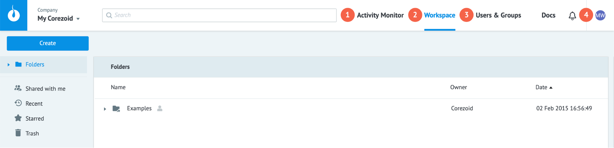
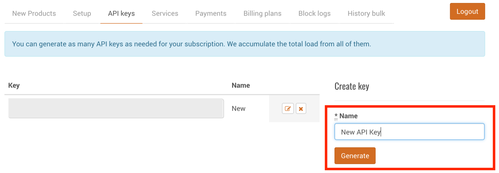

# Быстрый старт

  

## Содержание:

- [Регистрация](#регистрация)
- [Браузер процессов](#браузер-процессов)
- [Создание процесса](#создание-процесса)
    - [Режим “Edit”](#режим-edit)
    - [Режим “View”](#режим-view)
    - [Режим “Debug”](#режим-debug)
- [Работа с логиками API Call, Condition](#работа-с-узлами-api-call-condition)

  
  

## Регистрация

Для начала работы с Corezoid сперва необходимо [зарегистрироваться](https://admin.corezoid.com/signup).  
  

## Браузер процессов

После регистрации вы попадаете в браузер процессов, который состоит из 4 компонентов:

  

1.  **Activity Monitor** - учет вычислительных ресурсов, которые потребляют ваши процессы.
    
2.  **Workspace** - основное рабочее пространство для навигации по процессам.
    
3.  **Users & Groups** - управление доступами процессов. 
    
4.  **Profile** - информация о вашем профиле, активной подписке и истории платежей.
    

## Создание процесса

Для создания процесса нажмите в левом верхнем углу кнопку **“Create”** и выберите из выпадающего списка пункт **“Process”**.

 

  
В появившемся окне укажите произвольное название процесса и короткое описание (опционально), которое поможет понять предназначение и функциональность процесса. После этого нажмите кнопку “**OK**”.  
  

Поздравляем! Вы создали свой первый процесс на платформе Corezoid :)

##  Редактор процессов

Для того, чтобы разобраться как работает Corezoid, нужно понимать, что каждый процесс состоит из совокупности узлов.

**Узел** - это базовый вычислительный элемент Corezoid, с помощью которого производится обработка информации. Всего Corezoid имеет 15 узлов, каждый из которых отвечает за отдельный тип логики обработки информации. Комбинируя узлы пользователь строит процессы, которые будут обрабатывать входящие и исходящие заявки.

Подробнее о типах узлов можно прочитать [здесь](https://doc.corezoid.com/ru/interface/nodes/).

**Заявка** - это объект с данными, который поступает в процесс для обработки. Заявки могут быть загружены в процесс как из внешних систем, так и из процессов Corezoid.  
  
**По умолчанию каждый новый процесс состоит из 2 узлов:**

-   Синий - стартовый узел, в который поступают все входящие заявки;
-   Красный - финальный узел, в который поступают обработанные заявки.
    
Зеленая соединяющая узлы линия показывает направление движения заявки по процессу.

  

  
**Сверху расположено меню управления процессом:**  
  

1.  **View** — режим просмотра исполнения процесса в режиме реального времени;
    
2.  **Edit** — режим редактирования процессов;
    
3.  **Debug** — режим отладки процесса для проверки работоспособности или поиска уязвимостей;
    
4.  **Undo/Redo** <> — кнопки отмены или применения последнего изменения;
    
5.  **Process Errors** — информационное меню об ошибках процесса;
    
6.  **Share** — позволяет подключать пользователей Corezoid к просмотру, загрузке данных и редактированию процессов.
    

  

### Режим “Edit”

Изменение процесса производится путем перетягивания узлов из списка узлов (слева) на рабочее полотно процесса либо с помощью нажатия иконки “+”, которая появляется при наведении на линию соединяющую процессы.

Все изменения процесса применяются только после нажатия на кнопку **Deploy**.

Промежуточные изменения автоматически сохраняются каждые 10 секунд. К 20 последним изменениям можно применить кнопки Undo/Redo.

  

###  Режим “View”

Для отслеживания работы процесса в режиме реального времени перейдите во вкладку **View**.

При клике на любой узел в режиме **View** у вас появляется боковое меню с 2 вкладками:

1.  **Statistics** - статистика в разрезе количества обработанных заявок за выбранный период времени;
    
2.  **Archive** - это архив заявок, которые находятся сейчас в узле. В этой вкладке вы можете видеть список всех заявок и содержимое этих заявок.  
      

Также в этом режиме вы можете создавать новые заявки и смотреть как они обрабатываются вашим процессом.

### Заявки

Заявка - это набор данных, описанных в формате JSON ("ключ":"значение").

Максимальный размер заявки в процессе - **128 kb**.  
  

Пример заявки в процессе:

1.  **ID** - уникальный идентификатор, по которому можно найти и модифицировать заявку в рамках всей системы Corezoid.
    
2.  **Референс заявки (REF)** - уникальный идентификатор, по которому можно найти и модифицировать заявку в рамках одного процесса.
    
3.  **Created** - дата и время создания заявки.
    
4.  **Changed** - дата и время изменения заявки.
    
5.  **JSON объект**, содержащий описание параметров заявки.
    

###  Создание новой заявки вручную

**Рассмотрим процесс создания новой заявки на примере скриншота, где:**  
  

1.  **“+ New task”** - кнопка создания новой заявки. После клика на эту кнопку открывается боковое меню с параметрами создания новой заявки.
    
2.  Режимы создания новой заявки: **create** - создание новой уникальной заявки, которой еще нет в процессе, **modify** - изменение существующей в процессе заявки по REF.
    
3.  **“Key-Value”** - вкладка для описания данных заявки в формате “key-value” (JSON).
    
4.  **“Code editor”** - эта вкладка позволяет редактировать эти же параметры, но в формате текстового редактора кода.
    
5.  Выбор типа данных добавленного параметра (ниже подробнее описаны доступные типы данных).
    
6.  Кнопка удаления параметра.
    
7.  **+ Add parameter** - добавления нового параметра.
    
8.  **Add task** - добавления новой заявки в процесс.
 

**Типы данных:**
 
1.  **String** - текст. Пример: Иванов Иван Петрович.
    
2.  **Number** - число. Пример: 13, 0.4, 32.
    
3.  **Boolean** - логическое значение, могут иметь лишь одно из двух состояний — «истина» или «ложь». Пример: true, false.
    
4.  **Array** - массив данных. Пример: [“Антон”, “Денис”, 941, {“key”: “value”}, ...].
    
5.  **Object** - объект данных в формате JSON. Пример: {“objectName”: “objectValue”}.
    

При движении заявки из стартового узла в финальный, счетчик в финальном узле увеличивается на 1. Это означает, что заявка успешно прошла путь от создания до отработки в процессе.

Для того, чтобы просмотреть отработанную заявку, кликните на финальный узел. В появившемся окне вы увидите все отработанные заявки и их содержание.

  

### Режим “Debug”

Для тестирования процесса в режиме реального времени перейдите в режим Debug.  
  

Перед Вами открылся интерфейс тестирования. В этом режиме вы можете работать как с заявками, которые уже поступают в процесс из внешних систем, так и эмулировать создание новых заявок аналогично режиму “View”.

Если заявка попала в узел с красным крестиком, то кликнув на него Вы увидите текст ошибки, который позволит разобраться из-за чего заявка так повела себя.  

**Совет:**
Рекомендуем после каждого изменения процесса “прогонять” через процесс новую тестовую заявку, чтобы проверить корректность работы процесса. Это позволит избежать сбоев при “боевом” запуске процесса.

  

## Работа с узлами: API Call, Condition

У Вас уже есть готовый процесс, который состоит из стартового и финального узла. Давайте теперь добавим в него новый узел с логикой API Call.

Для добавления нового узла наведите на линию, которая соединяет стартовый и финальный узлы, нажмите иконку “+” и в появившемся списке выберите логику **API Call**.

### API Call

Логика API Call позволяет вызывать API в форматах: JSON, XML, SOAP.
При добавления логики API Call у вас появляется 4 узла: узел API Call + 3 узла, которые отвечают за обработку ошибок, возникающих при вызове API.
  

Теперь давайте настроим параметры вызова API. Для этого кликните на узел **API Call** и в появившемся боковом меню вы увидите параметры вызова API:

1.  **Add title** - поле для ввода названия узла. Мы настоятельно рекомендуем добавлять название всем узлам, чтобы пользователи могли без труда “прочитать” процесс и понимать, что в нем происходит без необходимости заходить в каждый узел и смотреть для чего используется та или иная логика. 
      
2.  **Add description** - поле для ввода описания узла. Если узел выполняет базовую логику, которая понятна из названия, то можно пренебречь этим полем. В противном случае, рекомендуем добавлять описание. 
      
3.  **URL** - ссылка для вызова API.
      
4.  **Request format** - формат запроса. Бывает 2 типов: *Default* - стандартный HTTP-вызов API; *Corezoid* - запрос к внутреннему [API Сorezoid](https://doc.corezoid.com/ru/interface/nodes/api/corezoid.html) (продвинутое использование Corezoid).  
      
5.  **Методы вызова API** - все стандартные HTTP-методы, необходимые для работы с API: [GET](https://doc.corezoid.com/ru/interface/nodes/api/get.html), [POST](https://doc.corezoid.com/ru/interface/nodes/api/post.html), [PUT, DELETE, HEAD, PATCH](https://doc.corezoid.com/ru/interface/nodes/api/put__delete__head.html). 
Подробнее об HTTP-методах можно прочитать [здесь](https://ru.wikipedia.org/wiki/HTTP#%D0%9C%D0%B5%D1%82%D0%BE%D0%B4%D1%8B).
    
6.  **Content-Type** - выбор типа формата данных при запросе к API: application/json, application/x-www-form-urlencoded, application/xml, text/xml, application/soap+xml. Подробнее о Content-type можно прочитать [здесь](https://developer.mozilla.org/ru/docs/Web/HTTP/%D0%97%D0%B0%D0%B3%D0%BE%D0%BB%D0%BE%D0%B2%D0%BA%D0%B8/Content-Type).  
      
7.  **Parameters** - описание параметров, которые будут переданы в API. Параметры описываются в формате “key-value”, по аналогии созданию новой заявки.  
    
8.  **Additionally** - дополнительные параметры вызова API, которые мы рассмотрим в рамках других уроков.
   
Давайте теперь вызовем реальный API сервиса погоды [OpenWeatherMap](https://openweathermap.org/current), который будет возвращать нам погоду в указанном городе на сегодня.

**Для этого нужно:**

1.  [Зарегистрироваться](https://home.openweathermap.org/users/sign_up) в сервисе погоды для получения доступа к API.

2.  Создать новый API Key  

    
    
Далее необходимо добавить следующий URL в узел **API Call**:  [http://api.openweathermap.org/data/2.5/weather?q=London&units=metric&APPID={APIKEY](http://api.openweathermap.org/data/2.5/weather?q=London&units=metric&APPID=%7BAPIKEY)}, где {APIKEY} - ключ, который вы создали.

И выбрать **Request method: GET**, т.к. мы хотим запросить данные у API.

Далее переходим в режим View, создаем новую пустую заявку, нажав на кнопку **“+ New task”**, и жмем кнопку **“Add task”**. 

После успешной обработки заявки, жмем на узел **“Final”** и справа у появится боковое меню с описание параметров заявки, в которой содержится ответ API в формате JSON.

**Поздравляем! Вы успешно вызвали ваш первый API с помощью Corezoid.**

###  Condition

Теперь давайте научимся распределять поток заявок по процессу на основании данных, которые мы получили в заявке. Для этого мы будем использовать узел **Condition**, который отвечает за условные логические операторы “если …, то …”. 

Для начала нам необходимо освободить пространство для добавления нового узла **Condition** между узлами **API Call** и **Final**. Для этого нужно кликнуть на узел **Final** и перетащить его вниз. 

Далее наведите мышкой на соединительную линию между узлами **API Call** и **Final**, нажмите на иконку “+” и в появившемся списке выберите узел **Condition**. 

У вас должно получиться так, как на скриншоте ниже:

 

Теперь разберем элементы узла Condition:

1.  **Condition** - список доступных условных логических операторов:

	a.  **==** - равно
    
	b.  **=!** - неравно
    
	c.  **>** - больше
    
	d.  **<** - меньше
    
	e.  [RegExp](https://ru.wikipedia.org/wiki/%D0%A0%D0%B5%D0%B3%D1%83%D0%BB%D1%8F%D1%80%D0%BD%D1%8B%D0%B5_%D0%B2%D1%8B%D1%80%D0%B0%D0%B6%D0%B5%D0%BD%D0%B8%D1%8F)
    

2.  **+ Add parameter** - добавление нового параметра в условие
    
3.  **+ Add condition** - добавление нового условия
    
4.  Список ошибок, которые не позволяют применить изменения к процессу.
    
5.  **“+”** - добавления нового узла, переход к которому будет осуществляться при исполнении описанного условия.  
      
    
Давайте теперь добавим следующее условие: если текущая температура в Лондоне больше +20 градусов по Цельсию, то мы будем перенаправлять заявку в финальный узел под названием “Warm”, если в диапазоне от +5 до +20 - в узел “Normal”, а если на улице менее +5 градусов - в узел “Cold”.

Вспомним, что API отдает нам ответ виде вложенного объекта в формате JSON:

    "main": {
		    "temp": 9.66,
		    "pressure": 1029,
		    "humidity": 87,
		    "temp_min": 8.89,
		    "temp_max": 10.56
    },

где **temp** - текущая температура.

**Для добавления условий нам необходимо:**

1.  В поле “key” добавляем конструкцию `{{main.temp}}`, где:  
    `{{ }}`  - конструкция для обращения к параметрам заявки, которые находятся во вложенных объектах или массивах;  
    `main` - первый уровень вложенности (название объекта);  
    `temp` - переменная, к которой мы хотим обратиться.  
      
    Подробнее о принципах работы с объектами можно прочитать [здесь](https://developer.mozilla.org/ru/docs/Web/JavaScript/Guide/Working_with_Objects).  
      
    
2.  Выбираем условный оператор больше (“>”)
3.  В поле “value” добавляем значение “20” - это значение нашей температуры
4.  Так как мы работаем с числами, выбираем тип значения “N”  
      
    У вас должна получиться следующая конструкция:  
     
5.  Нажимаем на кнопку “+ Add condition”
6.  Добавляем второе условие, которое состоит из 2 параметров:  
    
      
    Для добавления второго элемента, нажмите кнопку “+ Add parameter”
    

  

Теперь давайте добавим финальные узлы, в которое будут маршрутизироваться заявки в зависимости от текущей температуры:

1.  Нажмите на кнопку “+” возле каждого из условий и выберите узел “End: Success”  
     
2.  Добавьте в поле “title” название узла “Warm”.
3.  Повторите операцию со вторым условием, назвав узел “Normal”
4.  Переименуйте узел “Final” на “Cold”
    

  
Мы не добавляли третье условие, так как если ни одно из условий выше не будет выполнено, значит температура ниже 5 градусов и мы по безусловному переходу переведем заявку в узел “Cold”.

**Теперь давайте протестируем добавленные условия:**

1.  Нажмите кнопку **“Deploy”**
2.  Перейдите в режим **“View”**
3.  Cоздайте в процессе новую пустую заявку
4.  Посмотрите в какой из узлов она попадет

На момент написания этого текста в Лондоне было +8.46 градусов и заявка ожидаемо попала в узел “Normal”, так как температура находится в диапазоне от +5 до +20.

  

Поздравляем! Теперь вы умеете вызывать API и работать управлять заявками с помощью узла **Condition**.

