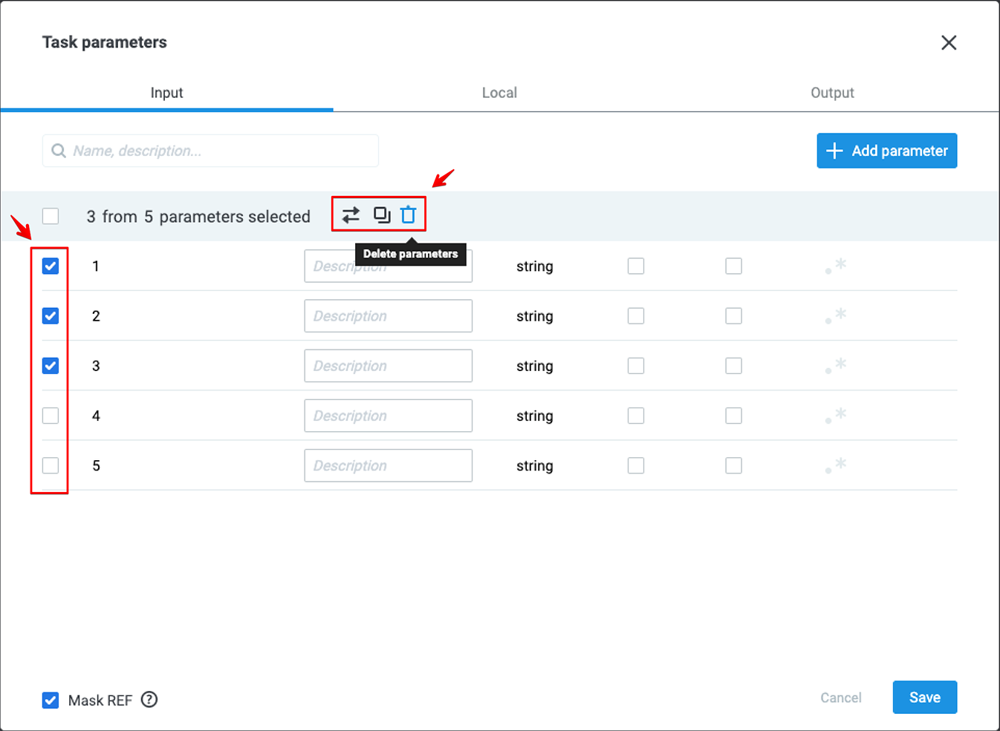
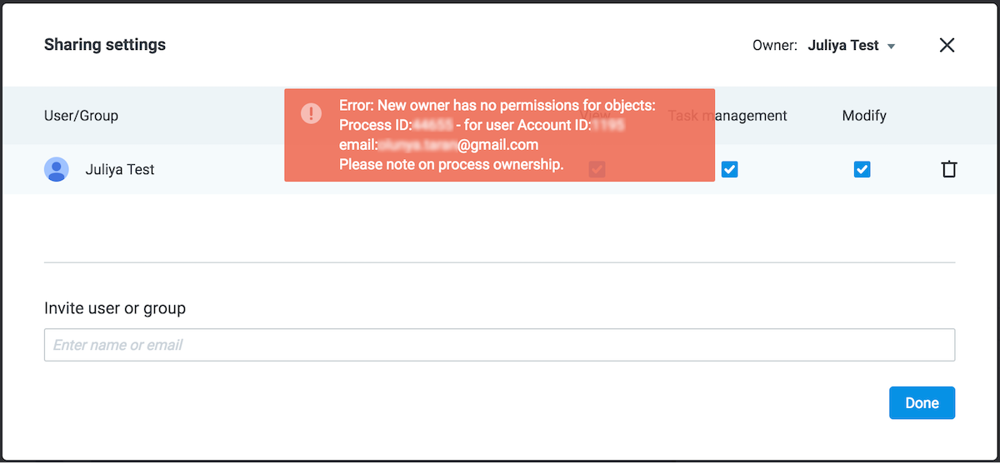

# История изменений

**Обратите внимание!** Планируются изменения:

1. В v 4.3 (ориентировочно - июль 2019) строка с JSON-данными не будет восприниматься, как JSON-объект, если при работе с данными подразумевается обращение к его свойствам.<br>
Например, из строки с JSON-данными<br>
```
{
"obj":"{\"key\":\"value\"}" //тип String
}
```
нельзя будет получить значение параметра `key` (`{{obj.key}}`) или обработать его.<br>
2. В v 4.4 (ориентировочно - август 2019) будет прекращена поддержка запроса Corezoid API для копирования объектов:<br>
https://admin.corezoid.com/api/2/json
```
{
  "ops": [
      "type": "create",
      "obj": "obj_copy",
      "obj_type": "folder",
      "obj_id": {{copy_folder_id}},
      "folder_id": {{to_folder_id}},
      "title": "{{folder_new_name}}",
      "company_id": "{{company_id}}"
}
```
Необходимо заменить URL на следующий:<br>
https://admin.corezoid.com/api/2/copy

## v 4.2 - 02 июля 2019

**Новое:**

1. Оптимизирована выгрузка (Download) и загрузка объектов из файла (Create → From file).
2. Улучшена работа **Upload master**:<br>
    * отображение результата загрузки объектов из файла:<br>
    <br>
    * детальный отчет об ошибках загрузки - **Show details**:<br>
    <br>
    * возможность прервать загрузку:<br>
    <br>
3. Добавлена возможность выгрузки заявок в **CSV** файл за указанный период:<br>
    <br>

**Исправлено:**

1. Некорректное отображение объекта, добавленного в **Избранное**, после перемещения в другую папку.
2. Несоответствие данных на дашборде при выборе **Previous month** и **Custom Range** (тот же период).
3. Некорректная работа **Sign In\Sign Up** на [Corezoid Marketplace](https://market.corezoid.com/).
4. Добавлена информация о приложении, которое запрашивает доступ к аккаунту:<br>

5. И другие скучные баги :)


## v4.1 - 22 Мая 2019

**Новое:**

1. При [импорте заявок](https://doc.corezoid.com/ru/interface/tasks/import_from_csv.html) из CSV файла добавлена возможность указать [тип данных](https://doc.corezoid.com/ru/interface/tasks/task_parameters.html#type-тип-параметра) для каждого параметра:<br/>
<br/>
2. В окне **Task parameters** добавлена кнопка для перемещения параметра из одной вкладки в другую:<br/>
<br/>
3. В логике **Code** добавлена поддержка библиотек `moment-timezone.js` и `sha512.js`.

Примеры:

```
require("libs/moment-timezone.js");
data.date = moment().tz('Europe/Kiev').format("DD-MM-YYYY HH:mm:ss");

require("libs/sha512.js");
data.sha512 = CryptoJS.SHA512("test").toString();
```

**Исправлено:**

1. Перенос параметров в другую вкладку без дополнительного нажатия кнопки кнопки **Save**.
2. Некорректное отображение верстки окна Task parameters в браузере **Safari**.
3. Пустой выпадающий список узлов в логике **Get from Queue**, если в выбранном процессе их более 30.


## v4.0 - 14 Мая 2019

**Новое:**

1. Сортировка папок в Workspace по умолчанию выполняется в **алфавитном порядке**:<br/>
<br/>
2. В блоке [Customize response parameters](https://doc.corezoid.com/ru/interface/nodes/api/#customize-response-parameters) логики **API Call** реализована возможность динамически задавать **key** (имя) параметра.<br/>
Пример: `{{param}}`<br/>
<br/>
После вызова API, заявка будет содержать новый объект с названием `{{param}}`, т.е. значение параметра `param`:<br/>
<br/>
**Важно!** Название параметра (**key**) будет сформировано в соответствии с теми параметрами заявки, которые были до вызова API. Параметры, полученные после вызова API, не будут динамически подставлены. Если указанного параметра в заявке нет или он имеет пустое значение до вызова API, то название параметра также будет иметь пустое значение.<br/>
3. В логике API Call добавлен новый формат запроса (Request format) - **Raw**.<br/>
В качестве тела запроса во вкладке **Code editor** теперь можно указать данные в форматах: string, number, array, object.<br/>
Пример тела запроса c массивом:<br/>
<br/>
Пример запроса API Corezoid с динамической подстановкой названия параметра:<br/>
<br/>
Теперь часть запроса в формате XML можно подставить с помощью динамического параметра, значение которого будет присвоено из тела заявки:<br/>
<br/>
где<br/>
`{ "program": "<program><loadname>APP1LMD1</loadname><pgmname>APP1PGM1</pgmname></program>" }`<br/>
Также в **Code editor** поддерживается **конвертация** значений в строку/число/объект/массив с помощью конструкций:<br/>
`$.to_object()`<br/>
`$.to_number()`<br/>
`$.to_array()`<br/>
`$.to_string()`<br/>
Для конвертации строкового параметра `"str": "{\"obj\": {\"key\": \"value\"}}"` в объект, конструкция будет выглядеть следующим образом: `$.to_object({{str}})`
4. Новый функционал в меню **Task Parameters**:
    * массовые операции: перенос, копирование и удаление выбранных параметров;
    * автоматическая проверка наличия дублирующих названий параметров.



**Исправлено:**

1. Некорректная работа API Call - если в ответе от API приходил пустой массив, параметр `_conveyor_api_array_` не отображался в теле заявки.
2. Не работала функция **Log out** при просмотре Dashboard.
3. Не отображался email, на который отправлялось письмо с инструкциями по восстановлению пароля:<br/>

4. Ошибка добавления нового узла с помощью кнопки **"+"**.
5. Ошибка с истечением срока действия прямой ссылки на процесс при входе без авторизации.
6. И другие скучные баги :)


## v3.5.1 - 24 Апреля 2019

**Новое:**

1. Новый дизайн страницы регистрации и единый аккаунт авторизации для всех продуктов экосистемы **Middleware**, который в ближайшей перспективе позволит пользователям Corezoid получать доступ по одной учетной записи ко всей продуктовой линейке, без разделения на типы аккаунтов в зависимости от выбранного продукта и/или сервиса:<br/>

2. Добавлена визуализация процесса валидации нового пароля для наглядности вводимых данных пользователем системы:<br/>

3. Добавлена подсветка текста для отображения длинных названий процессов и папок<br/>

4. Для пользователей собственных окружений реализована возможность передачи объектов от пользователя к пользователю, глобально по всей системе.
5. **Bot Platform версии 2.0** - набор универсальных процессов в Corezoid для создания и управления ботами в наиболее популярных мессенджерах:<br/>
   * Facebook Messenger;
   * Viber;
   * Telegram.

Мы рекомендуем всем пользователям данной функциональности переходить на использование версии  **Bot Platform 2.0**, так как поддержку версии 1.0 планируется прекратить с 01.06.2019.<br/>
Вы можете создавать универсальные бизнес-процессы, которые доступны во всех мессенджерах, а не разрабатывать бизнес-логику под каждый из мессенджеров отдельно:<br/>


**Исправлено:**

1. Сортировка данных и перемещение метрик при выборе типа отображения **Table chart** в **Dashboard**.
2. Ошибка округления значения float числа (с плавающей запятой). Округление float числа будет выполняться до 6 знаков после запятой.
3. Ошибка, связанная с **moment.js** в Usercode.

## v3.5 - 3 Апреля 2019

**Новое:**

1.  Улучшена функция поиска процессов по части его названия - увеличен лимит на вывод найденных вариантов в выпадающем списке с 20 до 30. При превышении лимита выдачи в 30 вариантов пользователю будет отображаться сообщение с рекомендацией повторить поиск по более уникальной части названия процесса:

2. На странице авторизации добавлена **Google reCaptcha**, которая отображается после 5ти неверных ввода пароля:


  

**Исправлено:**

1.  Ошибка загрузки больших файлов. Ускоренно создание процессов из файла. Теперь `json` структуры папки загружается значительно быстрее.
    
2.  Ошибка прав доступа для ownera группы - при шаринге объектов членами группы доступ так же предоставляется и владельцу этой группы
    
3.  Ошибка в режиме дебаг при просмотре истории прохождения заявки в финальном узле при успешном выполнении запроса (TypeError: Cannot read property 'toString' of null)
    
4.  Некорректное отображение поля для ввода **Throw exception** - теперь при расширении панели логики Reply to Process поле Throw exception также расширяется:

5.  Отображение информации в терминале для логики **Git Call**. Теперь терминал сохраняет состояние результата последней сборки и при внесении изменении любого поля зависимости, будет гореть индикатор 'build', до тех пор пока не начнется сборка. Также добавлена функция rebuild, для того чтобы переписать зависимость, если она обновилась в Git.
    
6.  Ошибка загрузки заявок по узлам, при просмотре узла в режиме View.


## 23.01.2019

**Новое:**

1. Добавлена новая логика **GIT Call**. Вы можете настроить дополнительную логику обработки заявки с использованием сторонних библиотек. Подробнее про новую логику вы можете прочитать в документации.
Пример подключения [библиотеки moment](https://github.com/moment/moment/) с GitHub:

2. Теперь с помощью функции **CONV** можно получить из диаграммы состояний параметры заявки любой вложенности, а также элементы массива. Пример: `{{conv[12345].ref[template].message.attachment.payload.buttons[0]}}`
3. Добавлена поддержка UUID  и Crypto в логике **Code** для языка программирования Erlang.

**Исправлено:**

1. Уменьшение поля ввода для текста ошибки в логике **Reply to Process** при использовании флага Throw exception.
2. Ошибка связки аккаунтов Corezoid и Sender после создания компании из административной панели Sender.
3. Получение значений параметров заявок из удаленной диаграммы состояний.
4. Ошибка проверки прав доступа на **Copy task**/**Modify task**/**Call Process** после перемещения объекта из/в папки, к которой предоставлен доступ.
5. Некорректная работа логики **Condition** при проверке условия для пустого объекта или массива.


## 13.12.2018

**Новое:**
- Добавлен мастер загрузки файлов. Вы можете видеть статус загрузки файла:


**Исправлено:**
- Валидация email пользователя с использование букв в разных регистрах. При добавлении email с буквами в разных регистрах - email приводится к нижнему регистру
- Ошибка в некорректной выгрузке заявок в файл **csv** из процессов

## 04.10.2018

**Новое:**
- При загрузке папки с процессами из файла, если в процессах есть ошибки - они загружаются в статусе **Paused**. Чтобы сделать **Deploy** процесса, необходимо устранить все ошибки.
- Теперь динамическую конструкцию для получения всей заявки:

```
  {{conv[{{proc_id}}].ref[{{ref}}]}}
```
можно указывать в качестве значения параметра в логиках **API Call** и **Sender Action**:


**Исправлено:**
- Отображение в дашбордах метрик из удаленных процессов.
- Отсутствие доступа к объекту у владельца группы пользователей при предоставлении доступа для [**группы**](https://doc.corezoid.com/ru/interface/users_groups.html#groups).
- Отсутствие валидации обязательных параметров при копировании заявок в процесс с помощью логик.
- Отсутствие проверки типа для обязательных входящих параметров при добавлении заявки в процесс используя логики и загрузку через [**Direct url**](https://doc.corezoid.com/ru/interface/tasks/direct_url.html).


## 09.08.2018

**Новое:**
- Поле для **поиска** процессов и диаграмм состояний:
    - по идентификатору
    - по наименованию
    - по URL, который используются в узлах с логикой API Call
    - по наименованию узла


Такой же поиск осуществляется в поле **Process** в настройках логик Copy task, Modify task, Call Process, Get from queue.

- Теперь объекты после удаления хранятся в корзине **90 дней**, после чего они будут удалены навсегда.
- При предоставлении доступа пользователям доступен поиск:
    - по логину
    - по email
    - по номеру телефона
- Возможность получить значение всей заявки с помощью конструкции:
conv[{{proc_id}}].ref[{{ref}}]


- Возможность отменить маскирование значений в заявке для **двумерного массива**:


**Исправлено:**

- Некорректное отображение пользовательского кода при наведении на узел с логикой **Code** в режиме Edit и View.


## 11.07.2018

**Новое:**
- В интерфейсе Corezoid появилась опция для переключения на **тёмную тему** оформления:


## 20.06.2018

**Новое:**
- Пользователей и API ключи может удалять только владелец компании
- При отсутствии прав на указанный в логиках процесс пользователю теперь отображается в тексте ошибки Account ID и email владельца процесса.


- При передаче авторства на процесс, если в нем вызывается процесс без доступа новому владельцу, будет отображена ошибка с ID процесса, Account ID и email его владельца:



- Если процесс создается из файла или копированием и содержит ошибки deploy, он будет в статусе **paused**.
- Продолжение движения заявки по узлам после возврата статуса процесса на **active**.

**Исправлено:**

- Если процесс, указанный в логиках Copy task, Modify task, Call Process, Get from queue, в статусе **debug**, **paused** или **blocked** - отображается ошибка *"Only active process can be used"*.
- Добавлена поддержка символа `":"` в наименовании параметра при добавлении в [**Task parameters**](https://doc.corezoid.com/ru/interface/tasks/task_parameters.html).

## 22.05.2018

**Новое:**
- Добавлена возможность в архиве заявок развернуть отдельную заявку для просмотра в **Code editor**


**Исправлено:**

- Смещение связи между узлами при их переименовании
- Исправления для корректной работы Corezoid в браузере **Mozilla Firefox**:
    - отображения длинных наименований объектов в **Workspase**;
    - отображения длинных наименований групп и api keys в **Users&Groups**;
    - отображения кнопки удаления пользователя в окне **Sharing settings**;
    - перемещения нескольких объектов в папку.

## 04.04.2018

**Новое:**
- Отображение ошибки *"called process doesn't found"*, если в логиках указан удаленный процесс или процесс из другой компании.

- При запросе `"type":"create","obj":"obj_copy"` по вложенным объектам возвращаются старые и новые id объектов

**Исправлено:**

- Некорректная дата (напр., `"03.04.2018 24:67:31"`) при использовании арифметических операций с аргументами в функции `$.date()`
- Отображение активной кнопки Deploy при переключении **Edit ↔ View** без изменений в процессе
- Отсутствие id узла сразу после создания
- Поиск групп, в которые добавлен пользователь, при предоставлении доступа к объектам
- Ошибка *"not_found_main_node"* в работе логики **Copy task** в загруженный из файла процесс без версии с **Deploy** (до **Deploy** заявки останавливаются в стартовом узле)
- Возможность копировать и создавать из файла процессы с логиками **Sender Form**, **Sender Action** в My Corezoid.


## 21.03.2018

**Новое:**
- При удалении объектов доступна кнопка undo для отмены. В корзине (**Trash**) при восстановлении объектов (**Restore**) доступны кнопки:
    - **locate** - переход в папку куда был восстановлен элемент
    - **undo** - отменить восстановление объекта
При нажатии кнопки **Delete forever** запрашивает подтверждение.
- При запросе `"type":"create","obj":"obj_copy"` возвращаются старые и новые идентификаторы объектов `obj_id`
- Обновлено окно выбора параметров для ключа и значения в логиках:
Для выбора key окно называется **Select parameter**, доступен выбор из вкладок:
    - **Task** - [описанные параметры процесса](https://doc.corezoid.com/en/interface/tasks/task_parameters.html)
    - **Global** - системные параметры заявки
Для выбора value окно называется **Select value**, доступен выбор из вкладок:
    - **Task** - [описанные параметры процесса](https://doc.corezoid.com/en/interface/tasks/task_parameters.html)
    - **Global** - системные параметры заявки
    - [**Functions**](https://doc.corezoid.com/en/interface/functions/)
- При добавлении пользователя в окне предоставления доступа автоматически проставляется доступ **View**.


**Исправлено:**

- Добавление описания параметров из архива заявок без экранирования специальных символов в наименовании.
- При удалении узла не удалялись заявки, содержащиеся в нем
- Search for a user in the **Sharing settings**, if you just paste the e-mail
- Поиск пользователя в окне предоставления доступа, если сразу вставить e-mail
- Отсутствие ошибки при копировании процесса, в котором есть узел с логикой **Code** без заполненного кода
- Отсутствие ошибки при попытке скопировать удаленную папку
- Отображение значения параметра типа **Boolean** в **Code editor** как **false**, если задан не константой (напр, `{{param}}`).
- Возникновение ошибок *"Value 'null' is not valid for key 'err_node_id'”* и *“Value 'null' is not allowed for key 'err_node_id'”* после восстановления эскалационных узлов
- Скрытие значений в массиве даже после описания параметра, если он имеет вид:
```
  "arr": [
    "123",
    "456"
  ]
```
Для отмены скрытия описать следующим образом:


## 22.02.2018

**Новое:**
- Окно **Task Parameters** теперь разделено на блоки параметров **Input**, **Local** и **Output**. Добавлены кнопки копирования и вставки параметров.


- Кнопка создания эскалационных узлов для логик вынесена из панели настроек в уведомление об ошибке:


- Обновления дизайна:
    - исправлено смещение фокуса при смене режимов **Edit ↔ View**
    - добавлены кнопки **History** и **Info** в режиме **Edit**


**Исправлено:**

- Некорректная работа выбора компании при копировании объектов через **Make a copy**
- Пустой референс при импорте заявок из CSV с указанием `Reference` из последнего столбца
- При добавлении узла кликом на панели выбора узлов сразу открывается панель настройки логики
- Отображение в архиве заявок в режиме **Table** значения `false` (Boolean) вместо `0` (Number)
- Редкие случаи погрешности в 1 секунду между значениями при использовании функций `$.date()` и `$.unixtime()` в логиках несколько раз, например:
```
{
 "start": "$.date(%y%m%d%h%i%s)",
 "stop": "$.date(%y%m%d%h%i%s)"
}
```

## 17.01.2018

**Новое:**
- Новый дизайн и функционал окна **Task parameters**:
    - добавлена вкладка **Code Editor** (для копирования параметров между процессами в формате json)
    - кнопка **+ Add parameter** перемещена вниз под список параметров
    - добавлены кнопки **Save** (сохранить все изменения) и **Cancel** (закрыть без сохранения)
    - кнопка **+ Add parameter** позволяет добавить несколько пустых полей для новых параметров
    - поле **Description** теперь необязательно к заполнению
    - убрана опция `Output`
- Улучшения в работе с вкладкой **Activity Monitor**:
    - можно изменять размер и расположение графиков
    - отображение прелоадеров в процессе смены настроек отображения статистики
    - динамическое изменение размера/расположения графиков при изменении размеров окна браузера
- Сохранение фокуса и зума при смене режима **Edit ↔ View**, при открытии страницы и после перезагрузки - фокус на стартовом узле


- Улучшен выбор диапазона **Custom range** (дашборды, статистика по процессам и узлам):
    - добавлена возможность ручного ввода времени
    - при установке даты по умолчанию время `Start` устанавливается на 00:00, а `End` - на 23:59


- [URL API callback](https://doc.corezoid.com/ru/interface/nodes/callback.html) в узле с логикой **Waiting for Callback** можно копировать непосредственно после создания узла (до Deploy)


**Исправлено:**
- Отображения ошибки на узле после ее устранения
- Отсутствие объекта после перемещения папки в папку через Drag'n'Drop до перезагрузки страницы


## 27.12.2017

**Новое:**
- Сохранение фокуса (зума и координат) при переходе между режимами **Edit** → **View** → **Edit**

- Добавлены горячие клавиши в режимах **Edit**, **View** и **Debug**:
    - Удаление выделенных узлов - `backspace/delete`
    - Копирование выделенных узлов - `Ctrl + c`
    - Вставка узлов - `Ctrl + v`
    - Deploy - `Ctrl + s`
    - Undo - `Ctrl + z`
    - Redo - `Ctrl + y`
    - Свернуть/развернуть узел - `Ctrl + m`
    - Выделить все узлы - `Ctrl + a`
    - Полноэкранный режим  `F10` (вкладки **View**/**Edit** при фокусе на холсте)
    - Переход на вкладку **View** - `Ctrl+Shift+W`
    - Переход на вкладку **Edit** - `Ctrl+Shift+E`
    - Переход на вкладку **Debug** - `Ctrl+Shift+D`
- Добавлена возможность передачи всех параметров **Send all** в логике **Call Process**

- Реализована возможность снимать выделение с одного узла при множественном выделении

- Добавлен **Account ID**

- Обновлен модуль истории и добавлены статусы 

- Отображение списка ошибок со ссылками на узлы. При нажатии на ошибку в списке - открывается узел с ошибкой


**Исправлено:**
- Исправлен формат ответа от сервиса в формате NVP с numeric на string


## 06.12.2017

**Новое:**
- В параметрах процесса добавлен чек-бокс **Mask REF** для управления маскированием референса заявки (по умолчанию маскируется):


- В параметрах процесса можно указать название массива (без указания индекса) с ключом для отмены маскировки этого ключа для всего массива: `arr[].key`
- Добавлена возможность отображения [системных параметров](https://doc.corezoid.com/ru/interface/tasks/task_archive.html#system-parameters) заявки:


- Возможность добавить системные параметры при [экспорте заявок](https://doc.corezoid.com/ru/interface/tasks/export_to_csv.html):


- При добавлении нового узла автоматически открывается панель редактирования, фокус ставится на поле ввода наименования (кнопка **Delete** не удаляет узел, как при выделении существующего узла).

**Исправлено:**
- Некорректное отображение нескольких чартов в дашборде при уменьшении размера окна. Теперь чарты переносятся вниз с возможностью скролла
- Доступность кнопок **Modify** и **Delete** в архиве заявок, если к процессу предоставлен доступ только на просмотр
- Возможность **Deploy** после загрузки из файла процесса, в котором есть ссылки на процессы из другой компании
- Закрытие информационной панели после перезагрузки страницы с процессами
- В логике **Set Parameter** теперь можно указывать параметр с экранированием квадратных скобок в качестве value

**Пример:**
В заявке параметр, наименование которого содержит квадратные скобки: `"task[update][date]": "04.12.2017`

Для получения значения этого параметра, указывается конструкция с экранированием:


## 23.11.2017

**Новое:**
- Обновлен интерфейс Corezoid:
    - переименованы разделы окружения: Monitor → Activity Monitor, Files → Workspace, Users → Users & Groups)
    - в разделе **Users & Groups** в Users/API keys отображаются все пользователи/ключи, включая те, что входят в группы (при удалении из списка, удаляются также из группы)
    - выбор компании (включая создание) вынесен отдельным блоком и является общим для всех разделом
    - отображение дерева папок с процессами


- В параметрах процесса можно объявлять вложенные объекты и элементы массива и проставлять свойство **Auto-clear**. Для объявления параметров, в наименовании которых есть точка, необходимо экранирование символом `"\"`.


- В наименовании параметров поддерживается символ `"#"`, `“@”`
- При копировании узла фокус переходит на копию и панель редактирования открыается для нового узла
- Параметр `URL` в логике **API Call** теперь валидируется: допускается значение, которое начинается с `http` или `https`, также можно задавать динамически параметрами заявки.
- Изменен формат запроса API Corezoid `"type":"list","obj":"company_users"`, не поддерживаются запросы `"type":"list","obj":"company_members"` и `"type":"list","obj":"groups_users"`.

**Исправлено:**
- Отсутствие кнопки **Modify** для заявки, если она была найдена поиском по `ref/id`
- Отсутствие процессов в разделе **Favorites** в режиме **Edit**, если процесс в рамках компании


- Ошибка при вводе числа с плавающей точкой для значения параметра типа Number через **Add task**
- Ошибка доступа, если доступ предоставлен только к папке, в которой находится процесс
- Возможность **Deploy** после загрузки из файла процесса, в котором есть ссылки на несуществующие процессы

## 18.10.2017

**Новое:**
- Обновлен календарь для указания **Custom Range** для [дашбордов](https://doc.corezoid.com/ru/interface/dashboard.html#временной-интервал), статистики во вкладке Monitor и [Statistics](https://doc.corezoid.com/ru/interface/tasks/task_archive.html#режим-statistics) узла


- Добавлена поддержка символа `"."` в наименовании параметра процесса, необходимо экранирование через `"\"`.
Например, для проверки значения параметра `"ab.new"` (не объекта `"ab"` с свойством "new"`):


**Исправлено:**
- Ошибка “Процесс не найден” при поиске в логиках (`Copy task`, `Modify task` и др.) по имени процесса, если он находится в папке, к которой предоставлен доступ
- Отсутствие ошибки при добавление в избранное удаленного объекта
- Отображение старого имени узла `Start` после переименования
- Проблемы с отображением введенного нового пароля в процедуре восстановления


## 04.10.2017

**Новое:**
- После нажатия кнопки **Modify** в архиве заявок всегда открывается панель Add new с содержимым заявки для редактирования:


- При добавления связанного чарта работает поиск дашборда по имени:


- Для экспорта заявок за предустановленный отрезок времени установлено ограничение - **50 000 заявок**.


**Исправлено:**
- Маскировка трехзначных чисел при объявлении параметра в **Task Parameters**
- Некорректное отображении узлов **Start** и **End** в режиме View при двойном клике


## 20.09.2017

**Новое:**
- При загрузке заявок в процесс [из файла CSV](https://doc.corezoid.com/ru/interface/tasks/import_from_csv.html) в случае возникновения ошибок формируется отчет с ошибками и отправляется на e-mail.
- Добавлена возможность остановить загрузку заявок из файла CSV:


Отчет с заявками, которые не были загружены, отправляется пользователю на e-mail.
- Добавлена возможность при экспорте заявок выбрать предустановленный отрезок времени:


- При прохождении узла с логикой API Call в случае возникновения ошибки `"_conveyor_api_return_description_": "no_scheme"` заявка переходит в конечный узел.
- Добавлена кнопка **Clear values** для очищения значений параметров при добавлении заявки через **Add task**:


- В API Corezoid с помощью запроса `"type":"modify","obj":"node"` нельзя изменить тип узла в процессе.

**Исправлено:**
- Очищение параметров ранее добавленной заявки через **Add Task**
- Некорректное отображение выпадающего списка для переключения наименования параметра на `Reference` при импорте заявок из файла CSV
- Некорректное отображение **Custom range** для режима **Statistics** при просмотре архива заявок
- Неактивная кнопка **"Add task"** при заполнении обязательных входящих параметров через **Code editor**
- Отображение объектов из My Corezoid в дереве процессов компании, в которой еще нет папок


## 06.09.2017

**Новое:**
- Добавлена возможность задать секретный ключ в логике `API Call` динамическим ключом:


- В настройках логики `API Call` при проставлении флага **Debug info** добавлен параметр http_res_code` (HTTP status code):


**Исправлено:**
- Ошибка при загрузке файла CSV в кодировке Windows-1251
- Пустой ответ при вызове процесса через логику `Call Process` в режиме **Keys** с выбранным флагом **Throw exception**
- Некорректная обработка JSON стандарта RFC 7159 в логике `API Call`
- Отображение параметра заявки типа String как тип Number, если он содержит число


## 09.08.2017

**Новое:**
- При указании значения параметра в логиках добавлен выбор доступных функций:

- При экспорте заявок из `Task archive` в **Custom range** по умолчанию подставляется количество заявок в узле
- При импорте заявок из файла добавляется системный параметр с информацией об источнике загрузки (IP-адрес, наименование файла):

- В дашбордах для построения чарта типа **Funnel chart** добавлен флаг "Sort automatically" (`"sort" = true|false`), при выборе которого метрики автоматически сортируются по убыванию


  
**Исправлено:**
- Отображение активной кнопки **Add task** при незаполненных обязательных параметрах процесса
- Некорректное отображение длинного референса заявки в `Task archive` при горизонтальной прокрутке
- Отображение пустых подписей метрик в дашбордах, если узел не имеет пользовательского наименования


  
  
## 26.07.2017

**Новое:**
- Реализована возможность открытия из режима **View** процессов, которые указаны в логиках: `Reply to Process`, `Copy task`, `Modify task`.

- Реализована возможность копирования узла с логикой `Code` с содержимым
- Реализована подсветка узлов, в которые реализован переход по условию в логике `Condition`

- Добавлена возможность форматирования кода в `Code editor` логики `Code`

- В запросах Corezoid API v2 типов **list** и **modify** для объекта  `conv_params` переименован параметр `conv_id` на `obj_id`:
```
{"ops":[{"obj_id":<conv_id>, "type":"modify", "obj":"conv_params", "params":[...]}]}
{"ops":[{"obj_id":<conv_id>, "type":"list", "obj":"conv_params", ...}]}
```
  
**Исправлено:**
- Некорректная работа логики `Modify task` при выбранном параметре `Synchronous callback`
- Ошибки при конвертации XML


  
## 12.07.2017

**Новое:**
- Реализовано вытягивание связей по `+` в свёрнутых узлах (только для выхода)
- Реализована возможность создавать эскалационные узлы при их отсутствии/случайном удалении

- Добавлено отображение тултипа с условиями перехода при наведении на дугу в режиме **View**
- В эскалационный узел для логики `Modify Task` добавлено новое условие **IF** `duplicate_callback`
- Реализована возможность уменьшения/увеличения набора узлов используя горячие клавиши "ctrl+m" ("cmd+m")
- Добавлен флаг `Synchronous` (`is_sync = true`) в логике `Waiting for callback` для проверки наличия изменяемой заявки в узле, соответсвующему callbackurl (а не в каом либо другом callback или другом узле)
- При создании `BotPlatform` добавлена ссылка на [документацию]`


  
## 22.05.2017

**Новое:**
- Реализована [конструкция](https://doc.corezoid.com/ru/interface/functions/getParamFromCount.html) для динамического получения параметра `CallbackURL` узла
- Реализован модуль экспорта/импорта заявок в формате CSV
- При загрузке папок из файла реализовано динамическое изменение `DirectURL` процессов, которые добавлены в логике этих процессов в рамках ранее выгруженной папки
- Реализован новый модуль (интерфейс) работы с дашбордами
- Добавлена валидация при построении логики через [Corezoid API v2](https://doc.corezoid.com/ru/api/README_v2.html) (logic “go” always going after main logic “API, RPC, etc... )
- При вызове стороннего API с помощью Логики `API Call` в header запроса реализована передача параметра `X-Corezoid-TaskID`, который равен `task_id` текущей заявки Corezoid
- Новая версия процессов `BotPlatform`:
    -   добавлен функционал подключения операторов компании
    -   добавлен шаблон процесса `Сommand Lang` для установки языка общения Бота 
    -   добавлена диаграмма состояний `Texts` c готовыми заявками, которые содержат объекты, описывающие кнопки мессенжеров Viber, Telegram, Facebook

